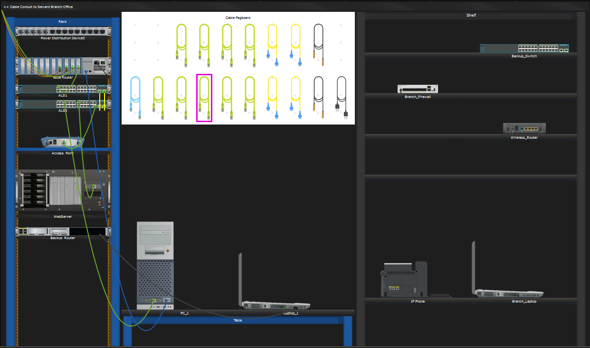
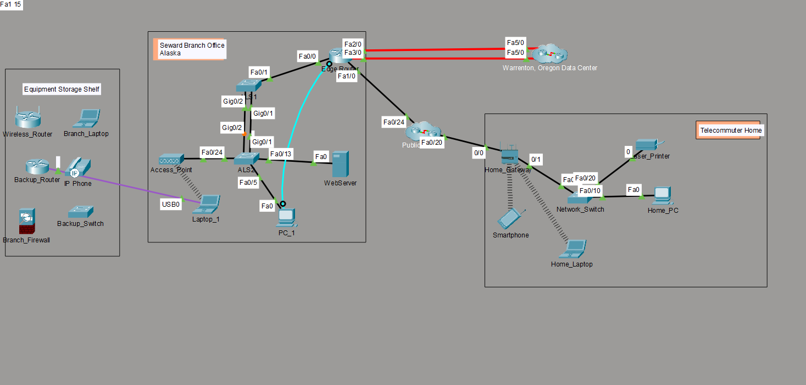
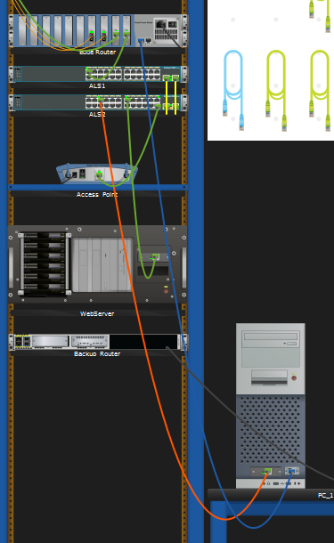
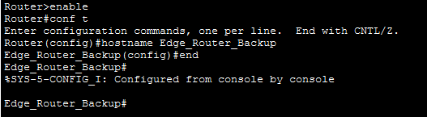

# Lab 1.0.5 — Logical and Physical Mode Exploration

## Overview

This lab explores the **Logical and Physical modes in Cisco Packet Tracer** and introduces the physical organization of network infrastructure within a simulated branch office.

The activity covers device identification, wired and wireless connectivity, network and management connections, installation of a backup router, and basic Cisco IOS configuration.

## Objectives

- Explore the Cisco Packet Tracer interface and device categories
- Differentiate between Logical Mode and Physical Mode
- Identify networking equipment within a wiring closet
- Connect end devices to networking devices
- Differentiate between network and management connections
- Install and power on a backup router
- Establish console management connections
- Access a router through the Cisco IOS CLI
- Configure a router hostname

## Network Environment

The primary network environment explored in this lab is the **Seward Branch Office**.

### Physical Location

```text
Intercity
   ↓
Seward
   ↓
Branch Office
   ↓
Branch Office Wiring Closet
```

#### Logical Mode — Network Topology



### Devices

| Device | Role |
|---|---|
| Edge_Router | Branch router |
| ALS1 | Network switch |
| ALS2 | Network switch |
| Access_Point | Wireless access point |
| WebServer | Server |
| PC_1 | End device |
| Laptop_1 | Wireless and management device |
| Backup_Router | Backup router |

### Connection Types

| Connection | Purpose | Example |
|---|---|---|
| Copper Straight-Through | Ethernet network connectivity | PC_1 → ALS2 |
| Console | Local device management | PC_1 → Edge_Router |
| USB Console | Local device management | Laptop_1 → Backup_Router |
| Wireless | Wireless network connectivity | Laptop_1 → Access_Point |

---

## Implementation

### 1. Packet Tracer Interface Exploration

The Packet Tracer device selection area was explored to identify the available network device categories:

- Routers
- Switches
- Hubs
- Wireless Devices
- Security
- WAN Emulation

### 2. Wiring Closet Exploration

Physical Mode was used to navigate to the **Branch Office Wiring Closet** and examine its physical infrastructure.

The wiring closet included:

- Equipment rack
- Cable pegboard
- Table
- Shelf

The **WebServer** and **Access_Point** were identified as devices using wired connections to **ALS2**.

In Logical Mode, **Laptop_1** was identified as a wireless client connected to **Access_Point**. In Physical Mode, Laptop_1 was located on the table inside the Branch Office Wiring Closet.

### 3. Network Connection

**PC_1** was connected to **ALS2** using a copper straight-through cable.

```text
PC_1 FastEthernet0
        │
        │ Copper Straight-Through
        ↓
ALS2 FastEthernet Port
```

This connection provides Ethernet network connectivity between the end device and the switch.


### 4. Console Management Connection

A console cable was connected from the **RS232 port of PC_1** to the **Console port of Edge_Router**.

```text
PC_1 RS232
     │
     │ Console Cable
     ↓
Edge_Router Console
```

Unlike the Ethernet connection, the console connection provides **local management access** to the router.

### 5. Backup Router Installation

**Backup_Router** was installed in the equipment rack and powered on.

A USB cable was then connected between **Laptop_1** and the **USB Console port of Backup_Router**.

```text
Laptop_1 USB
     │
     │ USB Cable
     ↓
Backup_Router USB Console
```

The USB console connection provides local access to the router for configuration and management.

### 6. Cisco IOS Configuration

The Terminal application on **Laptop_1** was used to access the Cisco IOS CLI of the backup router.

The following commands were used to configure the router hostname:

```text
Router> enable
Router# configure terminal
Router(config)# hostname Edge_Router_Backup
Edge_Router_Backup(config)# end
Edge_Router_Backup#
```


| Command | Purpose |
|---|---|
| `enable` | Enter Privileged EXEC mode |
| `configure terminal` | Enter Global Configuration mode |
| `hostname Edge_Router_Backup` | Configure the router hostname |
| `end` | Return to Privileged EXEC mode |

The CLI prompt changed from `Router` to `Edge_Router_Backup`, confirming that the hostname was successfully configured.

### Display Name vs Hostname

| Name | Meaning |
|---|---|
| Display Name | Label used by Packet Tracer to visually identify the device |
| Hostname | Device name configured within Cisco IOS |

---

## Results

The lab was successfully completed, including:

- Logical and Physical Mode exploration
- Network infrastructure identification
- Wired and wireless connectivity identification
- Ethernet connection between PC_1 and ALS2
- Console connection between PC_1 and Edge_Router
- Backup router installation
- USB console connection
- Cisco IOS CLI access
- Router hostname configuration

---

## Key Takeaways

- **Logical Mode** shows how network devices are connected.
- **Physical Mode** shows where network devices and infrastructure are physically located.
- **Ethernet connections** provide normal network connectivity.
- **Console connections** provide local device management access.
- An access point can provide wireless connectivity to clients while maintaining a wired connection to a switch.
- Cisco IOS uses different command modes for device management and configuration.
- The Packet Tracer Display Name and Cisco IOS hostname are separate values.

---

## Conclusion

This lab provided practical experience with Cisco Packet Tracer's Logical and Physical modes, physical network infrastructure, Ethernet connectivity, and local device management.

The activity also introduced console and USB console connections and basic Cisco IOS configuration by configuring a hostname on a backup router. These concepts provide a foundation for later labs involving device configuration, addressing, switching, routing, and troubleshooting.
