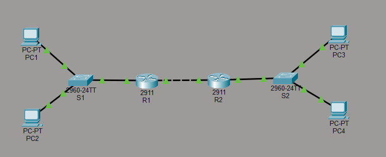
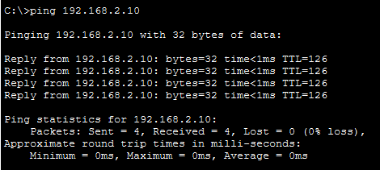
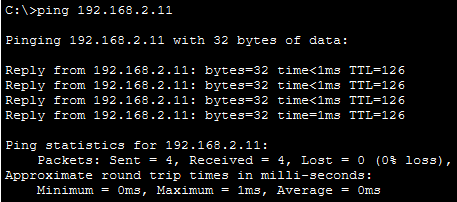

# Lab 1.5.5 – Two-LAN WAN Network

## Overview

This lab demonstrates the design and configuration of a simple network consisting of two LANs connected through a WAN. The network was built in Cisco Packet Tracer using PCs, switches, and routers.

The implementation includes IPv4 addressing, router interface configuration, default gateways, static routing, and connectivity verification between devices on different networks.

## Packet Tracer File

The completed Cisco Packet Tracer topology is available in this repository:

[Download Packet Tracer File](packet-tracer/two-lan-wan-network.pkt)

> Requires Cisco Packet Tracer to open the `.pkt` file.

## Objectives

- Build two separate LANs connected through a WAN.
- Configure IPv4 addresses and subnet masks on network devices.
- Configure default gateways on end devices.
- Configure router interfaces for LAN and WAN connectivity.
- Configure static routes between the two LANs.
- Verify local and end-to-end connectivity using `ping`.

## Network Topology

The network consists of two separate LANs connected through a point-to-point WAN link between two routers.

- **LAN 1:** PC1 and PC2 connect to Switch S1, which connects to Router R1.
- **WAN:** Router R1 connects directly to Router R2.
- **LAN 2:** Router R2 connects to Switch S2, which connects to PC3 and PC4.

### Network Structure


### Devices Used

| Device | Model | Purpose |
|---|---|---|
| R1 | Cisco 2911 Router | Routes traffic between LAN 1 and the WAN |
| R2 | Cisco 2911 Router | Routes traffic between the WAN and LAN 2 |
| S1 | Cisco 2960-24TT Switch | Connects devices within LAN 1 |
| S2 | Cisco 2960-24TT Switch | Connects devices within LAN 2 |
| PC1–PC4 | PC-PT | End devices used for connectivity testing |

### Connections

| From Device | From Port | To Device | To Port |
|---|---|---|---|
| PC1 | FastEthernet0 | S1 | FastEthernet0/1 |
| PC2 | FastEthernet0 | S1 | FastEthernet0/2 |
| S1 | GigabitEthernet0/1 | R1 | GigabitEthernet0/0 |
| R1 | GigabitEthernet0/1 | R2 | GigabitEthernet0/1 |
| R2 | GigabitEthernet0/0 | S2 | GigabitEthernet0/1 |
| S2 | FastEthernet0/1 | PC3 | FastEthernet0 |
| S2 | FastEthernet0/2 | PC4 | FastEthernet0 |

## IP Addressing

The topology uses three IPv4 networks:

| Network | Address | Prefix | Purpose |
|---|---|---|---|
| LAN 1 | 192.168.1.0 | /24 | Network for PC1 and PC2 |
| WAN | 10.0.0.0 | /30 | Point-to-point connection between R1 and R2 |
| LAN 2 | 192.168.2.0 | /24 | Network for PC3 and PC4 |

### Addressing Table

| Device | Interface | IPv4 Address | Subnet Mask | Default Gateway |
|---|---|---|---|---|
| R1 | G0/0 | 192.168.1.1 | 255.255.255.0 | — |
| R1 | G0/1 | 10.0.0.1 | 255.255.255.252 | — |
| R2 | G0/0 | 192.168.2.1 | 255.255.255.0 | — |
| R2 | G0/1 | 10.0.0.2 | 255.255.255.252 | — |
| PC1 | FastEthernet0 | 192.168.1.10 | 255.255.255.0 | 192.168.1.1 |
| PC2 | FastEthernet0 | 192.168.1.11 | 255.255.255.0 | 192.168.1.1 |
| PC3 | FastEthernet0 | 192.168.2.10 | 255.255.255.0 | 192.168.2.1 |
| PC4 | FastEthernet0 | 192.168.2.11 | 255.255.255.0 | 192.168.2.1 |

## Configuration

### Router R1

R1 provides the default gateway for LAN 1 and connects LAN 1 to R2 through the WAN.

```text
enable
configure terminal

interface gigabitEthernet0/0
ip address 192.168.1.1 255.255.255.0
no shutdown
exit

interface gigabitEthernet0/1
ip address 10.0.0.1 255.255.255.252
no shutdown
exit

ip route 192.168.2.0 255.255.255.0 10.0.0.2

end
```

### Router R2

R2 provides the default gateway for LAN 2 and connects LAN 2 to R1 through the WAN.

```text
enable
configure terminal

interface gigabitEthernet0/0
ip address 192.168.2.1 255.255.255.0
no shutdown
exit

interface gigabitEthernet0/1
ip address 10.0.0.2 255.255.255.252
no shutdown
exit

ip route 192.168.1.0 255.255.255.0 10.0.0.1

end
```
### Static Routing

| Router | Destination Network | Next Hop |
|---|---|---|
| R1 | 192.168.2.0/24 | 10.0.0.2 |
| R2 | 192.168.1.0/24 | 10.0.0.1 |

The static routes allow each router to reach the LAN located behind the other router.

## Verification

Connectivity was tested after configuring the router interfaces, default gateways, and static routes.

### Verification Commands

The following commands were used on the routers to verify interface status and routing information:

```text
show ip interface brief
show ip route
```

The WAN connection between R1 and R2 was tested using:

```text
R1# ping 10.0.0.2
```

### End-to-End Connectivity

End-to-end connectivity was tested from LAN 1 to devices in LAN 2.

From PC1:

```text
ping 192.168.2.10
ping 192.168.2.11
```

Both destination PCs were successfully reachable, confirming that traffic could travel across both LANs through the R1–R2 WAN connection.




## Key Takeaways

- A router interface can act as the default gateway for devices within a LAN.
- Devices on different networks require a router to communicate with each other.
- A `/30` subnet provides two usable IPv4 addresses, making it suitable for a simple point-to-point WAN connection.
- Static routes allow routers to reach remote networks that are not directly connected.
- The next-hop address in a static route must point to the neighboring router, not the router's own interface.
- `ping`, `show ip interface brief`, and `show ip route` are useful commands for verifying and troubleshooting network connectivity.

## Conclusion

This lab demonstrated the design and configuration of two LANs connected through a point-to-point WAN. IPv4 addressing, default gateways, router interfaces, and static routes were configured to provide communication between the two networks.

Successful end-to-end ping tests confirmed that devices in LAN 1 could communicate with devices in LAN 2 through R1 and R2.
