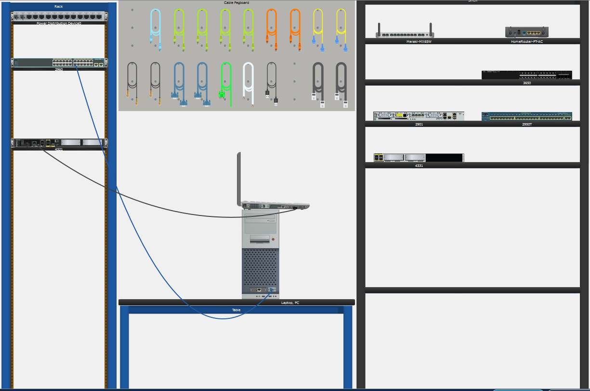
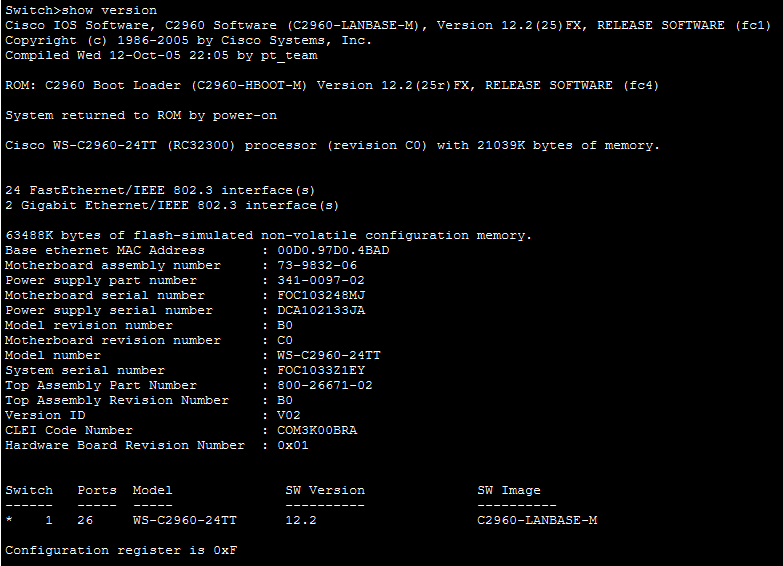
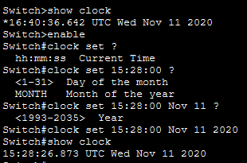

# Lab 2.3.8 – Navigate the IOS Using a Terminal Client for Console Connectivity

## Overview

This lab explores console connectivity to Cisco switches and routers using Cisco Packet Tracer Physical Mode. It focuses on accessing the Cisco IOS CLI through serial and mini-USB console connections, viewing device information, and performing basic device configuration.

## Objectives

- Access a Cisco switch through a serial console connection.
- Use the Packet Tracer Terminal application to access the Cisco IOS CLI.
- Display the IOS version and system clock.
- Configure and verify the system clock.
- Access a Cisco router through a mini-USB console connection.
- Understand different methods of local console connectivity.

## Lab Setup

### Devices Used

| Device | Purpose |
|---|---|
| Cisco 2960 Switch | Used to practice serial console access |
| Cisco 4321 Router | Used to practice mini-USB console access |
| PC | Provides terminal access to the switch |
| Laptop | Provides terminal access to the router |

### Connections

| From | Connection | To |
|---|---|---|
| PC RS-232 | Rollover Console Cable | Switch Console Port |
| Laptop USB | Mini-USB Cable | Router Mini-USB Console Port |



## Implementation

### 1. Switch and PC Setup

- Installed the Cisco 2960 switch in the rack.
- Placed the PC on the table.
- Inspected the switch and PC interfaces.
- Identified the console and RS-232 ports.

### 2. Serial Console Connection

- Connected the PC RS-232 port to the switch console port using a rollover console cable.
- Opened the Terminal application on the PC.
- Used the default terminal settings:
  - 9600 bits per second
  - 8 data bits
  - No parity
  - 1 stop bit
  - No flow control
- Accessed the switch User EXEC mode.

```text
Switch>
```

### 3. Display Device Information

The IOS image and version were displayed using:

```text
Switch> show version
```

The current system clock was displayed using:

```text
Switch> show clock
```


### 4. Configure the System Clock

Privileged EXEC mode was accessed using:

```text
Switch> enable
Switch#
```

The system clock was manually configured and then verified.

```text
Switch# clock set 15:28:00 Nov 11 2020
Switch# show clock
```


### 5. Router Mini-USB Console Connection

- Installed the Cisco 4321 router in the rack.
- Placed the laptop on the table.
- Connected the laptop to the router using a mini-USB console cable.
- Opened the Terminal application on the laptop.
- Skipped the initial configuration dialog by entering `no`.
- Accessed the router User EXEC mode.

```text
Router>
```

## Important Commands Used

| Command | Purpose |
|---|---|
| `show version` | Displays the Cisco IOS image and version information |
| `show clock` | Displays the device system date and time |
| `enable` | Enters Privileged EXEC mode |
| `clock set` | Manually configures the system date and time |
| `?` | Displays context-sensitive command help |

## Key Takeaways

- Console connections provide direct local access to Cisco devices.
- A rollover console cable can connect a PC to a switch console port.
- Mini-USB provides another method of console access on supported Cisco devices.
- Packet Tracer Terminal simulates a terminal emulator used to access the Cisco IOS CLI.
- `show version` displays important IOS and device information.
- Privileged EXEC mode is required to configure the system clock.
- Correct device time is useful for network management and troubleshooting.
- Console connections provide direct local access to Cisco devices.
- Physical access to console ports should be restricted to prevent unauthorized device access.
- Console authentication can provide additional protection.
- Serial console connections are reliable and widely supported, but modern computers may require an adapter.
- USB console connections are convenient on modern computers but may require additional drivers.
- Both serial and USB console connections can be used to access the Cisco IOS CLI.