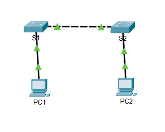

# Lab 2.5.5 – Configure Initial Switch Settings

## Overview

This lab focuses on performing an initial configuration of Cisco switches using the Cisco IOS Command-Line Interface (CLI). The activity includes examining the default switch configuration, configuring device identification and access security, encrypting passwords, configuring a Message of the Day (MOTD) banner, and saving the configuration to NVRAM.

## Objectives

- Verify the default switch configuration.
- Configure a hostname for a Cisco switch.
- Secure console access with a password.
- Secure Privileged EXEC mode.
- Configure an encrypted enable secret.
- Encrypt plain-text passwords.
- Configure a Message of the Day (MOTD) banner.
- Save the running configuration to NVRAM.
- Apply the initial configuration to a second switch.

## Lab Setup

### Devices Used

| Device | Purpose |
|---|---|
| S1 | Primary switch used for initial configuration |
| S2 | Second switch used to repeat and verify the configuration process |

### Network Topology



---

## Implementation

### 1. Verify the Default Switch Configuration

Privileged EXEC mode was accessed using:

```text
Switch> enable
Switch#
```

The current running configuration was examined using:

```text
Switch# show running-config
```

This was used to inspect the switch's default configuration before making changes.

### 2. Configure the Switch Hostname

Global Configuration mode was entered and the switch hostname was changed to `S1`.

```text
Switch# configure terminal
Switch(config)# hostname S1
S1(config)#
```

### 3. Secure Console Access

The console line was configured with a password and login authentication was enabled.

```text
S1(config)# line console 0
S1(config-line)# password letmein
S1(config-line)# login
S1(config-line)# exit
```

The `login` command instructs the switch to request the configured console password when a user accesses the console.

### 4. Secure Privileged EXEC Mode

An enable password was configured:

```text
S1(config)# enable password c1$c0
```

An encrypted enable secret was then configured:

```text
S1(config)# enable secret itsasecret
```

When both are configured, the enable secret is used for access to Privileged EXEC mode.

### 5. Encrypt Plain-Text Passwords

Password encryption was enabled using:

```text
S1(config)# service password-encryption
```

The running configuration was then checked to verify that previously visible plain-text passwords were no longer displayed as plain text.

```text
S1# show running-config
```

### 6. Configure a MOTD Banner

A Message of the Day banner was configured to warn users that access is restricted.

```text
S1(config)# banner motd "This is a secure system. Authorized Access Only!"
```

The banner is displayed when a user accesses the switch.

### 7. Save the Configuration

The completed running configuration was saved to the startup configuration in NVRAM.

```text
S1# copy running-config startup-config
```

The startup configuration can be examined using:

```text
S1# show startup-config
```

Saving the configuration ensures that the changes are retained after the switch loses power or restarts.

### 8. Configure S2

The same initial configuration process was applied to S2.

The configuration included:

- Hostname `S2`
- Console password
- Enable password
- Enable secret
- Password encryption
- MOTD banner
- Configuration verification
- Saving the configuration to NVRAM

---

## Important Commands

| Command | Purpose |
|---|---|
| `enable` | Enters Privileged EXEC mode |
| `show running-config` | Displays the active running configuration |
| `configure terminal` | Enters Global Configuration mode |
| `hostname S1` | Changes the device hostname |
| `line console 0` | Enters console line configuration mode |
| `password letmein` | Configures the console password used in this lab |
| `login` | Enables password authentication on the console line |
| `enable password` | Configures a password for Privileged EXEC access |
| `enable secret` | Configures an encrypted secret for Privileged EXEC access |
| `service password-encryption` | Encrypts plain-text passwords in the configuration |
| `banner motd` | Configures a Message of the Day banner |
| `show startup-config` | Displays the startup configuration stored in NVRAM |
| `copy running-config startup-config` | Saves the running configuration to NVRAM |

---

## Key Takeaways

- Cisco switches can be configured through different IOS configuration modes.
- Device hostnames make network devices easier to identify.
- Console access can be protected using password authentication.
- Privileged EXEC mode should be protected from unauthorized access.
- `enable secret` provides protected Privileged EXEC authentication and overrides `enable password` when both are configured.
- Plain-text passwords can be obscured in the configuration using `service password-encryption`.
- MOTD banners can display access warnings to users connecting to a device.
- The running configuration must be saved to the startup configuration to preserve changes after a restart.
- `show running-config` and `show startup-config` can be used to verify active and saved configurations.