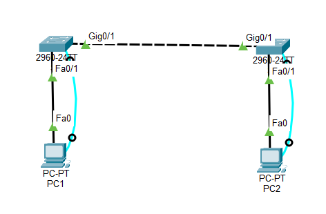
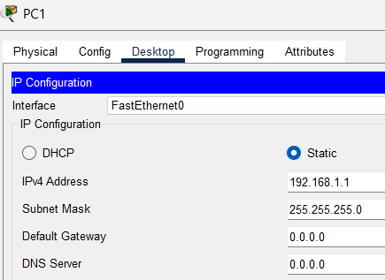
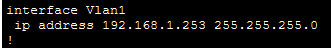
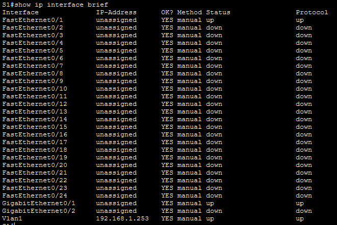
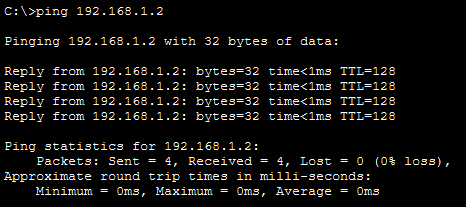
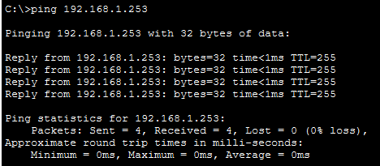
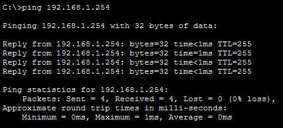

# Lab 2.7.6 – Implement Basic Connectivity

## Overview

This lab focuses on implementing basic network connectivity between two switches and two PCs. It includes initial switch configuration, IPv4 addressing on end devices, configuration of switch management interfaces using VLAN 1, configuration verification, and connectivity testing using ping.

## Objectives

- Perform a basic configuration on S1 and S2.
- Configure console and Privileged EXEC mode passwords.
- Configure an MOTD banner.
- Configure IPv4 addresses on PC1 and PC2.
- Configure VLAN 1 management IP addresses on S1 and S2.
- Verify switch interface configuration.
- Save switch configurations to NVRAM.
- Test connectivity between devices using ping.

## Packet Tracer File

The completed Cisco Packet Tracer file for this lab is included in the repository.

📦 [Open Packet Tracer File](packet-tracer/basic-connectivity.pkt)

> **File:** `basic-connectivity.pkt`  
> **Software:** Cisco Packet Tracer

## Lab Setup

### Devices Used

| Device | Purpose |
|---|---|
| S1 | Switch configured with a VLAN 1 management IP |
| S2 | Switch configured with a VLAN 1 management IP |
| PC1 | End device used for IPv4 configuration and connectivity testing |
| PC2 | End device used for IPv4 configuration and connectivity testing |

### Addressing Table

| Device | Interface | IP Address | Subnet Mask |
|---|---|---|---|
| S1 | VLAN 1 | `192.168.1.253` | `255.255.255.0` |
| S2 | VLAN 1 | `192.168.1.254` | `255.255.255.0` |
| PC1 | NIC | `192.168.1.1` | `255.255.255.0` |
| PC2 | NIC | `192.168.1.2` | `255.255.255.0` |

### Network Topology



---

## Implementation

### 1. Configure S1 and S2

Basic device configuration was performed on both switches.

For S1:

```text
Switch> enable
Switch# configure terminal
Switch(config)# hostname S1
```

For S2:

```text
Switch> enable
Switch# configure terminal
Switch(config)# hostname S2
```

### 2. Configure Console and Privileged EXEC Security

The console password used in this lab was:

```text
cisco
```

The encrypted Privileged EXEC password used was:

```text
class
```

Example configuration:

```text
S1(config)# line console 0
S1(config-line)# password cisco
S1(config-line)# login
S1(config-line)# exit

S1(config)# enable secret class
```

The same security configuration was applied to S2.

### 3. Configure an MOTD Banner

An MOTD banner was configured to warn users against unauthorized access.

Example:

```text
S1(config)# banner motd #Authorized access only#
```

### 4. Save the Initial Configuration

The running configuration was saved to NVRAM:

```text
S1# copy running-config startup-config
```

The same step was completed on S2.

---

## PC IPv4 Configuration

### PC1

```text
IP Address: 192.168.1.1
Subnet Mask: 255.255.255.0
```

### PC2

```text
IP Address: 192.168.1.2
Subnet Mask: 255.255.255.0
```



---

## Switch Management Interface Configuration

### S1 VLAN 1

```text
S1# configure terminal
S1(config)# interface vlan 1
S1(config-if)# ip address 192.168.1.253 255.255.255.0
S1(config-if)# no shutdown
S1(config-if)# exit
```

### S2 VLAN 1

```text
S2# configure terminal
S2(config)# interface vlan 1
S2(config-if)# ip address 192.168.1.254 255.255.255.0
S2(config-if)# no shutdown
S2(config-if)# exit
```



---

## Verification

The IP addresses and interface status were checked using:

```text
show ip interface brief
```

The active configuration could also be verified using:

```text
show running-config
```



---

## Connectivity Testing

Connectivity was tested using the `ping` command.

From PC1:

```text
ping 192.168.1.2
ping 192.168.1.253
ping 192.168.1.254
```

The lab expects successful connectivity between the devices once the addressing and switch management interfaces are configured correctly. :contentReference[oaicite:1]{index=1}




---

## Important Commands

| Command | Purpose |
|---|---|
| `enable` | Enters Privileged EXEC mode |
| `configure terminal` | Enters Global Configuration mode |
| `hostname` | Changes the device hostname |
| `line console 0` | Enters console line configuration mode |
| `password` | Configures the console password |
| `login` | Enables password authentication |
| `enable secret` | Configures the encrypted Privileged EXEC password |
| `banner motd` | Configures a login warning banner |
| `interface vlan 1` | Enters the VLAN 1 switched virtual interface |
| `ip address` | Assigns an IPv4 address and subnet mask |
| `no shutdown` | Enables the interface |
| `show ip interface brief` | Displays interface addresses and status |
| `show running-config` | Displays the active configuration |
| `copy running-config startup-config` | Saves the configuration to NVRAM |
| `ping` | Tests IP connectivity |

---

## Key Takeaways

- Switches can forward Ethernet traffic without having an IP address.
- A switch management IP is configured so the switch itself can be reached and managed over the network.
- VLAN 1 is used as the management interface in this lab.
- `no shutdown` is required to administratively enable the VLAN interface.
- PCs and switch management interfaces must use valid addresses in the same subnet for direct connectivity.
- `show ip interface brief` provides a quick overview of interface addressing and status.
- `ping` is used to verify basic IP connectivity.
- Saving the running configuration to startup configuration preserves the settings after a restart.

## Reference

Lab activity based on Cisco Networking Academy CCNA: Introduction to Networks (ITN) course materials.

**Lab:** 2.7.6 – Packet Tracer: Implement Basic Connectivity

This repository documents my own implementation, screenshots, verification results, and understanding of the activity.