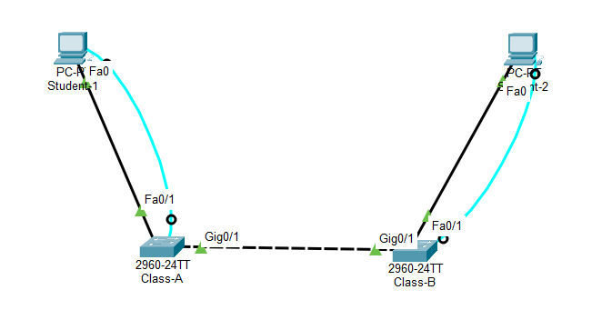
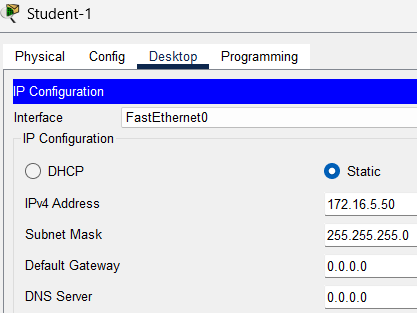
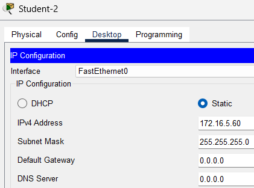
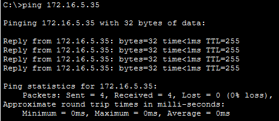
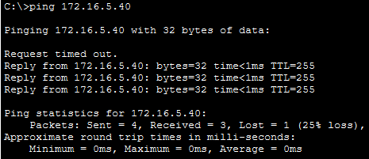
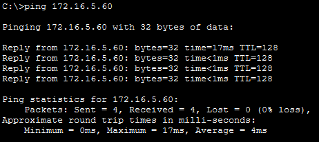

# Lab 2.9.1 – Basic Switch and End Device Configuration

## Overview

This lab demonstrates the configuration of a small LAN consisting of two Cisco switches and two end devices. It combines the fundamental Cisco IOS configuration and connectivity skills developed throughout Module 2.

The activity includes switch access and security configuration, IPv4 addressing, switch management interface configuration, configuration saving, and end-to-end connectivity verification.

## Objectives

- Configure hostnames and IP addresses on two Cisco IOS switches.
- Configure access security for the switches.
- Encrypt clear-text passwords.
- Configure an MOTD banner.
- Configure IPv4 addressing on two end devices.
- Configure switch management interfaces.
- Save the running configurations.
- Verify connectivity between network devices.

## Packet Tracer File

The completed Cisco Packet Tracer implementation for this lab is included in the repository.

📦 [Open Packet Tracer File](packet-tracer/basic-switch-end-device-configuration.pkt)

> **File:** `basic-switch-end-device-configuration.pkt`  
> **Software:** Cisco Packet Tracer

## Lab Setup

### Devices Used

| Device | Purpose |
|---|---|
| Switch 1 | Provides LAN connectivity and a configurable management interface |
| Switch 2 | Provides LAN connectivity and a configurable management interface |
| PC 1 | End device used for IPv4 configuration and connectivity testing |
| PC 2 | End device used for IPv4 configuration and connectivity testing |

### Addressing Table

> Replace the placeholders below with the addressing information generated by your Packet Tracer activity.

| Device | Interface | IP Address | Subnet Mask |
|---|---|---|---|
| Class-A | VLAN 1 | `172.16.5.35` | `255.255.255.0` |
| Class-B | VLAN 1 | `172.16.5.40` | `255.255.255.0` |
| Student-1 | NIC | `172.16.5.50` | `255.255.255.0` |
| Student-2 | NIC | `172.16.5.60` | `255.255.255.0` |

### Network Topology



---

## Implementation

### 1. Console Access

Each switch was accessed through a console connection to perform the initial configuration.

### 2. Configure Device Hostnames

The required hostnames were configured on both switches.

```text
Switch> enable
Switch# configure terminal
Switch(config)# hostname <hostname>
```

### 3. Configure Device Access Security

Access to the switches was secured using the passwords specified by the Packet Tracer activity.

The configuration included:

- Line password configuration
- Login authentication
- Privileged EXEC secret
- Clear-text password encryption

```text
Switch(config)# line console 0
Switch(config-line)# password 8ubRU
Switch(config-line)# login
Switch(config-line)# exit

Switch(config)# enable secret C9WrE
Switch(config)# service password-encryption
```

### 4. Configure MOTD Banner

An appropriate Message of the Day banner was configured to warn against unauthorized access.

```text
Switch(config)# banner motd #Authorized access only#
```

### 5. Configure Switch Management Interfaces

IPv4 addresses were assigned to the VLAN 1 management interfaces according to the addressing requirements.

```text
Switch(config)# interface vlan 1
Switch(config-if)# ip address <ip-address> 255.255.255.0
Switch(config-if)# no shutdown
```

### 6. Configure End Devices

The required IPv4 addresses and subnet masks were configured on both PCs using:

**Desktop → IP Configuration**

The configured addresses correspond to the addressing requirements generated by the Packet Tracer activity.




### 7. Save Switch Configurations

The running configuration on each switch was saved to NVRAM.

```text
Switch# copy running-config startup-config
```

This ensures that the configuration is retained after the device restarts.

---

## Verification

### Configuration Verification

The switch configurations were verified using appropriate Cisco IOS `show` commands.

Examples:

```text
show running-config
show ip interface brief
```

`show running-config` was used to inspect the active device configuration, while `show ip interface brief` was used to verify interface addressing and operational status.

### Connectivity Verification

Connectivity between the devices was verified using `ping`.

Example:

```text
ping <destination-ip-address>
```

Successful ping responses confirmed end-to-end IPv4 connectivity between the configured devices.




---

## Important Commands

| Command | Purpose |
|---|---|
| `enable` | Enters Privileged EXEC mode |
| `configure terminal` | Enters Global Configuration mode |
| `hostname` | Configures the device hostname |
| `line console 0` | Enters console line configuration |
| `password` | Configures a line password |
| `login` | Enables password authentication |
| `enable secret` | Secures Privileged EXEC access |
| `service password-encryption` | Encrypts clear-text passwords |
| `banner motd` | Configures a Message of the Day banner |
| `interface vlan 1` | Enters the VLAN 1 management interface |
| `ip address` | Configures an IPv4 address and subnet mask |
| `no shutdown` | Administratively enables an interface |
| `show running-config` | Displays the active configuration |
| `show ip interface brief` | Displays interface addressing and status |
| `copy running-config startup-config` | Saves the running configuration to NVRAM |
| `ping` | Tests IP connectivity |

---

## Key Takeaways

- Initial switch configuration combines device identification, security, addressing, and configuration management.
- Console access can be used to perform the initial configuration of a Cisco switch.
- Switch access should be protected using appropriate authentication.
- Clear-text passwords can be encrypted in the configuration.
- MOTD banners can display access warnings.
- A switch management interface requires an IP address for IP-based management.
- End devices require correct IPv4 addressing to communicate across the LAN.
- Cisco IOS `show` commands can be used to verify device configuration.
- `ping` can be used to verify basic network connectivity.
- Running configurations should be saved to NVRAM to preserve changes after a restart.

## Reference

Lab activity based on Cisco Networking Academy CCNA: Introduction to Networks (ITN) course materials.

**Lab:** 2.9.1 – Packet Tracer: Basic Switch and End Device Configuration

This repository documents my own implementation, configurations, screenshots, verification results, and understanding of the activity.# Lab 2.9.1 – Basic Switch and End Device Configuration