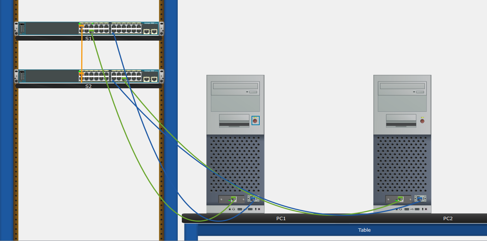
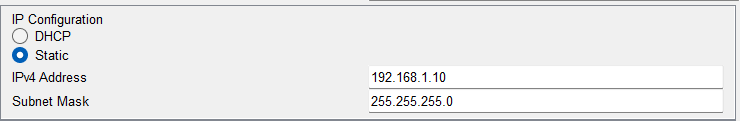
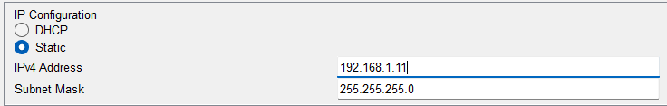
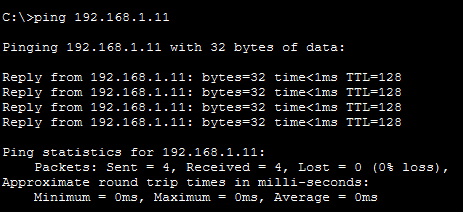
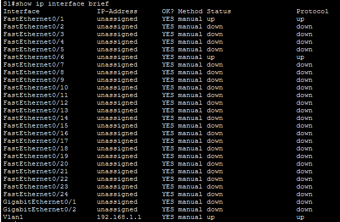
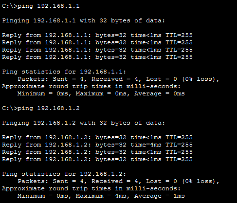
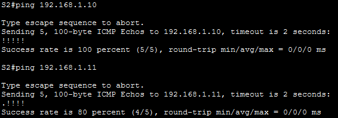

# Lab 2.9.2 – Basic Switch and End Device Configuration (Physical Mode)

## Overview

This lab implements a basic LAN using two Cisco switches and two PCs in Cisco Packet Tracer Physical Mode.

The activity focuses on physically arranging and cabling network devices, configuring IPv4 addressing on end devices, accessing switches through console connections, configuring basic Cisco IOS settings, assigning switch management IP addresses, saving configurations, and verifying network connectivity.

## Objectives

- Set up the network topology in Packet Tracer Physical Mode.
- Connect switches and end devices using the appropriate Ethernet cables.
- Configure static IPv4 addressing on PC-A and PC-B.
- Verify connectivity between the PCs.
- Access Cisco switches through console connections.
- Configure basic switch settings and security.
- Configure VLAN 1 management interfaces.
- Save switch configurations.
- Verify device and interface information.
- Test connectivity between PCs and switches.

## Packet Tracer File

The completed Cisco Packet Tracer implementation for this lab is included in the repository.

📦 [Open Packet Tracer File](packet-tracer/basic-switch-end-device-configuration-physical-mode.pkt)

> **File:** `basic-switch-end-device-configuration-physical-mode.pkt`  
> **Environment:** Cisco Packet Tracer Physical Mode

---

## Lab Setup

### Devices Used

| Device | Purpose |
|---|---|
| S1 | Provides LAN connectivity and switch management |
| S2 | Provides LAN connectivity and switch management |
| PC-A | End device and console terminal for S1 |
| PC-B | End device for connectivity testing |

### Addressing Table

| Device | Interface | IP Address | Subnet Mask |
|---|---|---|---|
| S1 | VLAN 1 | `192.168.1.1` | `255.255.255.0` |
| S2 | VLAN 1 | `192.168.1.2` | `255.255.255.0` |
| PC-A | NIC | `192.168.1.10` | `255.255.255.0` |
| PC-B | NIC | `192.168.1.11` | `255.255.255.0` |

### Network Connections

| From | Port | To | Port | Cable |
|---|---|---|---|---|
| S1 | FastEthernet0/1 | S2 | FastEthernet0/1 | Copper Cross-Over |
| S1 | FastEthernet0/6 | PC-A | FastEthernet0 | Copper Straight-Through |
| S2 | FastEthernet0/18 | PC-B | FastEthernet0 | Copper Straight-Through |
| PC-A | RS-232 | S1 | Console | Console Cable |

### Physical Topology



---

## Implementation

### 1. Set Up the Physical Topology

- Installed switches S1 and S2 in the rack.
- Placed PC-A and PC-B on the table.
- Powered on the PCs.
- Connected S1 and S2 using a copper cross-over cable.
- Connected each PC to its respective switch using copper straight-through cables.
- Verified that the network links became active.

### 2. Configure PC IPv4 Addressing

PC-A was configured with:

```text
IP Address: 192.168.1.10
Subnet Mask: 255.255.255.0
```

PC-B was configured with:

```text
IP Address: 192.168.1.11
Subnet Mask: 255.255.255.0
```

A default gateway was not required because the devices communicate within the same local network and no router is present.




### 3. Verify Initial PC Connectivity

The configuration on PC-A was verified using:

```text
ipconfig /all
```

Connectivity from PC-A to PC-B was tested using:

```text
ping 192.168.1.11
```

Successful replies confirmed connectivity between the two end devices.



---

## Switch Configuration

### 4. Access S1 Through the Console

PC-A was connected to the console port of S1 using a console cable.

The switch CLI was accessed through:

```text
PC-A → Desktop → Terminal
```

The default terminal settings were used to establish the console session.

### 5. Configure Basic Switch Settings

Privileged EXEC and Global Configuration modes were accessed:

```text
Switch> enable
Switch# configure terminal
```

The switch hostname was configured:

```text
Switch(config)# hostname S1
```

### 6. Configure Switch Security

The privileged EXEC password was configured as:

```text
S1(config)# enable secret class
```

Console access was protected using:

```text
S1(config)# line console 0
S1(config-line)# password cisco
S1(config-line)# login
S1(config-line)# exit
```

An MOTD banner was also configured to warn against unauthorized access.

Example:

```text
S1(config)# banner motd #Authorized access only#
```

### 7. Configure the VLAN 1 Management Interface

S1 was configured with:

```text
S1(config)# interface vlan 1
S1(config-if)# ip address 192.168.1.1 255.255.255.0
S1(config-if)# no shutdown
```

S2 was configured with:

```text
S2(config)# interface vlan 1
S2(config-if)# ip address 192.168.1.2 255.255.255.0
S2(config-if)# no shutdown
```

The same required basic switch configuration was completed on S2.

### 8. Save the Configuration

The running configuration was saved to NVRAM:

```text
copy running-config startup-config
```

This preserves the configuration after the switch restarts.

---

## Verification

### Switch Configuration Verification

The following commands were used to inspect the switch configuration and status:

```text
show running-config
show version
show ip interface brief
```

These commands were used to verify:

- Current switch configuration
- Cisco IOS and device information
- Interface status
- VLAN 1 management addressing



### Interface Status

The activity requires verification of the following interfaces:

| Interface | S1 Status | S1 Protocol | S2 Status | S2 Protocol |
|---|---|---|---|---|
| Fa0/1 | up | up | up | up |
| Fa0/6 | up | up | down | down |
| Fa0/18 | down | down | up | up |
| VLAN 1 | up | up | up | up |

> Complete this table using the results from your own Packet Tracer implementation.

---

## Connectivity Verification

Final connectivity was tested between the PCs and switches.

From a PC:

```text
ping 192.168.1.1
ping 192.168.1.2
```

From a switch:

```text
ping 192.168.1.10
ping 192.168.1.11
```

Successful ping responses confirm that IPv4 connectivity was established between the configured devices.





---

## Important Commands

| Command | Purpose |
|---|---|
| `enable` | Enters Privileged EXEC mode |
| `configure terminal` | Enters Global Configuration mode |
| `hostname` | Configures the switch hostname |
| `enable secret` | Configures the Privileged EXEC password |
| `line console 0` | Enters console line configuration mode |
| `password` | Configures the console password |
| `login` | Enables console password authentication |
| `banner motd` | Configures an MOTD banner |
| `interface vlan 1` | Enters the VLAN 1 SVI |
| `ip address` | Assigns an IPv4 address and subnet mask |
| `no shutdown` | Enables the interface |
| `show running-config` | Displays the active configuration |
| `show version` | Displays IOS and device information |
| `show ip interface brief` | Displays interface addressing and status |
| `copy running-config startup-config` | Saves the configuration to NVRAM |
| `ping` | Tests IP connectivity |

---

## Key Takeaways

- Packet Tracer Physical Mode can simulate the physical installation and cabling of network devices.
- Copper cross-over cables can be used for switch-to-switch connections.
- Copper straight-through cables are used in this activity for PC-to-switch connections.
- Console connections provide local access to the Cisco IOS CLI.
- PCs can communicate through switches before the switches themselves are assigned management IP addresses.
- VLAN 1 provides the switch management interface in this activity.
- Switch management IP addresses allow the switches themselves to participate in IP communication.
- Basic switch security includes privileged EXEC and console authentication.
- `show` commands are important for configuration and interface verification.
- `ping` verifies basic IP connectivity.
- Running configurations should be saved to NVRAM to preserve them after a restart.

## Reflection

### Why are some FastEthernet ports up while others are down?

Switch interfaces connected to active devices have an operational link and appear as `up`. Unused interfaces without an active connection remain `down`.

### What could prevent communication between the PCs?

Connectivity can fail because of incorrect IP addressing or subnet masks, incorrect cabling, disconnected or inactive interfaces, or incorrect device configuration.

---

## Reference

Lab activity based on Cisco Networking Academy CCNA: Introduction to Networks (ITN) course materials.

**Lab:** 2.9.2 – Packet Tracer: Basic Switch and End Device Configuration – Physical Mode

This repository documents my own Packet Tracer implementation, configurations, screenshots, verification results, and understanding of the activity.