# Lab 3.7.10 – Use Wireshark to View Network Traffic

## Overview

This lab uses Wireshark to capture and analyze ICMP network traffic.

The activity examines ICMP Echo Request and Echo Reply packets generated by `ping` and compares communication with devices on the local network to communication with remote hosts.

The analysis focuses on IPv4 addresses, Ethernet MAC addresses, ICMP traffic, packet encapsulation, and the role of the default gateway when communicating with remote networks.

## Objectives

- Capture and analyze local ICMP traffic using Wireshark.
- Identify source and destination IPv4 addresses.
- Identify source and destination MAC addresses.
- Examine Ethernet II, IPv4, and ICMP information.
- Capture and analyze ICMP traffic to remote hosts.
- Compare local and remote packet delivery.
- Understand the role of ARP in local communication.
- Understand the role of the default gateway in remote communication.

---

## Lab Environment

| Component | Details |
|---|---|
| Operating System | Windows |
| Network Analyzer | Wireshark |
| Network Interface | Ethernet |
| Network Adapter | Realtek PCIe GbE Family Controller |
| Command-Line Tool | Windows Command Prompt |
| Protocol Analyzed | ICMP / IPv4 |

---

# Part 1 – Capture and Analyze Local ICMP Traffic

## 1. Retrieve Local Interface Information

The following command was used to identify the active network interface:

```cmd
ipconfig /all
```

The active Ethernet interface contained the following information:

| Property | Value |
|---|---|
| Adapter | Realtek PCIe GbE Family Controller |
| IPv4 Address | `192.168.0.11` |
| Subnet Mask | `255.255.255.0` |
| Default Gateway | `192.168.0.1` |
| Physical Address | `80-CE-62-3A-70-54` |

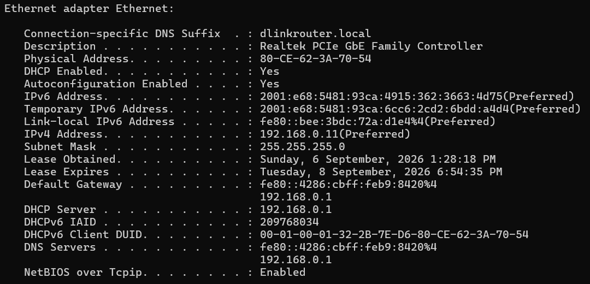

### Observation

The PC has the IPv4 address:

```text
192.168.0.11/24
```

The default gateway is:

```text
192.168.0.1
```

Both addresses belong to the `192.168.0.0/24` local network.

---

## 2. Start Wireshark Capture

Wireshark was opened and the active Ethernet interface was selected.

A display filter was applied:

```text
icmp
```

This filter displays ICMPv4 traffic relevant to the ping tests.

---

## 3. Generate Local ICMP Traffic

The local default gateway was used as the local destination for this implementation.

The following command was executed:

```cmd
ping 192.168.0.1
```

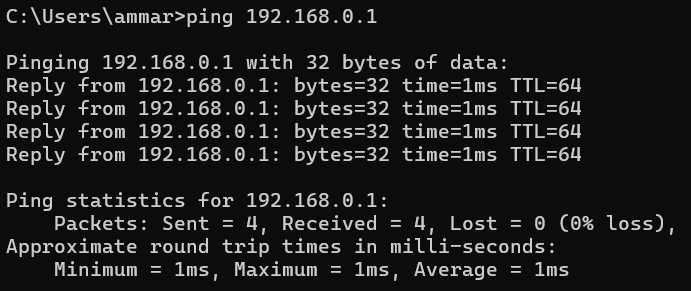

Successful Echo Replies confirmed IPv4 connectivity between the PC and the local router.

---

## 4. Examine Local ICMP Traffic

Wireshark captured ICMP Echo Request and Echo Reply packets.

The capture showed traffic similar to:

```text
192.168.0.11 → 192.168.0.1    Echo (ping) request
192.168.0.1  → 192.168.0.11   Echo (ping) reply
```

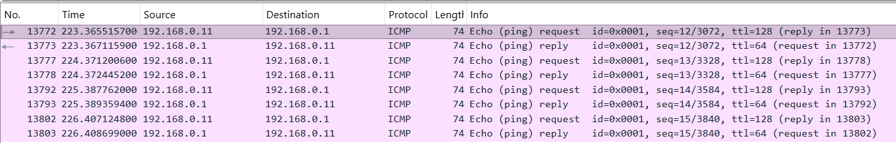

### ICMP Request

| Field | Value |
|---|---|
| Source IPv4 | `192.168.0.11` |
| Destination IPv4 | `192.168.0.1` |
| Protocol | ICMP |
| Message | Echo Request |

---

## 5. Examine the Ethernet II Frame

An ICMP Echo Request was selected and the Ethernet II section was expanded.

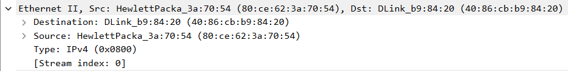

### Ethernet Information

| Field | Value |
|---|---|
| Source MAC | `80:CE:62:3A:70:54` |
| Destination MAC | `40:86:cb:b9:84:20` |

### Analysis

The source MAC address matches the physical address of the PC's Ethernet interface.

The destination MAC address belongs to the local device receiving the Ethernet frame.

The PC obtains the MAC address associated with a local IPv4 address using the Address Resolution Protocol (ARP).

---

## Local Packet Encapsulation

The captured traffic demonstrates encapsulation:

```text
ICMP Message
     ↓
IPv4 Packet
     ↓
Ethernet II Frame
     ↓
Network Interface
```

Wireshark displays these protocol layers separately, allowing the contents of the frame to be inspected.

---

# Part 2 – Capture and Analyze Remote ICMP Traffic

## 1. Generate Remote ICMP Traffic

A new Wireshark capture was started.

The following remote hosts were pinged:

```cmd
ping www.yahoo.com
ping www.cisco.com
ping www.google.com
```

The Domain Name System (DNS) resolves each hostname to an IP address before ICMP traffic is sent.

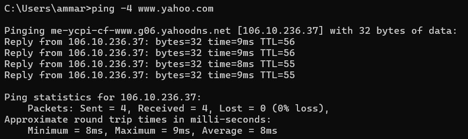
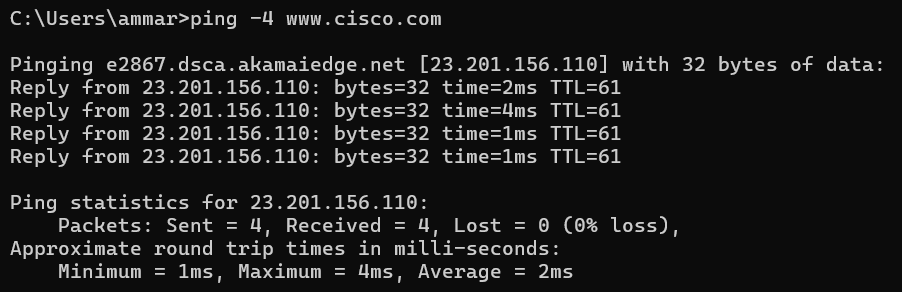
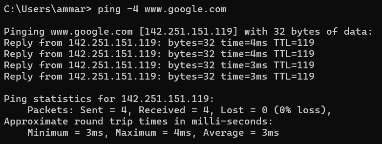

---

## 2. Examine Remote ICMP Traffic

The ICMP traffic generated for the remote destinations was examined in Wireshark.

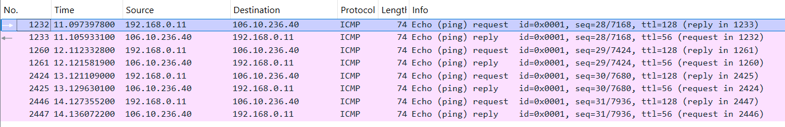
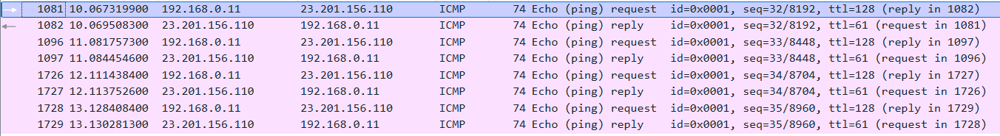
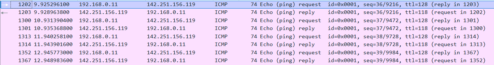

The values observed during the capture were:

| Remote Host | Destination IP | Destination MAC |
|---|---|---|
| `www.yahoo.com` | `106.10.236.37` | `40:86:cb:b9:84:20` |
| `www.cisco.com` | `23.201.156.110` | `40:86:cb:b9:84:20` |
| `www.google.com` | `142.251.156.119` | `40:86:cb:b9:84:20` |

> The IP addresses should be recorded from the actual lab capture because DNS results can vary.

---

## 3. Examine the Remote Ethernet Frame

An ICMP Echo Request to a remote host was selected and its Ethernet II information was examined.

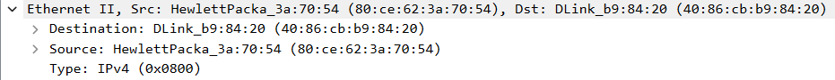
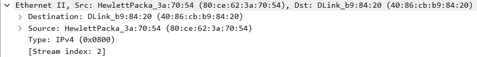
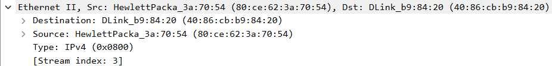

### Observation

The destination IPv4 address identifies the remote host.

However, the Ethernet destination MAC address identifies the local next-hop device rather than the remote Internet host.

For traffic leaving the local network, this next-hop device is normally the default gateway.

---

# Local vs Remote Communication

| Property | Local Destination | Remote Destination |
|---|---|---|
| Destination IP | Local host IP | Remote host IP |
| Destination MAC | Local destination MAC | Default gateway MAC |
| Router required | No | Yes |
| Layer 3 destination | Local host | Remote host |
| Layer 2 destination | Local host | Next-hop router |

### Key Difference

For a local destination:

```text
PC
 │
 └── Ethernet frame → Local Device
                       ↑
                  Destination MAC
```

For a remote destination:

```text
PC
 │
 └── Ethernet frame → Default Gateway
                            │
                            └──→ Remote Network
```

The IP packet can identify a remote destination, but the Ethernet frame only needs to reach the **next device on the local network**.

---

# Reflection

## Why does Wireshark show the actual MAC address of local hosts but not the actual MAC address of remote hosts?

MAC addresses are used for communication within a local Layer 2 network.

When the destination is on the same LAN, the sender can deliver the Ethernet frame directly to the destination device using its MAC address.

When the destination is on another network, the sender instead forwards the Ethernet frame to its default gateway. Therefore, the Ethernet frame contains the MAC address of the local router rather than the MAC address of the final remote host.

The router then forwards the IP packet toward the destination through subsequent networks.

---

# Important Commands and Filters

| Command / Filter | Purpose |
|---|---|
| `ipconfig /all` | Displays detailed network interface information |
| `ping <IPv4-address>` | Generates ICMP Echo Requests |
| `ping <hostname>` | Resolves a hostname and generates ICMP traffic |
| `icmp` | Wireshark display filter for ICMPv4 traffic |

---

# Important Concepts

| Concept | Meaning |
|---|---|
| Wireshark | Network protocol analyzer used to capture and inspect network traffic |
| ICMP | Protocol used for network control and diagnostic messages |
| Echo Request | ICMP message sent by `ping` |
| Echo Reply | ICMP response to an Echo Request |
| IPv4 Address | Logical Layer 3 address used for end-to-end packet delivery |
| MAC Address | Layer 2 address used for local Ethernet frame delivery |
| ARP | Resolves an IPv4 address to a MAC address on the local network |
| Default Gateway | Router used to reach destinations outside the local network |
| Ethernet II | Ethernet frame format carrying the IPv4 packet |
| Encapsulation | Process of placing higher-layer data inside lower-layer protocol structures |

---

# Key Takeaways

- Wireshark can capture and inspect network traffic at multiple protocol layers.
- The `icmp` display filter isolates ICMPv4 traffic.
- `ping` generates ICMP Echo Request and Echo Reply messages.
- IPv4 addresses provide logical addressing between source and destination hosts.
- MAC addresses provide local Layer 2 delivery.
- ARP is used to determine the MAC address associated with a local IPv4 address.
- Local traffic can be delivered directly to another device on the same network.
- Remote traffic must be forwarded to a default gateway.
- The destination IP address can remain the remote host while the Ethernet destination MAC identifies the local next-hop router.
- Wireshark makes the encapsulation of ICMP inside IPv4 and Ethernet II visible.

---

## Lab Reference

Lab activity based on Cisco Networking Academy CCNA: Introduction to Networks (ITN) course materials.

**Lab:** 3.7.10 – Use Wireshark to View Network Traffic

This repository documents my own Wireshark captures, observations, analysis, and understanding of the activity.