# Lab 3.5.5 – Investigate the TCP/IP and OSI Models in Action

## Overview

This lab uses Cisco Packet Tracer Simulation Mode to examine how data moves through a network and how different protocols operate at different layers of the TCP/IP and OSI models.

The activity focuses on generating web traffic, inspecting protocol data units (PDUs), examining encapsulation and decapsulation, and observing protocols such as HTTP, DNS, TCP, and ARP.

## Objectives

- Examine HTTP web traffic in Packet Tracer Simulation Mode.
- Observe how data is processed through the OSI model.
- Inspect outbound and inbound PDU information.
- Identify Layer 2, Layer 3, Layer 4, and Layer 7 information.
- Examine DNS and TCP events.
- Understand encapsulation and decapsulation.
- Identify common application-layer port numbers.

---

## Lab Environment

| Component | Purpose |
|---|---|
| Web Client | Generates HTTP requests |
| Web Server | Responds to HTTP requests |
| Packet Tracer Simulation Mode | Displays protocol events and PDUs |
| Event List Filters | Filters specific protocol events |
| PDU Information Window | Displays OSI layer and packet details |

---

# Part 1 – Examine HTTP Web Traffic

## 1. Switch to Simulation Mode

Packet Tracer was switched from Realtime Mode to Simulation Mode.

The Event List Filters were configured so that only HTTP traffic was displayed.

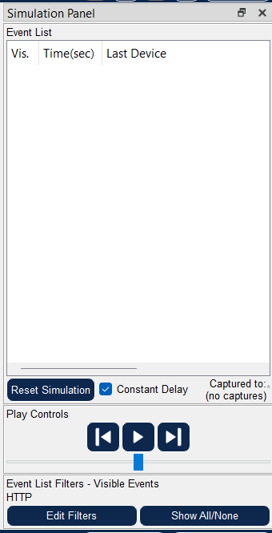

---

## 2. Generate HTTP Traffic

The Web Client web browser was opened and the following URL was entered:

```text
www.osi.local
```

The `Capture/Forward` button was used to advance through the network events.

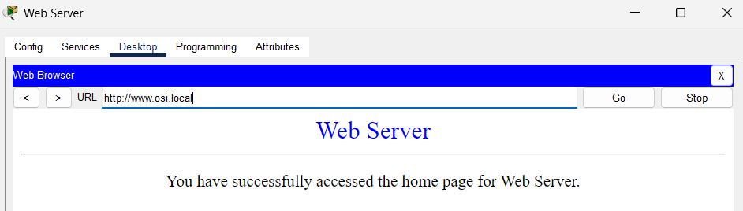

### Observation

After the first few events were processed, the requested web page had not yet fully loaded because the HTTP communication was still being processed through the simulated network events.

---

## 3. Examine the HTTP Packet

The first HTTP event was opened using the colored event box.

The OSI Model tab was used to examine the outgoing packet.

### Layer 7

Layer 7 represents the Application layer.

For this event, HTTP is used to request the web page from the server.

### Layer 4

Layer 4 contains TCP information.

The destination port used for the HTTP request is:

```text
80
```

### Layer 3

Layer 3 contains IP addressing information.

The destination IP address identifies the Web Server.

### Layer 2

Layer 2 contains Ethernet frame information, including:

- Source MAC address
- Destination MAC address

---

## 4. Examine Outbound PDU Details

The Outbound PDU Details tab was used to inspect the packet structure in greater detail.

### IP Section

The IP section contains:

- Source IP address
- Destination IP address

This information corresponds to:

```text
OSI Layer 3 – Network Layer
```
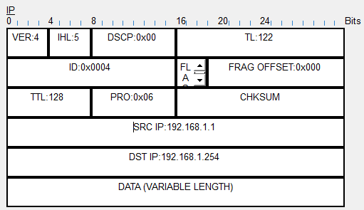

### TCP Section

The TCP section contains information such as:

- Source port
- Destination port

This information corresponds to:

```text
OSI Layer 4 – Transport Layer
```

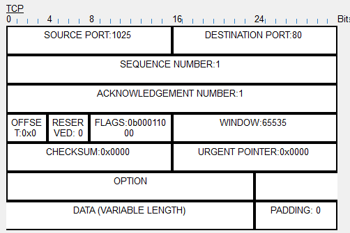

### HTTP Section

The HTTP section contains application-level information such as:

```text
Host: www.osi.local
```

This corresponds to:

```text
OSI Layer 7 – Application Layer
```

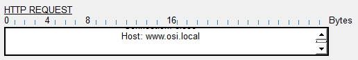

---

## 5. Compare Inbound and Outbound Processing

At intermediate and destination events, Packet Tracer displays both In Layers and Out Layers.

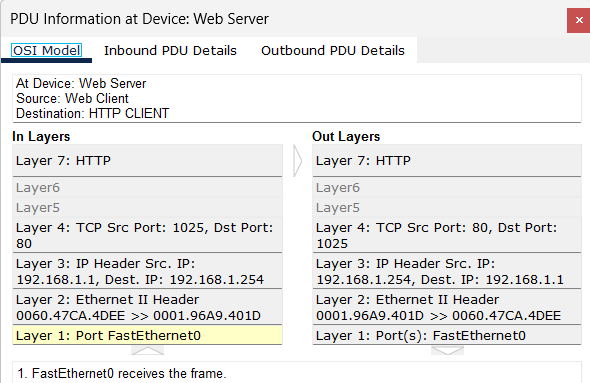

### Observation

Inbound processing shows the received packet being interpreted as it moves upward through the OSI layers.

Outbound processing shows a new packet or response being prepared and moving downward through the OSI layers.

This demonstrates:

```text
Incoming data → Decapsulation
Outgoing data → Encapsulation
```

---

## 6. Final HTTP Event

The final HTTP event displays only the inbound processing information because the packet has reached its final destination.

At this point, the receiving device no longer needs to create another outgoing HTTP packet for that particular event.

---

# Part 2 – Display Elements of the TCP/IP Protocol Suite

## 1. Display Additional Protocol Events

The Event List Filters were changed to display all available events.

Additional protocols appeared, including:

- ARP
- DNS
- TCP
- HTTP

These protocols perform different roles during communication.

### Protocol Roles

| Protocol | Purpose |
|---|---|
| ARP | Resolves an IPv4 address to a MAC address |
| DNS | Resolves domain names to IP addresses |
| TCP | Establishes, manages, and terminates reliable sessions |
| HTTP | Transfers web content |

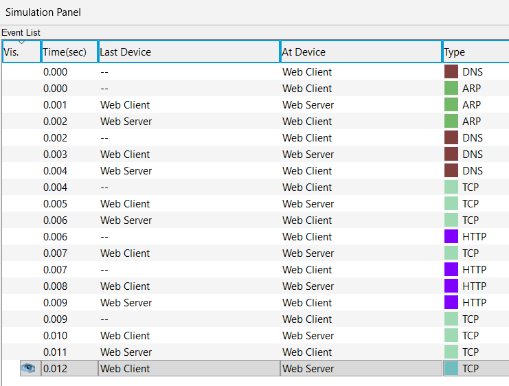

---

## 2. Examine DNS

The first DNS event was selected.

The OSI Model and PDU Details tabs were examined.

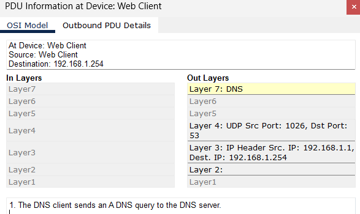

### DNS Query

The DNS client sends a query to determine the IP address associated with:

```text
www.osi.local
```

The requested name appears in the DNS Query section.

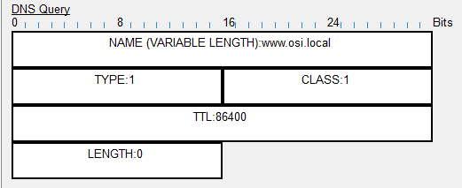

### DNS Answer

The DNS response contains the IP address associated with the requested hostname.

This allows the Web Client to communicate with the correct Web Server.

---

## 3. Examine TCP Connection Establishment

A TCP event following the HTTP event was selected.

Layer 4 was examined in the OSI Model tab.

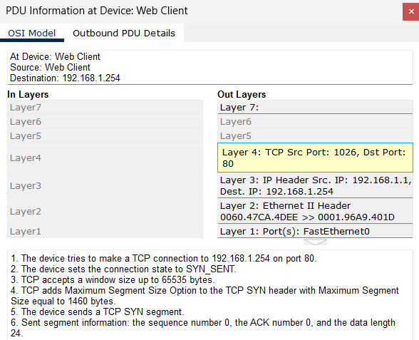

### Observation

TCP performs session establishment before application data is exchanged.

The event indicates that the communication channel has reached the:

```text
ESTABLISHED
```

state.

TCP is responsible for:

- Establishing the communication session
- Managing reliable data transfer
- Maintaining sequence information
- Terminating the session when communication is complete

---

## 4. Examine TCP Session Termination

The final TCP event was selected.

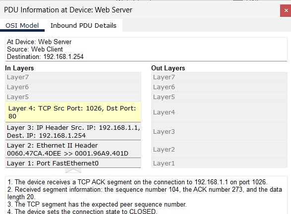

### Observation

This event represents the closing or termination of the TCP communication session.

TCP ensures that the communication channel is properly closed after the application has finished exchanging data.

---

# Encapsulation Process

The activity demonstrates how data is encapsulated as it moves down the protocol stack.

```text
Application Data
      ↓
TCP Segment
      ↓
IP Packet
      ↓
Ethernet Frame
      ↓
Bits
```

At the destination, the process is reversed:

```text
Bits
      ↓
Ethernet Frame
      ↓
IP Packet
      ↓
TCP Segment
      ↓
Application Data
```

This reverse process is known as:

```text
Decapsulation
```

---

# OSI and TCP/IP Model Relationship

| OSI Layer | Example Protocol / Information |
|---|---|
| Layer 7 – Application | HTTP, DNS |
| Layer 6 – Presentation | Data representation |
| Layer 5 – Session | Session management |
| Layer 4 – Transport | TCP, UDP, port numbers |
| Layer 3 – Network | IP addresses |
| Layer 2 – Data Link | Ethernet, MAC addresses |
| Layer 1 – Physical | Bits and physical transmission |

---

# Challenge Questions

## Web Server Port

The Web Server listens for HTTP requests on:

```text
TCP Port 80
```

## DNS Server Port

DNS requests use:

```text
UDP Port 53
```

---

# Important Concepts

| Concept | Meaning |
|---|---|
| PDU | Protocol Data Unit used at a specific networking layer |
| Encapsulation | Adding protocol information as data moves down the stack |
| Decapsulation | Removing protocol information as data moves up the stack |
| Source Port | Identifies the sending application/process |
| Destination Port | Identifies the receiving service |
| Source IP | Identifies the sending host |
| Destination IP | Identifies the receiving host |
| Source MAC | Identifies the sending interface on the local network |
| Destination MAC | Identifies the next receiving interface on the local network |

---

# Key Takeaways

- Packet Tracer Simulation Mode allows protocol activity to be examined step by step.
- HTTP operates at the Application layer.
- TCP operates at the Transport layer.
- IP operates at the Network layer.
- Ethernet and MAC addressing operate at the Data Link layer.
- Port numbers identify application services.
- IP addresses identify source and destination hosts.
- MAC addresses are used for local Ethernet delivery.
- DNS resolves human-readable names into IP addresses.
- TCP establishes and terminates reliable communication sessions.
- Encapsulation adds protocol information as data moves down the network stack.
- Decapsulation removes protocol information as data moves up the stack.
- A single web request can involve several protocols working together.

---

## Lab Reference

Lab activity based on Cisco Networking Academy CCNA: Introduction to Networks (ITN) course materials.

**Lab:** 3.5.5 – Packet Tracer: Investigate the TCP/IP and OSI Models in Action

This repository documents my own Packet Tracer observations, screenshots, protocol analysis, and understanding of the activity.