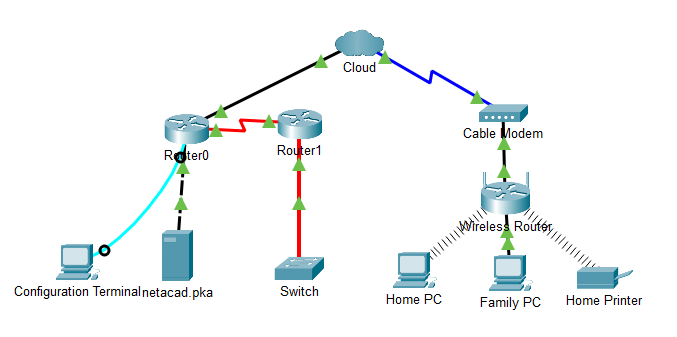
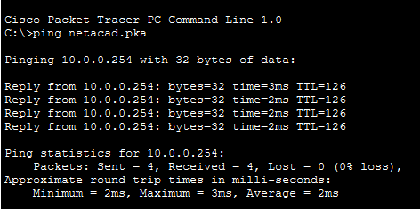
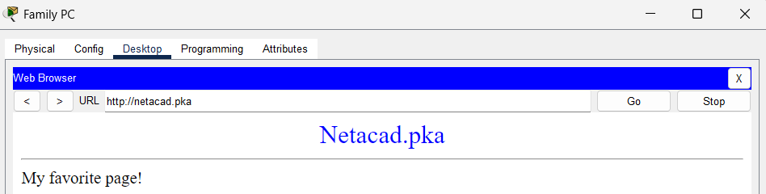
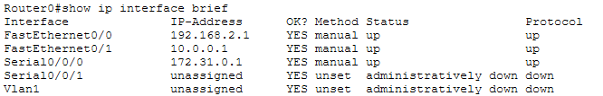
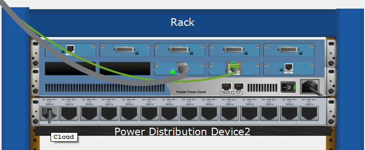
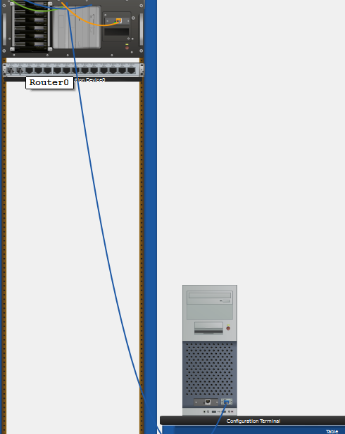
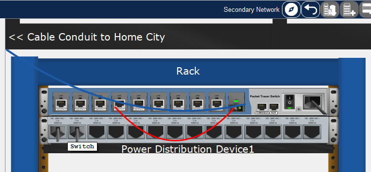
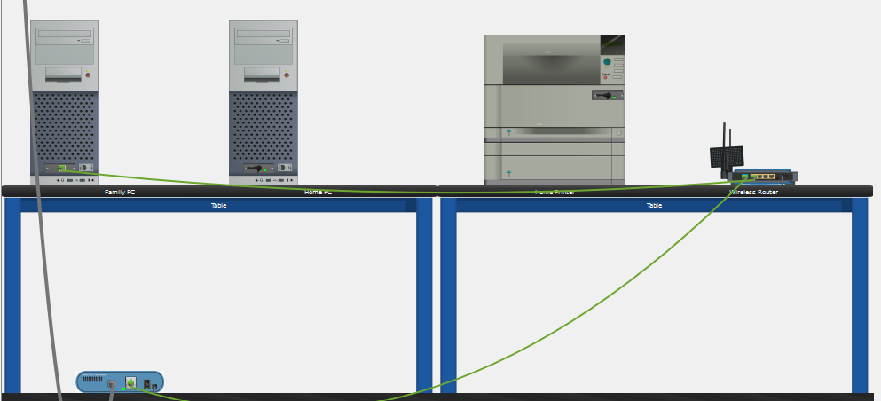

# Lab 4.6.5 – Connect a Wired and Wireless LAN

## Overview

This lab focuses on selecting and applying the correct network cabling in Cisco Packet Tracer.

The activity connects routers, a cloud device, a cable modem, a wireless router, a switch, a configuration terminal, and end devices. It also verifies network connectivity and explores the physical topology of the network.

## Objectives

- Connect Router0 to the Cloud.
- Connect the Cloud to the Cable Modem.
- Connect Router0 to Router1.
- Connect Router0 to netacad.pka.
- Connect Router0 to the Configuration Terminal.
- Connect Router1 to the Switch.
- Connect the Cable Modem to the Wireless Router.
- Connect the Wireless Router to the Family PC.
- Verify connectivity using `ping`, a web browser, and Cisco IOS commands.
- Examine the network in Packet Tracer Physical Workspace.


---

## Addressing Table

| Device | Interface | IP Address | Connects To |
|---|---|---|---|
| Cloud | Eth6 | N/A | Router0 F0/0 |
| Cloud | Coax7 | N/A | Cable Modem Port0 |
| Cable Modem | Port0 | N/A | Cloud Coax7 |
| Cable Modem | Port1 | N/A | Wireless Router Internet |
| Router0 | Console | N/A | Configuration Terminal RS232 |
| Router0 | F0/0 | `192.168.2.1/24` | Cloud Eth6 |
| Router0 | F0/1 | `10.0.0.1/24` | netacad.pka F0 |
| Router0 | Ser0/0/0 | `172.31.0.1/24` | Router1 Ser0/0 |
| Router1 | Ser0/0 | `172.31.0.2/24` | Router0 Ser0/0/0 |
| Router1 | F1/0 | `172.16.0.1/24` | Switch F0/1 |
| Wireless Router | Internet | `192.168.2.2/24` | Cable Modem Port1 |
| Wireless Router | Eth1 | `192.168.1.1` | Family PC F0 |
| Family PC | F0 | `192.168.1.102` | Wireless Router Eth1 |
| Switch | F0/1 | `172.16.0.2` | Router1 F1/0 |
| netacad.pka | F0 | `10.0.0.254` | Router0 F0/1 |
| Configuration Terminal | RS232 | N/A | Router0 Console |

---

## Initial Topology



---

# Part 1 – Connect to the Cloud

## 1. Connect Router0 to the Cloud

Router0 `F0/0` was connected to Cloud `Eth6`.

### Cable Used

```text
Copper Straight-Through
```

This connection uses a straight-through cable because the Cloud Ethernet interface functions like a switch interface in this activity.


---

## 2. Connect the Cloud to the Cable Modem

Cloud `Coax7` was connected to Cable Modem `Port0`.

### Cable Used

```text
Coaxial
```


---

# Part 2 – Connect Router0

## 1. Connect Router0 to Router1

Router0 `Serial0/0/0` was connected to Router1 `Serial0/0`.

### Cable Used

```text
Serial
```

## 2. Connect Router0 to netacad.pka

Router0 `F0/1` was connected to `netacad.pka F0`.

### Cable Used

```text
Copper Cross-Over
```

This connection uses a cross-over cable because the router and computer traditionally use the same transmit and receive wire pairs.

## 3. Connect Router0 to the Configuration Terminal

Router0 `Console` was connected to Configuration Terminal `RS232`.

### Cable Used

```text
Console Cable
```

This connection provides local management access to Router0 and does not carry normal network traffic.


---

# Part 3 – Connect Remaining Devices

## 1. Connect Router1 to the Switch

Router1 `F1/0` was connected to Switch `F0/1`.

### Cable Used

```text
Copper Straight-Through
```

## 2. Connect Cable Modem to Wireless Router

Cable Modem `Port1` was connected to the Wireless Router `Internet` port.

### Cable Used

```text
Copper Straight-Through
```

## 3. Connect Wireless Router to Family PC

Wireless Router `Ethernet 1` was connected to Family PC `F0`.

### Cable Used

```text
Copper Straight-Through
```


---

# Cabling Summary

| Connection | Cable Type |
|---|---|
| Router0 F0/0 ↔ Cloud Eth6 | Copper Straight-Through |
| Cloud Coax7 ↔ Cable Modem Port0 | Coaxial |
| Router0 Ser0/0/0 ↔ Router1 Ser0/0 | Serial |
| Router0 F0/1 ↔ netacad.pka F0 | Copper Cross-Over |
| Router0 Console ↔ Configuration Terminal RS232 | Console |
| Router1 F1/0 ↔ Switch F0/1 | Multi Mode Fiber |
| Cable Modem Port1 ↔ Wireless Router Internet | Copper Straight-Through |
| Wireless Router Eth1 ↔ Family PC F0 | Copper Straight-Through |

---

# Part 4 – Verify Connections

## 1. Test Family PC to netacad.pka

From the Family PC Command Prompt:

```cmd
ping netacad.pka
```

Successful replies confirm connectivity.



The Family PC web browser was then used to access:

```text
http://netacad.pka
```



---

## 2. Ping the Switch

The Switch IP address was pinged from the Home PC to verify connectivity.

```cmd
ping 172.16.0.2
```

Successful replies confirm that the path to the switch is working.

---

## 3. Verify Router0 Interfaces

The Configuration Terminal was opened and used to access Router0 through the console connection.

The following command was entered:

```text
show ip interface brief
```

This command displays the IP addressing and operational status of Router0 interfaces.



---

# Part 5 – Examine the Physical Topology

## 1. Examine the Cloud

The Physical Workspace was opened and the Cloud location was inspected.



### Question

**How many wires are connected to the switch in the blue rack?**

**Answer:**  
two

---

## 2. Examine the Primary Network

The Primary Network location was opened and its physical layout was examined.



### Question

**What is located on the table to the right of the blue rack?**

**Answer:**  
A pc

---

## 3. Examine the Secondary Network

The Secondary Network location was opened and the connected devices and cabling were examined.



### Question

**Why are there two orange cables connected to each device?**

**Answer:**  
The two orange cables are fiber-optic connections. Fiber communication uses separate paths for transmitting (Tx) and receiving (Rx) data, allowing communication in both directions.

---

## 4. Examine the Home Network

The Home Network location was opened.



### Question

**Why is there no rack to hold the equipment?**

**Answer:**  
The Home Network does not require a rack because it contains only a small number of networking devices. Home networking equipment is typically placed on a desk, table, or shelf rather than installed in a dedicated equipment rack.

---

# Important Concepts

| Concept | Meaning |
|---|---|
| Straight-Through Cable | Commonly used between different device types |
| Cross-Over Cable | Traditionally used between devices with similar transmit/receive wiring |
| Serial Cable | Used for serial WAN-style router connections |
| Console Cable | Provides local CLI management access |
| Coaxial Cable | Used between the Cloud and Cable Modem in this activity |
| Multi-Mode Fiber | Fiber-optic cable used for relatively short-distance, high-speed network connections |
| Physical Workspace | Shows the real-world placement of devices and cabling |
| Logical Workspace | Shows network devices and logical connections |

---

# Key Takeaways

- Correct cable selection depends on the devices and interfaces being connected.
- Copper straight-through cables are commonly used between unlike Ethernet devices.
- Copper cross-over cables may be required when devices use the same transmit and receive wire pairs.
- Serial connections can be used between routers.
- Console cables provide management access rather than normal network communication.
- Coaxial cabling is used between the cable modem and provider network in this activity.
- Successful link lights provide an initial indication that a physical connection is correct.
- `ping` verifies Layer 3 connectivity.
- `show ip interface brief` provides a quick overview of router interface status.
- Packet Tracer Physical Workspace helps visualize how equipment is physically installed and connected.

---

## Lab Reference

Lab activity based on Cisco Networking Academy CCNA: Introduction to Networks (ITN) course materials.

**Lab:** 4.6.5 – Packet Tracer: Connect a Wired and Wireless LAN

This repository documents my own Packet Tracer implementation, cabling choices, verification results, screenshots, and understanding of the activity.