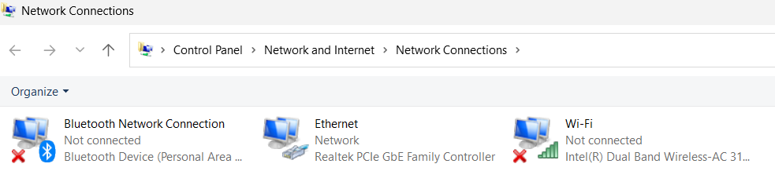
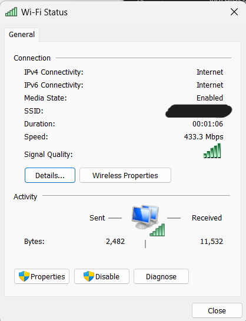
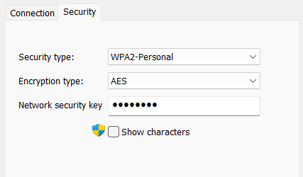
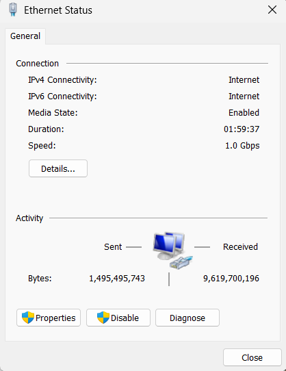

# Lab 4.6.6 – View Wired and Wireless NIC Information

## Overview

This lab examines the wired and wireless Network Interface Cards (NICs) installed on a Windows PC.

The activity focuses on identifying available network adapters, viewing connection status and addressing information, comparing Windows graphical interface information with `ipconfig /all`, enabling and disabling network adapters, examining wireless network information, and observing how Windows indicates network connectivity problems.

## Objectives

- Identify the wired and wireless NICs installed on the PC.
- View wireless connection information.
- Identify the wireless SSID and connection speed.
- Identify the wireless NIC MAC address.
- Examine DNS server information.
- Compare graphical network information with `ipconfig /all`.
- View wireless security information.
- Examine available wireless networks.
- View wired Ethernet connection information.
- Enable and disable network adapters.
- Observe Windows network status indicators.
- Restore network connectivity after disabling NICs.

---

## Lab Environment

| Component | Details |
|---|---|
| Operating System | Windows |
| Wired NIC | Realtek PCIe GbE Family Controller |
| Wireless NIC | Intel Dual Band Wireless-AC 3168 |
| Wired Connection | Ethernet LAN cable |
| Wireless Connection | Available Wi-Fi network |
| Command-Line Tool | Windows Command Prompt |

---

# Part 1 – Identify and Work with PC NICs

## 1. Identify Available Network Adapters

The Windows Network Connections window was opened to identify the available network interfaces.

The system contains both wired and wireless NICs.



### Identified NICs

| NIC Type | Adapter |
|---|---|
| Wired Ethernet | Realtek PCIe GbE Family Controller |
| Wireless Wi-Fi | Intel Dual Band Wireless-AC 3168 |

Other virtual or software-based adapters may also appear in Windows, but the main physical interfaces examined in this lab are Ethernet and Wi-Fi.

---

## 2. Examine the Wireless NIC

The Wi-Fi adapter was enabled and connected to an authorized wireless network.

The Wi-Fi Status window was opened to view the current wireless connection.



### Wireless Connection Information

| Property | Observed Value |
|---|---|
| SSID | Identified Successfully |
| Connection Speed | 433.3 mbps |

> The SSID is the name of the wireless network currently connected to the laptop.

---

## 3. Examine Wireless Connection Details

The Network Connection Details window was opened from the Wi-Fi Status window.


### Wireless NIC Information

| Property | Observation |
|---|---|
| Adapter | Intel(R) Dual Band Wireless-AC 3168 |
| MAC Address | Identified successfully |
| DHCP | Enabled |
| IPv4 Address | Assigned successfully |
| Subnet Mask | 255.255.255.0 |
| Default Gateway | Configured |
| DNS Server | Configured |
| IPv6 Address | Assigned successfully |

### DNS Observation

If multiple DNS servers are listed, they provide additional name-resolution options if one DNS server becomes unavailable.

---

## 4. Compare with `ipconfig /all`

The following command was used:

```cmd
ipconfig /all
```


The information displayed in Command Prompt was compared with the information shown in the Network Connection Details window.

### Observation

Both methods display similar network interface information, including:

- MAC address
- IPv4 address
- Subnet mask
- Default gateway
- DHCP information
- DNS server information

---

## 5. Examine Wireless Security

The Wireless Network Properties window was opened and the Security tab was inspected.



### Security Information

| Property | Observed Value |
|---|---|
| Security Type | `WPA2-Personal` |
| Encryption Type | `AES` |

> The actual wireless security key is intentionally not documented or shown in this repository.

---

## 6. View Available Wireless Networks

The Wi-Fi network list was opened to display SSIDs within range of the wireless NIC.

### Observation

The wireless NIC can detect multiple nearby SSIDs. A device can connect to an available wireless network when the correct authorization and security credentials are provided.

---

## 7. Examine the Wired Ethernet NIC

The Ethernet adapter status was opened from Network Connections.



The Ethernet connection details were then examined.

### Wired NIC Information

| Property | Observed Value |
|---|---|
| Adapter | Realtek PCIe GbE Family Controller |
| MAC Address | Identified successfully |
| IPv4 Address | Assigned successfully |
| Subnet Mask | `255.255.255.0` |
| Default Gateway | Configured |

---

## 8. Verify Ethernet Information with `ipconfig /all`

The following command was used again:

```cmd
ipconfig /all
```

### Observation

The Ethernet information displayed in Command Prompt matched the addressing and physical information shown in the Windows Network Connection Details window.

---

# Part 2 – Identify and Use System Tray Network Icons

## 1. Disable the Wi-Fi Adapter

The Wi-Fi NIC was disabled through the Network Connections window.


### Observation

After disabling Wi-Fi:

- The wireless adapter could no longer connect to wireless networks.
- Nearby SSIDs were no longer available through that interface.
- The Ethernet connection remained available.

---

## 2. Disable All Network Adapters

Both Wi-Fi and Ethernet adapters were temporarily disabled.


### Observation

With all network adapters disabled, Windows indicated that network connectivity was unavailable.

This demonstrates that an enabled and operational NIC is required before the PC can communicate with a network.

---

## 3. Restore Network Connectivity

The Ethernet and/or Wi-Fi NIC was re-enabled after testing.


### Observation

Network connectivity returned after an appropriate NIC was re-enabled.

---

# Wired vs Wireless NIC Comparison

| Feature | Ethernet NIC | Wi-Fi NIC |
|---|---|---|
| Medium | Copper Ethernet cable | Radio waves |
| Physical Connection | Required | Not required |
| MAC Address | Unique | Unique |
| IPv4 Configuration | Yes | Yes |
| Can be Enabled/Disabled | Yes | Yes |
| Requires SSID | No | Yes |
| Wireless Security | No | Yes |
| Connection Status | Windows Ethernet status | Windows Wi-Fi status |

---

# Important Concepts

| Concept | Meaning |
|---|---|
| NIC | Network Interface Card used to connect a device to a network |
| Ethernet NIC | Wired network interface using Ethernet cabling |
| Wireless NIC | Network interface using Wi-Fi radio communication |
| MAC Address | Unique Layer 2 hardware address associated with a network interface |
| SSID | Name used to identify a wireless network |
| IPv4 Address | Logical Layer 3 address assigned to a network interface |
| Default Gateway | Router used to reach other networks |
| DNS Server | Resolves domain names into IP addresses |
| Network Adapter Status | Indicates whether a NIC is enabled and connected |
| `ipconfig /all` | Displays detailed Windows network configuration information |

---

# Reflection

## Why would you activate more than one NIC on a PC?

More than one NIC may be active to provide access to different network connections, such as Ethernet and Wi-Fi.

Multiple NICs can provide:

- Connection flexibility
- Access to different networks
- An alternative connection if one interface becomes unavailable

---

# Key Takeaways

- A computer can contain multiple physical and virtual network interfaces.
- Each physical NIC has its own MAC address.
- Ethernet and Wi-Fi interfaces can receive different IP configurations.
- Windows provides both graphical and command-line methods to inspect NIC information.
- `ipconfig /all` provides detailed network configuration information.
- SSIDs identify wireless networks.
- Wireless NICs provide additional security information such as security and encryption types.
- Network adapters can be enabled or disabled through Windows.
- Disabling all NICs removes network connectivity.
- Troubleshooting should include checking whether the required NIC is enabled and operational.

---

## Lab Reference

Lab activity based on Cisco Networking Academy CCNA: Introduction to Networks (ITN) course materials.

**Lab:** 4.6.6 – View Wired and Wireless NIC Information

This repository documents my own Windows NIC observations, screenshots, network information, and understanding of the activity.