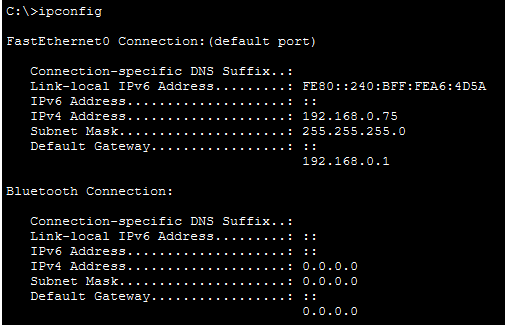
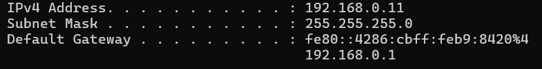
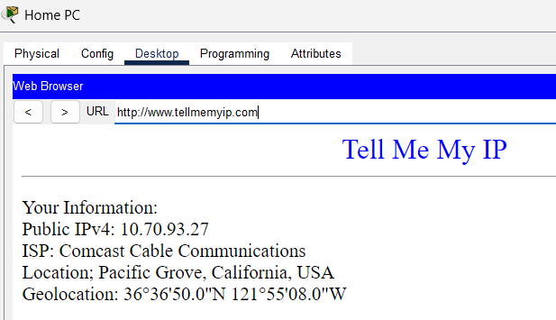
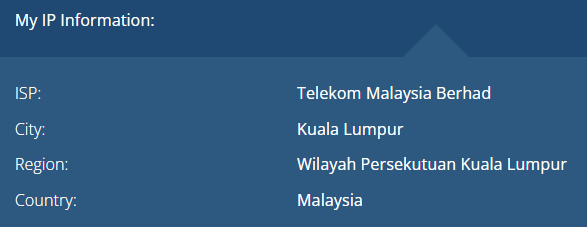
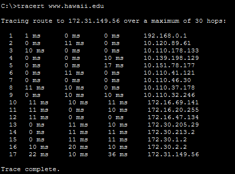
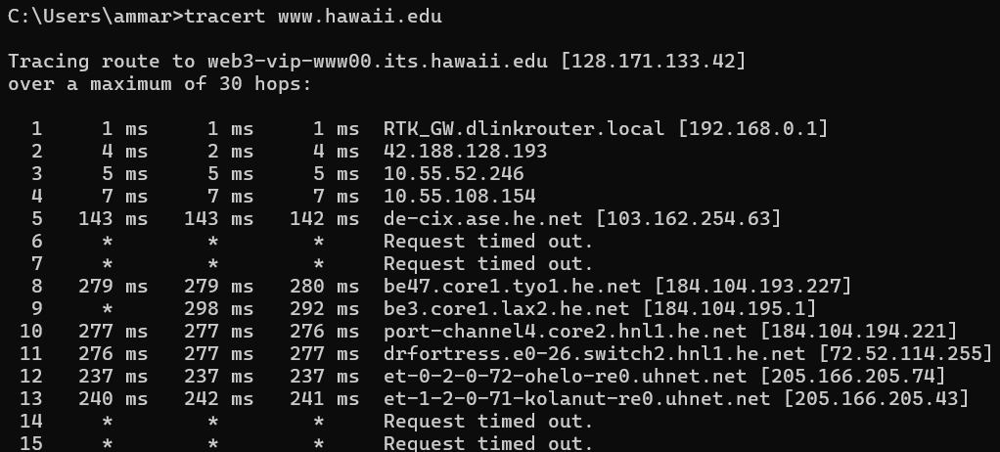
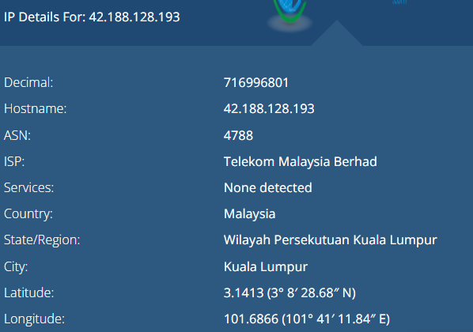
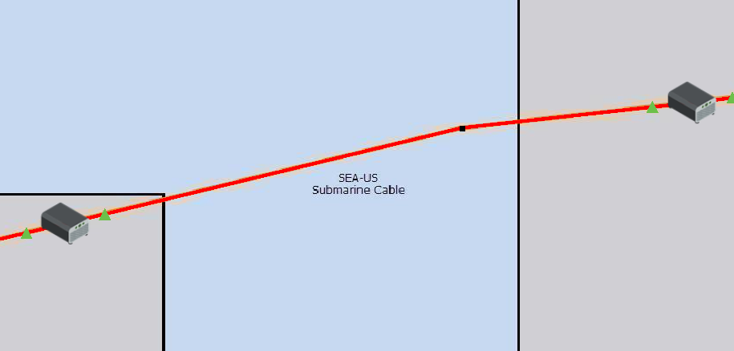

# Lab 4.7.1 – Physical Layer Exploration – Physical Mode

## Overview
This lab explores how network traffic travels from a home network through an ISP and other networks to reach a remote destination. Cisco Packet Tracer is used to examine the simulated network, while a real network is used for comparison.

## Objectives
- Examine local and public IPv4 addressing.
- Use tracert to identify the path to a remote destination.
- Identify routers and hops along the network path.
- Explore ISP infrastructure, POPs, and the local loop.
- Examine how different networks connect across the Internet.
- Explore long-distance connections such as submarine fiber-optic cables.
- Compare the Packet Tracer simulated network with a real network.

# Part 1 – Examine Local IP Addressing Information

## 1. Examine Local IPv4 Addressing
### Packet Tracer Simulation

The IPv4 configuration of the simulated Home PC was examined using:

```cmd
ipconfig
```



| Property | Observed Value |
|---|---|
| IPv4 Address | `192.168.0.75` |
| Subnet Mask | `255.255.255.0` |
| Default Gateway | `192.168.0.1` |

The Home PC uses a private IPv4 address. The default gateway is the Home Router, which allows the PC to communicate with networks outside its local network.

### Real Network Comparison

The IPv4 configuration of the real computer was examined using:

```cmd
ipconfig
```



| Property | Observed Value |
|---|---|
| IPv4 Address | `192.168.0.11` |
| Subnet Mask | `255.255.255.0` |
| Default Gateway | `192.168.0.1` |

Like the simulated Home PC, the real computer uses a private IPv4 address and a local router as its default gateway.

## 2. Examine Public IPv4 Information
### Packet Tracer Simulation
### Packet Tracer Simulation

The simulated public IPv4 information was examined by accessing `www.tellmemyip.com` from the Home PC.



| Property | Observed Value |
|---|---|
| IPv4 Address | `10.70.93.27` |
| ISP | Comcast Cable Communications |
| Location | Pacific Grove, California, USA |

The website shows the Internet-facing IPv4 information of the simulated home network. The addressing and location information in this Packet Tracer activity are simulated for learning purposes.

### Real Network Comparison

The public IPv4 information of the real network was examined using an online IP lookup service.



| Property | Observed Value |
|---|---|
| Public IPv4 Address | `Redacted for privacy` |
| ISP | Telekom Malaysia Berhad |
| City | Kuala Lumpur |
| Region | Wilayah Persekutuan Kuala Lumpur |
| Country | Malaysia |

Unlike the private IPv4 address assigned to the laptop, the public IPv4 address represents the Internet-facing connection seen by external networks.

The reported geographic location is approximate and may represent the ISP's network infrastructure rather than the exact physical location of the device.

## 3. Examine Physical Network Connections
### Packet Tracer Simulation

The physical connections of the simulated home network were examined using Packet Tracer Physical Mode.

| Connection | Technology / Media |
|---|---|
| Home PC → Home Router | Ethernet |
| Home Router → Cable Modem | Ethernet |
| Cable Modem → ISP | Coaxial cable |
| Local Loop | Cable broadband |

The Home PC connects to the Home Router through Ethernet. The home network then connects toward the simulated ISP through a Cable Modem and coaxial connection.

### Real Network Comparison

The real home network uses fiber-optic broadband instead of the cable broadband represented in Packet Tracer.

| Connection | Technology / Media |
|---|---|
| Laptop → Home Router | Ethernet |
| Home Router → ONT | Ethernet |
| ONT → ISP | Fiber optic |
| Local Loop | Fiber-optic broadband |

The laptop connects to the Home Router using Ethernet. The router connects to an Optical Network Terminal (ONT), which provides the connection between the home network and the ISP's fiber-optic network.

Compared with the Packet Tracer simulation, both networks use Ethernet within the home network, but they use different technologies for the ISP connection: coaxial cable in the simulation and fiber optic in the real network.

# Part 2 – Trace the Path Between Source and Destination

## 1. Run Traceroute
### Packet Tracer Simulation
The network path from the simulated Home PC to the University of Hawaii was examined using:

```cmd
tracert www.hawaii.edu
```



The traceroute reached `www.hawaii.edu` at `172.31.149.56` and displayed the intermediate Layer 3 hops along the simulated network path.

Each hop represents a router response along the path, while the three time values show the round-trip time (RTT) for each traceroute probe.

---

### Real Network Comparison
The same traceroute was performed from the real network using:

```cmd
tracert www.hawaii.edu
```



The real traceroute resolved `www.hawaii.edu` to `128.171.133.42` and displayed the actual network path selected by the ISP and other interconnected networks.

Some intermediate hops returned `Request timed out`. This does not necessarily indicate a connection failure because a router may continue forwarding traffic without responding to traceroute probes.

---

### Comparison

| Observation | Packet Tracer Simulation | Real Network |
|---|---|---|
| Source | Simulated Home PC | Personal laptop |
| Destination | `www.hawaii.edu` | `www.hawaii.edu` |
| Destination IPv4 | `172.31.149.56` | `128.171.133.42` |
| First Hop | `192.168.0.1` | `192.168.0.1` |
| Network Path | Simulated | Actual Internet route |
| Timeout Hops | Based on simulation | Some routers may not respond |

Although both traceroutes begin with the home router as the first hop, the remaining paths differ because Packet Tracer uses a simulated network while the real traceroute follows the actual Internet route.

## 2. Investigate the Second Hop
### Packet Tracer Simulation
The first two hops from the Packet Tracer traceroute were examined.

| Hop | IPv4 Address | Role |
|---:|---|---|
| 1 | `192.168.0.1` | Home Router |
| 2 | `10.120.89.61` | First visible ISP-side router |

The first hop is the Home Router, which acts as the default gateway for the Home PC.

The second hop represents the first visible router within the simulated ISP network.

The physical path between the home network and ISP can be represented as:

```text
Home PC
   ↓
Home Router
   ↓
Cable Modem
   ↓
ISP Access Network
   ↓
Second-Hop Router
```

The Cable Modem is part of the physical path but does not appear as a separate traceroute hop because it does not operate as a Layer 3 router in this topology.

The connection between the customer premises and the ISP access network is known as the **local loop**, or **last mile**.

---

### Real Network Comparison
The first two hops of the real traceroute were also examined.

| Hop | IPv4 Address | Role |
|---:|---|---|
| 1 | `192.168.0.1` | Home Router / Default Gateway |
| 2 | `42.188.128.193` | First visible upstream ISP-side router |

The real network uses fiber-optic broadband rather than the cable broadband represented in Packet Tracer.

The approximate physical path is:

```text
Laptop
   ↓
Home Router
   ↓
ONT
   ↓
Fiber-Optic Connection
   ↓
ISP Access Network
   ↓
Second-Hop Router
```

The Optical Network Terminal (ONT) terminates the fiber-optic connection at the customer premises but does not appear as a separate Layer 3 hop in the traceroute.

---

### Comparison

| Feature | Packet Tracer Simulation | Real Network |
|---|---|---|
| First Hop | Home Router | Home Router |
| Second Hop | ISP-side router | ISP-side router |
| Customer Equipment | Cable Modem | ONT |
| Access Technology | Cable | Fiber optic |
| Local Loop | Cable connection | Fiber-optic connection |

Both networks follow the same general process of forwarding traffic from the home router toward ISP infrastructure, although they use different physical access technologies.

## 3. Investigate the ISP POP Location
### Packet Tracer Simulation
The second hop of the simulated traceroute was investigated to identify the ISP Point of Presence (POP).

| Property | Observation |
|---|---|
| Second Hop | `10.120.89.61` |
| ISP | Comcast |
| POP | Simulated Comcast POP |
| General Location | Monterey, California |

A **Point of Presence (POP)** is a location where an ISP provides access to its network and connects customers to its wider infrastructure.

In the Packet Tracer activity, the home network connects toward the simulated Comcast POP through the ISP access network.

```text
Home Network
     ↓
Cable Modem
     ↓
ISP Access Network
     ↓
Comcast POP
     ↓
Comcast Network
```

---

### Real Network Comparison
The second hop from the real traceroute was investigated using an IP lookup service.

| Property | Observation |
|---|---|
| Second Hop | `42.188.128.193` |
| ISP / Organization | Telekom Malaysia Berhad |
| ASN | `4788` |
| City | Kuala Lumpur |
| Region | Wilayah Persekutuan Kuala Lumpur |
| Country | Malaysia |



The IP lookup can help identify the organization that owns or operates the address and provide approximate geographic information.

However, the reported location does not necessarily represent the exact physical location of the second-hop router or ISP POP. IP geolocation is based on database information and should be treated as an estimate.

---

### Comparison

| Feature | Packet Tracer Simulation | Real Network |
|---|---|---|
| Second Hop | `10.120.89.61` | `42.188.128.193` |
| ISP | Comcast | Telekom Malaysia Berhad |
| ASN | Not investigated | AS4788 |
| ISP POP | Simulated Comcast POP | Exact POP not confirmed |
| Location | Monterey, California | Kuala Lumpur, Malaysia (IP geolocation estimate) |
| Location Source | Defined by the Packet Tracer scenario | Online IP lookup |
| Location Accuracy | Known within the simulation | Approximate; may not represent the router's physical location |

Both networks show traffic leaving the home network and entering ISP infrastructure. In Packet Tracer, the ISP and POP are represented directly by the simulation. In the real network, the ISP can be identified from the second-hop IP address, but its exact physical POP location cannot be confirmed using traceroute and IP geolocation alone.

## 4. Investigate IP Geolocation
### Packet Tracer / Lab Investigation
The activity demonstrates that IP geolocation does not always identify the exact physical location of a network device.

IP geolocation services use databases that associate IP address ranges with geographic information. The reported location may represent an ISP office, administrative location, regional network location, or an approximate/default location rather than the actual location of the router.

The lab uses an example in which a large number of IP addresses were incorrectly associated with a location in Kansas, demonstrating the potential limitations of IP geolocation.

### Real Network Comparison

The second-hop IP address from the real traceroute was previously investigated using an IP lookup service.

| Property | Lookup Result |
|---|---|
| ISP | Telekom Malaysia Berhad |
| ASN | AS4788 |
| City | Kuala Lumpur |
| Region | Wilayah Persekutuan Kuala Lumpur |
| Country | Malaysia |

Although the lookup associates the IP address with Kuala Lumpur, this does not confirm that the second-hop router is physically located there.

The ISP and network ownership information is useful for identifying the network operator, while the geographic information should be treated as an estimate.

### Comparison

| Aspect | Packet Tracer / Lab Investigation | Real Network |
|---|---|---|
| Method | Lab-provided geolocation example | Online IP lookup |
| Geographic Information | Demonstrates possible inaccurate/default locations | Kuala Lumpur, Malaysia |
| Exact Router Location | Cannot be determined from IP geolocation | Cannot be confirmed |
| Main Lesson | IP geolocation can be inaccurate | Lookup location should be treated as approximate |

IP geolocation is useful for estimating the geographic region associated with an IP address, but it should not be considered proof of a network device's exact physical location.

## 5. Investigate the Local ISP Network
### Packet Tracer Simulation
The simulated traceroute was examined to identify the routers that belong to the local ISP.

In the Packet Tracer scenario, several consecutive hops belong to Comcast before the traffic transitions to another network.

| Hop | IPv4 Address | Network / ISP |
|---:|---|---|
| 2 | `10.120.89.61` | Comcast |
| 3 | `10.110.178.133` | Comcast |
| 4 | `10.139.198.129` | Comcast |
| 5 | `10.151.78.177` | Comcast |
| 6 | `10.110.41.121` | Comcast |
| 7 | `10.110.46.30` | Comcast |
| 8 | `10.110.37.178` | Comcast |
| 9 | `10.110.32.246` | Comcast |

The traffic therefore passes through multiple routers within Comcast's network rather than immediately leaving the ISP after the first ISP-side router.

The Packet Tracer Physical Workspace can also be used to examine the ISP routers and relate their interfaces to the addresses shown by `tracert`.

---

### Real Network Comparison
The real traceroute was examined in the same way to determine which initial hops belong to Telekom Malaysia before the traffic transitions to another network.

| Hop | IPv4 Address / Hostname | Network / ISP |
|---:|---|---|
| 2 | `42.188.128.193` | Telekom Malaysia Berhad |
| 3 | `10.55.52.246` | To be investigated |
| 4 | `10.55.108.154` | To be investigated |
| 5 | `de-cix.ase.he.net` | Hurricane Electric / interconnection |

The second hop was identified as belonging to Telekom Malaysia. Hops 3 and 4 use private `10.0.0.0/8` addresses, so their ownership cannot be determined from a normal public IP lookup alone.

By hop 5, the hostname indicates that the path has reached different network infrastructure, showing that the traffic has moved beyond the initial ISP path.

---

### Comparison

| Feature | Packet Tracer Simulation | Real Network |
|---|---|---|
| Local ISP | Comcast | Telekom Malaysia Berhad |
| ISP Path | Multiple simulated Comcast routers | Multiple upstream hops |
| Private ISP Addresses | Used in simulation | `10.x.x.x` addresses also appear |
| ISP Boundary | Clearly represented by the activity | Must be inferred from traceroute information |
| Next Network | Internet2 later in the simulated path | Different network infrastructure appears later |

Both networks demonstrate that traffic can pass through multiple routers within an ISP's infrastructure before being transferred to another independently operated network.

## 6. Investigate Router Names and Geographic Path
### Packet Tracer Simulation
The router names in the simulated traceroute were examined to identify clues about the geographic path and network ownership.

Examples from the simulated Comcast network include:

| Hop | Router Name / Hostname | Geographic Clue |
|---:|---|---|
| 3 | `po-302-1222-rur02.monterey.ca.sfba.comcast.net` | Monterey, California |
| 4 | `po-2-rur01.monterey.ca.sfba.comcast.net` | Monterey, California |
| 5 | `be-222-rar01.santaclara.ca.sfba.comcast.net` | Santa Clara, California |
| 6 | `be-39931-cs03.sunnyvale.ca.ibone.comcast.net` | Sunnyvale, California |
| 7 | `be-1312-cr12.sunnyvale.ca.ibone.comcast.net` | Sunnyvale, California |
| 8 | `be-303-cr01.9greatoaks.ca.ibone.comcast.net` | San Jose area, California |
| 9 | `be-2211-pe11.9greatoaks.ca.ibone.comcast.net` | San Jose area, California |

The hostnames provide clues about the path taken through Comcast's network. Names such as `monterey`, `santaclara`, and `sunnyvale` indicate the simulated geographic progression through California.

The `comcast.net` portion also identifies Comcast as the network operator.

---

### Real Network Comparison
The hostnames from the real traceroute were examined in the same way.

Examples include:

| Hop | Router Name / Hostname | Observation |
|---:|---|---|
| 1 | `RTK_GW.dlinkrouter.local` | Local home router |
| 5 | `de-cix.ase.he.net` | Indicates different network/interconnection infrastructure |
| 8 | `be47.core1.tyo1.he.net` | `tyo` suggests Tokyo |
| 9 | `be3.core1.lax2.he.net` | `lax` suggests Los Angeles |
| 10 | `port-channel4.core2.hnl1.he.net` | `hnl` suggests Honolulu |
| 11 | `drfortress.e0-26.switch2.hnl1.he.net` | `hnl` suggests Honolulu |
| 12 | `et-0-2-0-72-ohelo-re0.uhnet.net` | University of Hawaii network |
| 13 | `et-1-2-0-71-kolanut-re0.uhnet.net` | University of Hawaii network |

The real router hostnames provide clues that the traffic travels through multiple geographic regions and network operators before reaching Hawaii.

Router naming conventions are useful for interpreting a network path, but the names should be treated as clues rather than definitive proof of a router's physical location.

---

### Comparison

| Feature | Packet Tracer Simulation | Real Network |
|---|---|---|
| Router Names | Predetermined by the activity | Assigned by real network operators |
| Network Ownership Clues | `comcast.net` | `he.net`, `uhnet.net`, etc. |
| Geographic Clues | Monterey, Santa Clara, Sunnyvale, San Jose | Tokyo, Los Angeles, Honolulu |
| Geographic Accuracy | Defined by simulated topology | Hostname-based inference |
| Main Purpose | Understand simulated geographic path | Interpret clues from an actual Internet path |

Both traceroutes demonstrate that router hostnames can reveal useful information about network ownership and the possible geographic path taken by traffic.

## 7. Investigate Network Interconnections
### Packet Tracer Simulation
The simulated traceroute was examined to identify where traffic transitions from Comcast to another network.

The earlier hops travel through Comcast's network before the path reaches Internet2.

```text
Home Network
     ↓
Comcast ISP Network
     ↓
Network Interconnection
     ↓
Internet2
     ↓
Destination Network
```

| Network | Role |
|---|---|
| Comcast | Simulated local ISP |
| Interconnection | Allows traffic to move between independently operated networks |
| Internet2 | Research and education network used along the simulated path |

This demonstrates that Internet traffic does not remain within a single ISP. Networks interconnect and exchange traffic so that users can reach destinations operated by other networks.

---

### Real Network Comparison
The real traceroute also shows traffic moving between different network operators.

Examples from the traceroute include:

| Path | Observation |
|---|---|
| Telekom Malaysia network | Initial ISP path |
| `de-cix.ase.he.net` | Interconnection / Hurricane Electric infrastructure |
| `he.net` | Hurricane Electric network |
| `uhnet.net` | University of Hawaii network |

The hostname `de-cix.ase.he.net` provides a clue that the path reaches network infrastructure associated with an interconnection before continuing through Hurricane Electric.

The later transition from `he.net` to `uhnet.net` shows another change in network ownership as the traffic approaches the University of Hawaii.

```text
Home Network
     ↓
Telekom Malaysia
     ↓
Network Interconnection
     ↓
Hurricane Electric
     ↓
University of Hawaii Network
     ↓
Destination
```

---

### Comparison

| Feature | Packet Tracer Simulation | Real Network |
|---|---|---|
| Initial ISP | Comcast | Telekom Malaysia |
| Intermediate Network | Internet2 | Hurricane Electric |
| Destination Network | University of Hawaii | University of Hawaii |
| Interconnection | Represented in the simulation | Visible through traceroute clues |
| Network Changes | Predetermined | Based on actual Internet routing |

Both networks demonstrate that end-to-end Internet communication can involve multiple independently operated networks. Network interconnections allow traffic to move from one network operator to another before reaching the destination.

## 8. Investigate the Long-Distance Path
### Packet Tracer Simulation
The simulated network path was followed from California toward Hawaii.

The traffic travels through several networks before crossing the Pacific Ocean to reach the University of Hawaii.

```text
Monterey
   ↓
San Jose Area
   ↓
Los Angeles
   ↓
Pacific Ocean
   ↓
Hawaii
```

A long-distance submarine fiber-optic cable provides connectivity across the Pacific Ocean.



### Submarine Fiber-Optic Cable

Submarine cables carry network traffic between geographically separated locations using optical fiber.

Because the signal must travel a much greater physical distance, long-distance connections generally have higher propagation delay than nearby connections.

---

### Real Network Comparison
The real traceroute also provides clues that the traffic travels over a long geographic distance before reaching Hawaii.

Several router hostnames suggest the following path:

| Router Hostname | Geographic Clue |
|---|---|
| `be47.core1.tyo1.he.net` | Tokyo |
| `be3.core1.lax2.he.net` | Los Angeles |
| `port-channel4.core2.hnl1.he.net` | Honolulu |
| `drfortress.e0-26.switch2.hnl1.he.net` | Honolulu |

Based on these hostname clues, the observed route appears approximately as:

```text
Malaysia
   ↓
Tokyo
   ↓
Los Angeles
   ↓
Honolulu
   ↓
University of Hawaii
```

The traceroute also shows significantly higher round-trip times after the traffic enters the long-distance portion of the route.

The router hostnames and latency provide useful clues about the geographic path, but they do not by themselves prove the exact physical cable or route used between locations.

---

### Comparison

| Feature | Packet Tracer Simulation | Real Network |
|---|---|---|
| Long-Distance Destination | Hawaii | Hawaii |
| Path | Predetermined by activity | Selected by real network operators |
| Geographic Clues | Physical Mode and simulated topology | Router hostnames and RTT |
| Ocean Connectivity | Submarine fiber represented by simulation | Exact physical cable cannot be confirmed from traceroute |
| Latency | Simulated | Actual measured RTT |

Both networks demonstrate that reaching a geographically distant destination may require traffic to cross multiple cities, networks, and long-distance communication links.

## 9. Examine the Destination Network
### Packet Tracer Simulation
After crossing the long-distance network path, the simulated traffic reaches Hawaii and enters the University of Hawaii network.

The final portion of the path can be represented as:

```text
Internet2
    ↓
Hawaii
    ↓
University of Hawaii Network
    ↓
Destination Server
www.hawaii.edu
```

The Packet Tracer traceroute eventually reaches:

| Property | Observation |
|---|---|
| Destination | `www.hawaii.edu` |
| Destination IPv4 | `172.31.149.56` |
| Destination Network | University of Hawaii |
| Final Location | Hawaii |

The later hops represent network infrastructure closer to the destination before the traffic finally reaches the destination server.

---

### Real Network Comparison
The real traceroute also reaches network infrastructure associated with the University of Hawaii.

Examples from the later portion of the traceroute include:

| Hop | Hostname | Observation |
|---:|---|---|
| 11 | `drfortress.e0-26.switch2.hnl1.he.net` | Hurricane Electric infrastructure in the Honolulu portion of the route |
| 12 | `et-0-2-0-72-ohelo-re0.uhnet.net` | University of Hawaii network |
| 13 | `et-1-2-0-71-kolanut-re0.uhnet.net` | University of Hawaii network |
| 14+ | `Request timed out` | Devices did not respond to traceroute probes |

The real destination resolved to:

| Property | Observation |
|---|---|
| Destination | `www.hawaii.edu` |
| Destination IPv4 | `128.171.133.42` |
| Destination Network | University of Hawaii |
| Destination Reached by Traceroute | Not observed before the trace was stopped |

The `uhnet.net` hostnames indicate that the traffic had reached University of Hawaii network infrastructure.

Some later hops did not respond to traceroute probes. This does not necessarily indicate that traffic could not reach the destination because routers or destination systems may be configured not to respond to traceroute probes.

---

# Overall Comparison
| Feature | Packet Tracer Simulation | Real Network |
|---|---|---|
| Source Device | Home PC | Personal laptop |
| Local IPv4 | `192.168.0.75` | Private IPv4 address |
| Default Gateway | `192.168.0.1` | `192.168.0.1` |
| ISP | Comcast | Telekom Malaysia Berhad |
| Access Technology | Cable broadband | Fiber-optic broadband |
| ISP Equipment | Cable Modem | ONT |
| Second Hop | `10.120.89.61` | `42.188.128.193` |
| ISP Path | Simulated Comcast routers | Real ISP infrastructure |
| Intermediate Networks | Comcast, Internet2 | Telekom Malaysia, Hurricane Electric, University of Hawaii network |
| Geographic Path | California → Hawaii | Malaysia → Tokyo → Los Angeles → Honolulu (based on hostname clues) |
| Long-Distance Connection | Simulated submarine fiber | Exact physical cable not confirmed |
| Destination | `www.hawaii.edu` | `www.hawaii.edu` |
| Destination IPv4 | `172.31.149.56` | `128.171.133.42` |
| Network Environment | Simulated | Real Internet |

Both environments demonstrate the same general process of traffic leaving a local network, passing through ISP and interconnected network infrastructure, and progressing toward a remote destination. The main differences are the physical access technology, network operators, addressing, and actual route taken.

# Important Concepts
| Concept | Meaning |
|---|---|
| Private IPv4 Address | Address used within a private network |
| Public IPv4 Address | Globally routable address used for Internet communication |
| Default Gateway | Router used to reach networks outside the local network |
| Traceroute | Tool used to examine Layer 3 hops toward a destination |
| Hop | Router response observed along a traceroute path |
| RTT | Round-trip time measured for a network probe |
| ISP | Organization that provides Internet connectivity |
| POP | Point of Presence where an ISP provides access to its network |
| Local Loop / Last Mile | Connection between customer premises and ISP infrastructure |
| IP Geolocation | Approximate geographic information associated with an IP address |
| IXP | Infrastructure where independently operated networks exchange traffic |
| Autonomous System | Network or group of networks under a common routing administration |
| ASN | Unique number identifying an Autonomous System |
| BGP | Routing protocol used to exchange routing information between autonomous systems |
| Submarine Cable | Undersea fiber-optic infrastructure used for long-distance connectivity |

# Key Takeaways
- Devices use a default gateway to communicate outside their local network.
- Internet traffic can pass through many routers and multiple independently operated networks.
- Traceroute shows Layer 3 hops, not every physical device in the communication path.
- Multiple consecutive hops may belong to the same ISP.
- Router hostnames can provide clues about network ownership and geographic paths.
- IP geolocation provides approximate information and does not confirm the exact physical location of a router.
- Different networks interconnect to provide end-to-end Internet communication.
- Long-distance communication relies heavily on fiber-optic infrastructure, including submarine cables.
- Packet Tracer simplifies Internet infrastructure while a real traceroute shows the actual route selected by network operators.
- The Packet Tracer simulation and real network use different technologies and routes but demonstrate the same fundamental networking principles.

# Lab Reference

**Course:** Cisco Networking Academy – CCNA: Introduction to Networks (ITN)  
**Module:** 4 – Physical Layer  
**Lab:** 4.7.1 – Packet Tracer: Physical Layer Exploration – Physical Mode  
**Tool:** Cisco Packet Tracer

This documentation represents my own implementation, observations, analysis, and real-network comparison based on the concepts explored in the lab.