# Lab 4.7.2 – Connect the Physical Layer

## Overview

This lab explores how networking devices are physically connected using different interfaces, expansion modules, and network media.

The activity involves examining the physical characteristics of routers and switches, installing additional modules, selecting the correct cable types, connecting devices, and verifying wired and wireless connectivity.

## Objectives

- Identify management, LAN, and WAN interfaces on networking devices.
- Examine physical interfaces using Cisco IOS commands.
- Identify available expansion slots.
- Select suitable expansion modules for additional connectivity.
- Install modules into routers and switches.
- Select the correct cable type for different network connections.
- Connect routers, switches, PCs, and an access point.
- Verify interface status and connectivity.
- Explore wireless and cellular network interfaces.

---

## Lab Setup

### Main Devices

| Device Type | Devices |
|---|---|
| Routers | East, West |
| Switches | Switch1, Switch2, Switch3, Switch4 |
| PCs | PC1 – PC9 |
| Wireless Devices | Laptop, TabletPC |
| Wireless Infrastructure | Access Point |

The activity uses a combination of copper Ethernet, fiber-optic, serial, wireless, and cellular connections.

---

# Part 1 – Identify Physical Characteristics of Internetworking Devices

## 1. Examine the East Router

The Physical tab was used to inspect the East router and identify its available ports and expansion capabilities.

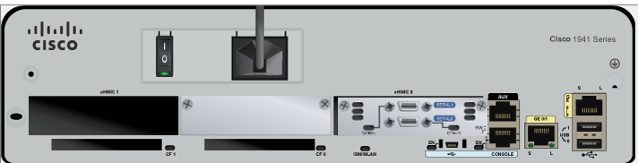

The router contains different types of interfaces for management, Ethernet connectivity, WAN connectivity, and expansion.

### Interface Categories

| Interface Type | Port Name(s) | General Purpose |
|---|---|---|
| Management Ports | `Console`, `AUX` | Local or administrative device management |
| GigabitEthernet | `GigabitEthernet0/0`, `GigabitEthernet0/1` | Ethernet LAN/WAN connectivity |
| Serial | `Serial0/0/0`, `Serial0/0/1` | WAN-style router connections |
| Expansion Slots | `eHWIC 0`, `eHWIC 1` | Installation of additional interface modules |

---

## 2. Examine Interfaces Using Cisco IOS

The following command was used:

```text
show ip interface brief
```

This provides a summary of the interfaces detected by Cisco IOS.

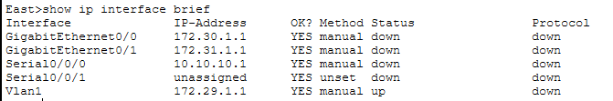

| Interface | IP Address | Interface Type | Status | Protocol |
|---|---|---|---|---|
| `GigabitEthernet0/0` | `172.30.1.1` | Physical | Down | Down |
| `GigabitEthernet0/1` | `172.31.1.1` | Physical | Down | Down |
| `Serial0/0/0` | `10.10.10.1` | Physical | Down | Down |
| `Serial0/0/1` | Unassigned | Physical | Down | Down |
| `Vlan1` | `172.29.1.1` | Virtual | Up | Down |

The output can be compared with the physical interfaces visible on the router.

The `Vlan1` interface shown in IOS is a virtual interface and does not represent a separate physical port.

---

## 3. Examine Interface Bandwidth

The following commands were used:

```text
show interface gigabitethernet 0/0
```
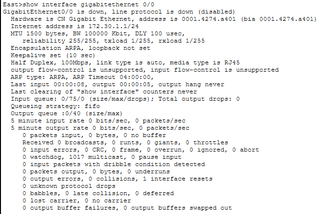

and

```text
show interface serial 0/0/0
```
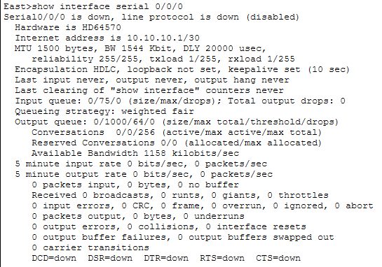

These commands provide detailed information about individual interfaces.

### Bandwidth Summary

| Interface | Interface Type | Default Bandwidth | Equivalent |
|---|---|---:|---:|
| `GigabitEthernet0/0` | Ethernet | `100000 Kbit/s` | `100 Mbps` |
| `Serial0/0/0` | Serial | `1544 Kbit/s` | `1.544 Mbps` |

**Observation:** The `BW` value shown by the `show interface` command represents the bandwidth value associated with the interface. For serial interfaces, this value may be used by routing processes and does not necessarily represent the actual physical transmission rate.

---

## 4. Examine Expansion Slots

The available expansion slots on the East router and Switch2 were inspected.


Expansion slots allow additional hardware modules to be installed when the existing interfaces are insufficient.

---

# Part 2 – Select Correct Modules for Connectivity

## 1. Determine Required Modules

The East router needed additional Ethernet ports to connect multiple PCs directly to the router.

A suitable expansion module was selected to provide the required Ethernet interfaces.

Switch2 also required an additional module to support a Gigabit optical connection to Switch3.

### Expansion Slots

| Device | Available Expansion Slots |
|---|---:|
| East Router | 1 |
| Switch2 | 1 |

Both devices have one available expansion slot for installing an additional module.

---

## 2. Install the Router Module

An attempt was first made to install the module while the router was powered on.

Packet Tracer displayed a warning indicating that the module could not be installed while the device was operating.

The correct process was therefore:

```text
Power OFF
    ↓
Install Module
    ↓
Power ON
```
### Available Router Modules

| Module | Simple Explanation |
|---|---|
| `HWIC-1GE-SFP` | Adds a Gigabit Ethernet SFP interface for fiber connectivity |
| `HWIC-2T` | Adds two Serial interfaces for WAN connections |
| `HWIC-4ESW` | Adds four Ethernet switch ports for connecting Ethernet devices |
| `HWIC-8A` | Adds asynchronous serial ports, typically for connecting serial devices |
| `WIC-Cover` | Covers an unused module slot; does not provide connectivity |
| `GLC-LH-SMD` | SFP transceiver used for Gigabit Ethernet fiber-optic connections |


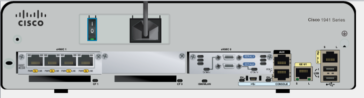

This demonstrates that some networking hardware is not hot-swappable.

---

## 3. Install the Switch Module

The required optical module was installed into Switch2.

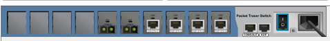

### Available Switch Modules

| Module | Connection |
|---|---|
| `PT-SWITCH-NM-1CE` | Copper Ethernet |
| `PT-SWITCH-NM-1CFE` | Copper FastEthernet |
| `PT-SWITCH-NM-1CGE` | Copper Gigabit Ethernet |
| `PT-SWITCH-NM-1FFE` | Fiber FastEthernet |
| `PT-SWITCH-NM-1FFE-SM` | Single-mode Fiber FastEthernet |
| `PT-SWITCH-NM-1FGE` | Fiber Gigabit Ethernet |
| `PT-SWITCH-NM-1FGE-SM` | Single-mode Fiber Gigabit Ethernet |
| `PT-SWITCH-NM-COVER` | Covers an unused module slot |

The module provides the interface required for the fiber-optic connection between Switch2 and Switch3.

---

## 4. Verify Installed Interfaces

After installing the modules and powering the devices back on, Cisco IOS was used to verify that the newly installed interfaces were detected.

```text
show ip interface brief
```

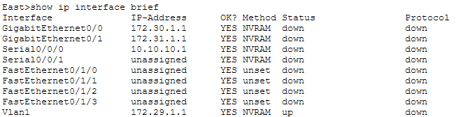
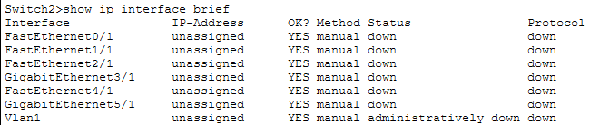


### Installed Modules

| Device | Module | Purpose | Slot | Provided Interfaces |
|---|---|---|---:|---|
| East Router | `HWIC-4ESW` | Adds four Ethernet switch ports | 1 | `FastEthernet0/1/0` – `FastEthernet0/1/3` |
| Switch2 | `PT-SWITCH-NM-1FGE` | Adds a Gigabit fiber interface | 5 | `GigabitEthernet5/1` |

### Module Naming Pattern

| Pattern | Meaning | Example |
|---|---|---|
| `HWIC` | High-Speed WAN Interface Card | `HWIC-4ESW` |
| `NM` | Network Module | `PT-SWITCH-NM-1FGE` |
| `1`, `2`, `4`, `8` | Usually indicates number of interfaces/ports | `HWIC-4ESW` = 4 ports |
| `C` | Copper | `1CGE` |
| `F` | Fiber | `1FGE` |
| `FE` | FastEthernet | `1CFE` |
| `GE` | GigabitEthernet | `1FGE` |
| `ESW` | EtherSwitch | `HWIC-4ESW` |
| `T` | Serial interface in modules such as `HWIC-2T` | `HWIC-2T` |
| `SM` | Single-Mode fiber | `1FGE-SM` |
| `COVER` | Empty-slot cover; provides no interface | `PT-SWITCH-NM-COVER` |

---

# Part 3 – Connect Devices

The devices were connected using the interfaces and media specified by the activity.

Cisco requires a combination of copper straight-through, copper crossover, fiber, and serial connections. :contentReference[oaicite:1]{index=1}

## Connection Table

| Device | Interface | Cable | Device | Interface |
|---|---|---|---|---|
| East | GigabitEthernet0/0 | Copper Straight-Through | Switch1 | GigabitEthernet0/1 |
| East | GigabitEthernet0/1 | Copper Straight-Through | Switch4 | GigabitEthernet0/1 |
| East | FastEthernet0/1/0 | Copper Straight-Through | PC1 | FastEthernet0 |
| East | FastEthernet0/1/1 | Copper Straight-Through | PC2 | FastEthernet0 |
| East | FastEthernet0/1/2 | Copper Straight-Through | PC3 | FastEthernet0 |
| Switch1 | FastEthernet0/1 | Copper Straight-Through | PC4 | FastEthernet0 |
| Switch1 | FastEthernet0/2 | Copper Straight-Through | PC5 | FastEthernet0 |
| Switch1 | FastEthernet0/3 | Copper Straight-Through | PC6 | FastEthernet0 |
| Switch4 | GigabitEthernet0/2 | Copper Cross-Over | Switch3 | GigabitEthernet3/1 |
| Switch3 | GigabitEthernet5/1 | Fiber | Switch2 | GigabitEthernet5/1 |
| Switch2 | FastEthernet0/1 | Copper Straight-Through | PC7 | FastEthernet0 |
| Switch2 | FastEthernet1/1 | Copper Straight-Through | PC8 | FastEthernet0 |
| Switch2 | FastEthernet2/1 | Copper Straight-Through | PC9 | FastEthernet0 |
| Switch2 | Gigabit3/1 | Copper Straight-Through | Access Point | Port 0 |
| East | Serial0/0/0 | Serial DCE | West | Serial0/0/0 |

---

## Copper Connections

Copper straight-through cables were primarily used between different Ethernet device types, including routers, switches, PCs, and the access point.

---

## Copper Cross-Over Connection

A copper crossover cable was used between Switch4 and Switch3.

```text
Switch4
   │
Copper Cross-Over
   │
Switch3
```

---

## Fiber-Optic Connection

Switch3 and Switch2 were connected using fiber.

```text
Switch3
   │
 Fiber
   │
Switch2
```

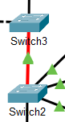

This connection required suitable Gigabit optical interfaces.

---

## Serial Connection

The East and West routers were connected using a Serial DCE cable.

```text
East Router
    │
 Serial DCE
    │
West Router
```

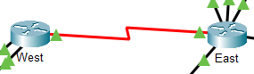

---

## Completed Topology

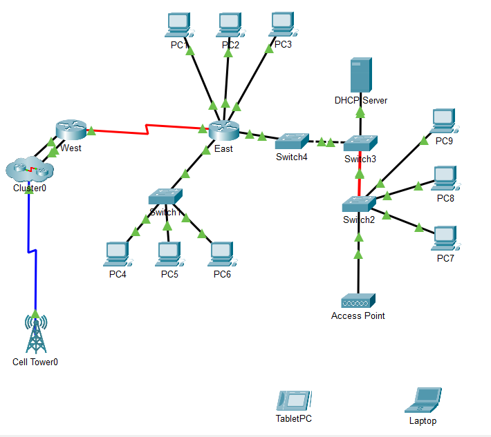

The completed topology demonstrates that different types of devices and network environments may require different physical interfaces and transmission media.

---

# Part 4 – Check Connectivity

## 1. Verify East Router Interfaces

The following command was used:

```text
show ip interface brief
```

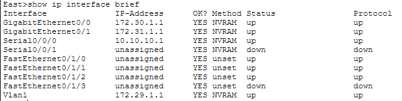

| Interface | Status | Protocol | Result |
|---|---|---|---|
| `GigabitEthernet0/0` | Up | Up | Operational |
| `GigabitEthernet0/1` | Up | Up | Operational |
| `Serial0/0/0` | Up | Up | Operational |
| `Serial0/0/1` | Down | Down | Unused |
| `FastEthernet0/1/0` | Up | Up | Operational |
| `FastEthernet0/1/1` | Up | Up | Operational |
| `FastEthernet0/1/2` | Up | Up | Operational |
| `FastEthernet0/1/3` | Down | Down | Unused |
| `Vlan1` | Up | Up | Operational |

Several connected interfaces should show:

```text
Status    Protocol
up        up
```

This indicates that the interface and protocol are operational.

Cisco provides an expected interface-status output for comparison after the cabling is completed.

---

## 2. Test Laptop Wireless Connectivity

The Laptop's `Wireless0` interface was enabled.

```text
Laptop
   )))
Wireless
   )))
Access Point
```

The web browser was then used to access:

```text
www.cisco.srv
```

Successful access confirmed wireless network connectivity.

---

## 3. Test TabletPC Wireless Connectivity

The TabletPC's `Wireless0` interface was enabled.

The device was then used to access the same web resource.

This demonstrates that different wireless end devices can connect through the same wireless infrastructure.

---

## 4. Change TabletPC to Cellular Connectivity

The TabletPC's wireless interface was disabled:

```text
Wireless0 → Off
```

The cellular interface was then enabled:

```text
3G/4G Cell1 → On
```

The connection changed from:

```text
TabletPC
   )))
 Wi-Fi
   )))
Access Point
```

to:

```text
TabletPC
   )))
 3G/4G
   )))
Cellular Network
```

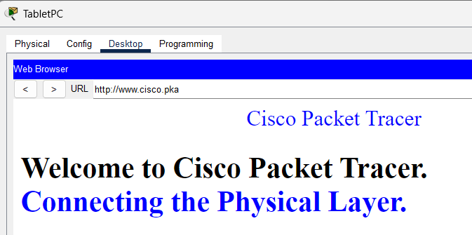

Web connectivity was tested again to confirm that the TabletPC could access the network using a different physical access technology.

Cisco notes that the wireless and cellular interfaces should not both remain active simultaneously during this activity. :contentReference[oaicite:3]{index=3}

---

# Important Concepts

| Concept | Meaning |
|---|---|
| Physical Interface | Hardware port used to connect a networking device |
| Management Port | Interface used to locally administer a device |
| Expansion Slot | Space where additional interface modules can be installed |
| Expansion Module | Hardware used to add additional interfaces or capabilities |
| Hot-Swappable | Hardware that can be inserted or removed while the device remains powered on |
| Copper Straight-Through | Ethernet cable commonly used between different device types |
| Copper Cross-Over | Traditionally used between similar Ethernet device types |
| Fiber-Optic Cable | Uses light to transmit data through optical fiber |
| Serial Connection | Point-to-point connection commonly associated with WAN technologies |
| Serial DCE | Serial side that provides clocking in a DCE/DTE connection |
| Wireless NIC | Network interface used for Wi-Fi communication |
| Cellular Interface | Interface used to access a mobile cellular network |
| Interface Status | Indicates whether an interface is operational |
| `up/up` | Interface and line protocol are functioning |
| Bandwidth | Logical/reference bandwidth value that may be used by routing processes |

---

# Key Takeaways

- Networking devices can contain multiple types of physical interfaces.
- Interfaces differ depending on the required media and network connection.
- Expansion modules can add new connectivity options when existing ports are insufficient.
- Some modules require the device to be powered off before installation.
- Selecting the correct interface is as important as selecting the correct cable.
- Copper, fiber, serial, wireless, and cellular technologies can all provide network connectivity.
- Fiber connections require interfaces capable of supporting optical transmission.
- `show ip interface brief` provides a quick way to verify interface availability and operational status.
- A device can contain multiple network interfaces, such as Ethernet, Wi-Fi, and cellular.
- Physical connectivity must be established correctly before higher-layer communication can function.

---

# Overall Lab Summary

This lab demonstrates the complete process of building physical network connectivity:

```text
Identify Device
      ↓
Inspect Interfaces
      ↓
Determine Requirements
      ↓
Install Module if Required
      ↓
Choose Correct Media
      ↓
Connect Devices
      ↓
Verify Interface Status
      ↓
Test Connectivity
```

The main lesson is that network connectivity depends on matching the correct **device interface, hardware module, transmission medium, and connection type**.

---

# Lab Reference

**Course:** Cisco Networking Academy – CCNA: Introduction to Networks (ITN)  
**Module:** 4 – Physical Layer  
**Lab:** 4.7.2 – Packet Tracer: Connect the Physical Layer  
**Tool:** Cisco Packet Tracer

This repository documents my own implementation, observations, screenshots, and understanding of the networking concepts practiced during the activity.