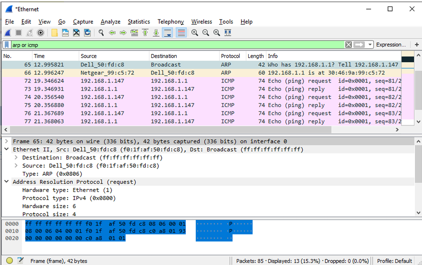
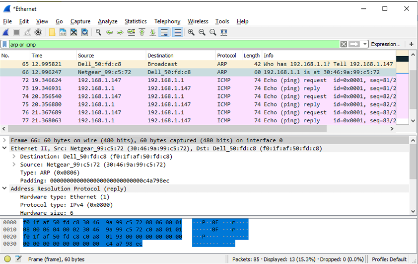
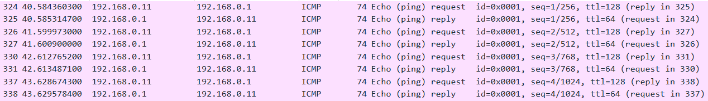
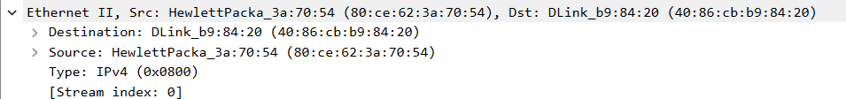
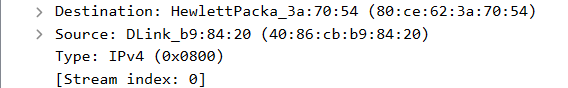
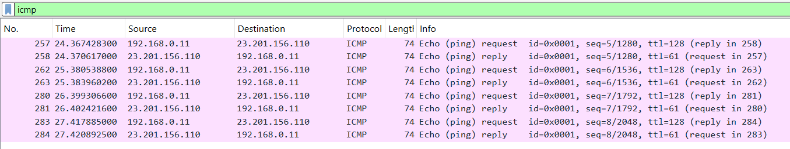
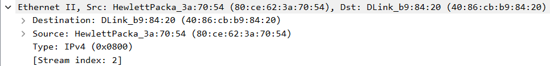

# Lab 7.1.6 — Use Wireshark to Examine Ethernet Frames

## Overview

This lab explores the structure of Ethernet II frames and uses Wireshark to analyze Layer 2 communication.

The activity examines Ethernet frame header fields, MAC addressing, ARP, ICMP traffic, and the differences between local and remote network communication.

---

## Objectives

- Examine the fields of an Ethernet II frame.
- Identify source and destination MAC addresses.
- Understand the purpose of the EtherType field.
- Observe ARP communication.
- Capture ICMP traffic using Wireshark.
- Analyze Ethernet frames for local communication.
- Analyze Ethernet frames for remote communication.
- Compare Layer 2 MAC addressing with Layer 3 IP addressing.

---

## Required Resources

| Resource | Purpose |
|---|---|
| Windows PC | Generate and analyze network traffic |
| Internet Connection | Test communication with remote hosts |
| Wireshark | Capture and inspect Ethernet frames |
| Command Prompt | Run `ipconfig` and `ping` commands |

---

# Part 1 — Examine Ethernet II Frame Fields

### Overview

This part examines the structure of an Ethernet II frame and analyzes ARP traffic using the example Wireshark capture provided in the lab.

---

## Ethernet II Frame Structure

| Field | Size | Purpose |
|---|---:|---|
| Preamble | 8 bytes | Synchronizes communication |
| Destination MAC | 6 bytes | Identifies the destination |
| Source MAC | 6 bytes | Identifies the sender |
| Frame Type | 2 bytes | Identifies the encapsulated protocol |
| Data | 46–1500 bytes | Contains the encapsulated data |
| FCS | 4 bytes | Detects transmission errors |

### Common EtherTypes

| EtherType | Protocol |
|---|---|
| `0x0800` | IPv4 |
| `0x0806` | ARP |

---

## Example Network Information

The provided example uses the following network information:

| Information | Value |
|---|---|
| PC IPv4 Address | `192.168.1.147` |
| PC MAC Address | `F0:1F:AF:50:FD:C8` |
| Default Gateway | `192.168.1.1` |
| Gateway MAC Address | `30:46:9A:99:C5:72` |

---

## ARP Process

Before the PC can ping the default gateway, it needs to know the gateway's MAC address.

```text
PC knows:
Gateway IP = 192.168.1.1

        ↓

Gateway MAC = Unknown

        ↓

ARP Request
"Who has 192.168.1.1?"

Destination MAC:
ff:ff:ff:ff:ff:ff

        ↓

ARP Reply

Gateway MAC:
30:46:9A:99:C5:72

        ↓

PC can send the ping
```

The ARP request uses `ff:ff:ff:ff:ff:ff`, which is the Ethernet broadcast address.

---

## ARP Request Analysis

| Field | Value |
|---|---|
| Destination MAC | `ff:ff:ff:ff:ff:ff` |
| Source MAC | `f0:1f:af:50:fd:c8` |
| EtherType | `0x0806` |
| Data | ARP |



---

## ARP Reply Analysis

The default gateway responds to the ARP request with its MAC address.

| Field | Value |
|---|---|
| Destination MAC | `f0:1f:af:50:fd:c8` |
| Source MAC | `30:46:9a:99:c5:72` |
| EtherType | `0x0806` |
| Data | ARP |



---

## MAC Address Structure

The gateway MAC address is:

```text
30:46:9A:99:C5:72
```

It is divided in the lab as:

```text
30:46:9A : 99:C5:72
---------   --------
   OUI      NIC-specific
```

| Portion | Value |
|---|---|
| OUI | `30:46:9A` |
| NIC-specific portion | `99:C5:72` |

---

## Questions and Answers

### 1. What is significant about the destination address?

The destination address is `ff:ff:ff:ff:ff:ff`, which is the Ethernet broadcast address. The ARP request is therefore sent to all devices on the local network.

### 2. Why is ARP sent before the first ping?

The PC knows the gateway's IP address but needs its MAC address before it can send an Ethernet frame to it.

### 3. What is the source MAC address in the first frame?

`f0:1f:af:50:fd:c8`

### 4. What is the OUI of the source NIC in the ARP reply?

`30:46:9A`

### 5. What portion of the MAC address is the OUI?

The first 24 bits, or first three bytes.

### 6. What is the NIC-specific portion?

`99:C5:72`

---

# Part 2 — Capture and Analyze Ethernet Frames

## Overview

In Part 2, Wireshark is used to capture and analyze Ethernet II frames generated by local and remote ICMP traffic.

The analysis compares:

- Communication with the local default gateway
- Communication with a remote host
- Source and destination MAC addresses
- Source and destination IPv4 addresses
- Ethernet II frame information

---

## 1. Network Information

The PC network configuration was checked before capturing traffic.

| Device | IPv4 Address |
|---|---|
| PC | `192.168.0.11` |
| Default Gateway | `192.168.0.1` |

---

## 2. Wireshark ICMP Capture

Wireshark was opened on the active network interface.

The following display filter was used:

```text
icmp
```

This displays ICMP traffic such as ping Echo Requests and Echo Replies.

---

## 3. Ping the Default Gateway

The default gateway was tested using:

```cmd
ping 192.168.0.1
```

Wireshark captured four ICMP Echo Requests and four corresponding Echo Replies.

| Traffic | Source IP | Destination IP |
|---|---|---|
| Echo Request | `192.168.0.11` | `192.168.0.1` |
| Echo Reply | `192.168.0.1` | `192.168.0.11` |



### Observation

The Echo Requests and Echo Replies confirm successful IP connectivity between the PC and the default gateway.

```text
PC                              Default Gateway
192.168.0.11                    192.168.0.1
      │
      │──── ICMP Echo Request ────►
      │
      │◄──── ICMP Echo Reply ─────│
```

---

## 4. Local Echo Request Analysis

The first ICMP Echo Request was selected in Wireshark and its Ethernet II information was examined.

| Field | Value |
|---|---|
| Frame Type | Ethernet II |
| Source MAC | `80:ce:62:3a:70:54` |
| Destination MAC | `40:86:cb:b9:84:20` |
| Source IPv4 | `192.168.0.11` |
| Destination IPv4 | `192.168.0.1` |



### Observation

The PC is communicating directly with its default gateway on the local network.

Therefore:

```text
Source MAC      = PC MAC
Destination MAC = Default Gateway MAC

Source IP       = PC IP
Destination IP  = Default Gateway IP
```

---

## 5. Local Echo Reply Analysis

The ICMP Echo Reply from the default gateway was then examined.

| Field | Echo Request | Echo Reply |
|---|---|---|
| Source MAC | PC MAC | Gateway MAC |
| Destination MAC | Gateway MAC | PC MAC |
| Source IP | `192.168.0.11` | `192.168.0.1` |
| Destination IP | `192.168.0.1` | `192.168.0.11` |



### Observation

The source and destination addresses are reversed in the Echo Reply because the gateway is sending the response back to the PC.

---

## 6. Local Frame Information

After examining the Ethernet II frame, the following information was identified:

| Information | Value |
|---|---|
| PC MAC Address | `40:86:cb:b9:84:20` |
| Default Gateway MAC Address | `80:ce:62:3a:70:54` |
| Frame Type | Ethernet II |
| Source IP | `192.168.0.11` |
| Destination IP | `192.168.0.1` |
| Last Two Highlighted Octets | `68 69` (`hi`) |

---

# Remote Traffic Analysis

## 7. Ping a Remote Host

A new Wireshark capture was started.

The remote Cisco host was tested using:

```cmd
ping www.cisco.com
```

The resulting ICMP traffic was captured in Wireshark.



---

## 8. Remote Echo Request Analysis

The first ICMP Echo Request to the remote host was selected and its Ethernet II and IPv4 information was examined.

| Field | Value |
|---|---|
| Source MAC | `80:ce:62:3a:70:54` |
| Destination MAC | `49:86:cb:b9:84:20` |
| Source IPv4 | `192.168.0.11` |
| Destination IPv4 | `23:201:156:110` |



---

## 9. Local vs Remote Communication

The local and remote Echo Requests were compared.

| Address | Local Gateway Ping | Remote Host Ping |
|---|---|---|
| Source MAC | PC MAC | PC MAC |
| Destination MAC | Gateway MAC | Gateway MAC |
| Source IP | `192.168.0.11` | `192.168.0.11` |
| Destination IP | `192.168.0.1` | `23:201:156:110` |

### Why Does the Destination IP Change but the Destination MAC Remain the Same?

The remote server is outside the PC's local network.

The IP packet identifies the final remote destination, but the Ethernet frame only needs to reach the next device on the local network: the default gateway.

Therefore:

```text
Destination IP  = Final remote host
Destination MAC = Local default gateway
```

The communication can be represented as:

```text
PC
192.168.0.11
      │
      │ Ethernet Frame
      │ Destination MAC = Gateway
      ▼
Default Gateway
192.168.0.1
      │
      │ Routes IP packet
      ▼
Internet
      │
      ▼
Remote Cisco Host
```

The Ethernet frame is used for communication on the current Layer 2 link, while the IP packet is routed toward the final destination.

---

## 10. Local vs Remote Addressing

### Local Communication

```text
PC → Default Gateway

Destination MAC = Gateway MAC
Destination IP  = Gateway IP
```

Both the Layer 2 and Layer 3 destination identify the gateway.

### Remote Communication

```text
PC → Remote Host

Destination MAC = Gateway MAC
Destination IP  = Remote Host IP
```

The Layer 2 destination is the next-hop router, while the Layer 3 destination is the final remote host.

---

## Key Takeaways

- Ethernet II frames use MAC addresses for Layer 2 communication.
- ARP resolves a known IPv4 address to the MAC address needed for local Ethernet communication.
- ARP requests use the broadcast MAC address `ff:ff:ff:ff:ff:ff` when the destination MAC is unknown.
- The EtherType field identifies the protocol carried by an Ethernet frame, such as IPv4 (`0x0800`) or ARP (`0x0806`).
- ICMP Echo Requests and Replies can be captured and analyzed using Wireshark.
- When communicating locally, the destination MAC and IP addresses identify the local destination device.
- When communicating with a remote host, the destination IP identifies the final host while the destination MAC identifies the local default gateway.
- MAC addresses are used on the current local link, while IP addresses allow communication across different networks.
- Wireshark helps visualize how Layer 2 Ethernet frames encapsulate Layer 3 packets.