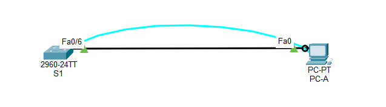
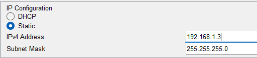
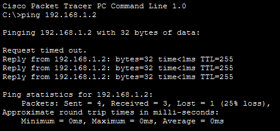
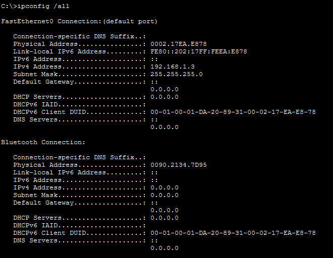
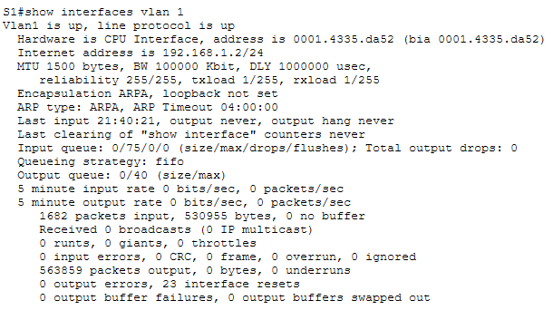
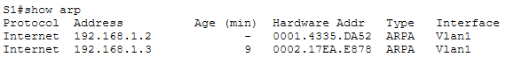
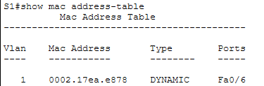

# Lab 7.2.7 — View Network Device MAC Addresses

## Overview

This lab examines how MAC addresses are identified and used on an Ethernet LAN.

The activity focuses on configuring a simple switch-to-PC network, verifying connectivity, identifying MAC addresses on both devices, analyzing the OUI and NIC-specific portions, and examining the switch ARP and MAC address tables.

---

## Objectives

- Configure a switch and PC with IPv4 addressing.
- Verify connectivity between PC-A and S1.
- Identify the MAC address of PC-A.
- Identify the MAC address of the S1 VLAN 1 interface.
- Examine the OUI and NIC-specific portions of MAC addresses.
- Use the switch ARP table to compare Layer 2 and Layer 3 addresses.
- Use the switch MAC address table to determine which port learned PC-A's MAC address.

---

## Packet Tracer File

This lab was recreated and completed using Cisco Packet Tracer.

📁 [Completed Packet Tracer File](packet-tracer/view-network-device-mac-addresses.pkt)

---

## Addressing Table

| Device | Interface | IP Address | Subnet Mask |
|---|---|---|---|
| S1 | VLAN 1 | `192.168.1.2` | `255.255.255.0` |
| PC-A | NIC | `192.168.1.3` | `255.255.255.0` |

---

# Part 1 — Configure Devices and Verify Connectivity

## 1. Network Topology

PC-A is connected directly to switch S1.

```text
S1 Fa0/6 ───────── PC-A
```



---

## 2. Configure PC-A

PC-A is configured with:

| Setting | Value |
|---|---|
| IPv4 Address | `192.168.1.3` |
| Subnet Mask | `255.255.255.0` |



---

## 3. Configure S1

The switch is configured with the hostname `S1`, DNS lookup is disabled, and VLAN 1 is assigned an IPv4 address.

```text
enable
configure terminal
hostname S1
no ip domain-lookup
interface vlan 1
ip address 192.168.1.2 255.255.255.0
no shutdown
end
```

---

## 4. Verify Connectivity

From PC-A, connectivity to S1 is tested using:

```cmd
ping 192.168.1.2
```



### Result

The ping should be successful after the switch VLAN 1 interface and PC-A are correctly configured.

---

# Part 2 — Display, Describe, and Analyze Ethernet MAC Addresses

## 5. PC-A MAC Address

The MAC address of PC-A is identified using:

```cmd
ipconfig /all
```

The MAC address appears as the **Physical Address**.

| Information | Value |
|---|---|
| PC-A MAC Address | `0002.17EA.E878` |
| OUI | `0002.17` |
| NIC-Specific Portion | `EA.E878` |
| Vendor | Cisco Packet Tracer (simulated) |



### MAC Address Structure

A MAC address is 48 bits, or 6 bytes.

```text
AA:BB:CC : DD:EE:FF
---------   --------
   OUI      NIC-specific
```

The first 24 bits represent the OUI.

The remaining 24 bits identify the NIC-specific portion.

---

## 6. S1 VLAN 1 MAC Address

The VLAN 1 interface information is displayed using:

```text
show interfaces vlan 1
```

The command displays the MAC address assigned to the switch SVI.

| Information | Value |
|---|---|
| VLAN 1 MAC Address | `0001.4335.da52` |
| OUI | `0001.43` |
| NIC-Specific Portion | `35.da52` |
| Vendor | Cisco Packet Tracer (simulated) |
| BIA | `0001.4335.da52` |



### BIA

`BIA` stands for:

```text
Burned-In Address
```

It is the MAC address originally assigned to the interface by the manufacturer.

If the normal MAC address and BIA are the same, the interface is using its original factory-assigned MAC address.

---

## 7. Examine the ARP Table

The switch ARP table is displayed using:

```text
show arp
```



The ARP table maps Layer 3 IPv4 addresses to Layer 2 MAC addresses.

| Layer 3 Address | Layer 2 Address | Interface |
|---|---|---|
| `192.168.1.2` | `0001.4335.DA52` | VLAN 1 |
| `192.168.1.3` | `0002.17EA.E878` | VLAN 1 |

### Observation

ARP creates an association between:

```text
IPv4 Address ↔ MAC Address
```

For example:

```text
192.168.1.3
      ↓
PC-A MAC Address
```

---

## 8. Examine the MAC Address Table

The switch MAC address table is displayed using:

```text
show mac address-table
```



PC-A should appear as a dynamically learned MAC address on:

```text
Fa0/6
```

| MAC Address | Type | Port |
|---|---|---|
| `<PC-A MAC>` | Dynamic | `Fa0/6` |

### Observation

The switch learns the source MAC address of incoming Ethernet frames and associates that MAC address with the port where the frame was received.

```text
PC-A MAC
    ↓
Fa0/6
```

This information is stored in the switch MAC address table.

---

# Important Concepts

## MAC Address

A MAC address is a Layer 2 address used to identify an Ethernet network interface.

Common formats include:

```text
00-05-9A-3C-78-00
00:05:9A:3C:78:00
0005.9A3C.7800
```

All three represent the same 48-bit MAC address.

---

## OUI

The Organizationally Unique Identifier is the first 24 bits of a MAC address.

It identifies the organization or manufacturer associated with that MAC address block.

---

## NIC-Specific Portion

The remaining 24 bits are assigned by the manufacturer to identify the individual network interface.

---

## ARP Table

The ARP table maps:

```text
IPv4 Address → MAC Address
```

It helps devices determine which Layer 2 address corresponds to a known Layer 3 address.

---

## MAC Address Table

The switch MAC address table maps:

```text
MAC Address → Switch Port
```

This allows the switch to forward Ethernet frames toward the correct interface.

---

# Reflection Questions

## 1. Can broadcasts exist at Layer 2?

Yes.

The Ethernet Layer 2 broadcast MAC address is:

```text
ff:ff:ff:ff:ff:ff
```

A frame sent to this address is delivered to all devices in the local broadcast domain.

---

## 2. Why would you need to know the MAC address of a device?

MAC addresses are useful for:

- Identifying devices on the local Ethernet network.
- Troubleshooting Layer 2 connectivity.
- Examining ARP entries.
- Determining which switch port a device is connected to.
- Verifying whether a switch has learned a device correctly.

---

# Key Takeaways

- Every Ethernet device has a Layer 2 MAC address.
- A MAC address is 48 bits, or 6 bytes, long.
- The first 24 bits represent the OUI.
- The remaining 24 bits identify the NIC-specific portion.
- `ipconfig /all` can be used to view the MAC address of a Windows PC.
- `show interfaces vlan 1` can display the MAC address of a switch SVI.
- `show arp` maps IPv4 addresses to MAC addresses.
- `show mac address-table` maps MAC addresses to switch ports.
- Switches dynamically learn MAC addresses from incoming Ethernet frames.
- PC-A should be learned on S1 port `Fa0/6`.
- Layer 2 broadcast traffic uses `ff:ff:ff:ff:ff:ff`.

---

## Lab Reference

Cisco Networking Academy  
CCNA: Introduction to Networks (ITN)  
Lab 7.2.7 — View Network Device MAC Addresses

This documentation reflects my own implementation, observations, and understanding of the lab.