# Lab 7.3.7 — View the Switch MAC Address Table

## Overview

This lab examines how Layer 2 switches learn MAC addresses and build their MAC address tables.

The activity uses two switches and two PCs to observe how MAC addresses are learned, mapped to switch ports, cleared, and relearned after network traffic is generated.

---

## Objectives

- Build and configure a two-switch Ethernet network.
- Configure IPv4 addressing on PCs and switch management interfaces.
- Identify MAC addresses on PCs and switches.
- Examine the switch MAC address table.
- Clear dynamic MAC address entries.
- Observe how switches relearn MAC addresses.
- Compare the switch MAC address table with a PC ARP cache.

---

## Addressing Table

| Device | Interface | IP Address | Subnet Mask |
|---|---|---|---|
| S1 | VLAN 1 | `192.168.1.11` | `255.255.255.0` |
| S2 | VLAN 1 | `192.168.1.12` | `255.255.255.0` |
| PC-A | NIC | `192.168.1.1` | `255.255.255.0` |
| PC-B | NIC | `192.168.1.2` | `255.255.255.0` |

---

## Packet Tracer File

This lab was recreated and completed using Cisco Packet Tracer.

📁 [Completed Packet Tracer File](packet-tracer/view-switch-mac-address-table.pkt)

---

# Part 1 — Build and Configure the Network

## 1. Network Topology

```text
PC-A                        PC-B
192.168.1.1                 192.168.1.2
   │                           │
   │ Fa0                       │ Fa0
   │                           │
Fa0/6                       Fa0/18
   │                           │
  S1────────Fa0/1──Fa0/1──────S2
192.168.1.11              192.168.1.12
VLAN 1                    VLAN 1
```

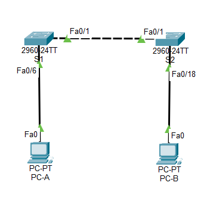

---

## 2. Configure PC Addresses

### PC-A

| Setting | Value |
|---|---|
| IPv4 Address | `192.168.1.1` |
| Subnet Mask | `255.255.255.0` |

### PC-B

| Setting | Value |
|---|---|
| IPv4 Address | `192.168.1.2` |
| Subnet Mask | `255.255.255.0` |

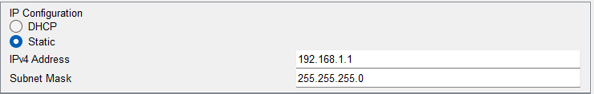
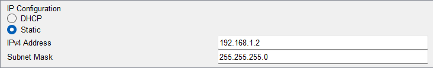

---

## 3. Configure S1

```text
enable
configure terminal
hostname S1
interface vlan 1
ip address 192.168.1.11 255.255.255.0
no shutdown
exit
line console 0
password cisco
login
exit
line vty 0 4
password cisco
login
exit
enable secret class
end
```

---

## 4. Configure S2

```text
enable
configure terminal
hostname S2
interface vlan 1
ip address 192.168.1.12 255.255.255.0
no shutdown
exit
line console 0
password cisco
login
exit
line vty 0 4
password cisco
login
exit
enable secret class
end
```

---

# Part 2 — Examine the Switch MAC Address Table

## 5. Record Device MAC Addresses

### PC-A and PC-B

The PC MAC addresses are displayed using:

```cmd
ipconfig /all
```

| Device | MAC Address |
|---|---|
| PC-A | `00D0.BA0E.8815` |
| PC-B | `0060.470A.26BD` |

### S1 and S2 Fa0/1

The switch interface MAC addresses are displayed using:

```text
show interface fastethernet 0/1
```

| Device | Interface | MAC Address / BIA |
|---|---|---|
| S1 | Fa0/1 | `0005.5e08.bd01` |
| S2 | Fa0/1 | `<0030.f249.0c01` |

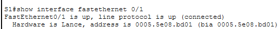
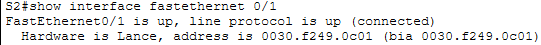

---

## 6. Examine S2 MAC Address Table

Before generating additional traffic, the MAC address table on S2 is displayed using:

```text
show mac address-table
```

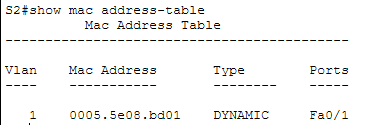

### Observations

| MAC Address | Type | Port | Device |
|---|---|---|---|
| `0005.5e08.bd01` | Dynamic | `Fa0/1` | S1 FastEthernet0/1 |

### Important Concept

A switch learns MAC addresses from the **source MAC address** of incoming Ethernet frames.

```text
Frame enters switch
        ↓
Read source MAC
        ↓
Record:

MAC Address ↔ Incoming Port
```

---

## 7. Clear the Dynamic MAC Address Table

The dynamic entries are cleared using:

```text
clear mac address-table dynamic
```

The table is immediately checked again:

```text
show mac address-table
```

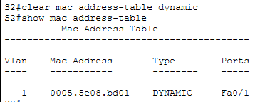

### Observation

Dynamic MAC address entries are removed, but some static or CPU-related entries may remain.

After traffic is generated again, dynamic MAC addresses can be relearned automatically.

---

## 8. Examine PC-B ARP Cache Before Ping

On PC-B:

```cmd
arp -a
```

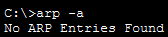

### Important Concept

The ARP cache maps:

```text
IPv4 Address ↔ MAC Address
```

This is different from the switch MAC address table, which maps:

```text
MAC Address ↔ Switch Port
```

---

## 9. Generate Network Traffic

From PC-B, ping:

```cmd
ping 192.168.1.1
ping 192.168.1.11
ping 192.168.1.12
```

These test connectivity to:

- PC-A
- S1
- S2

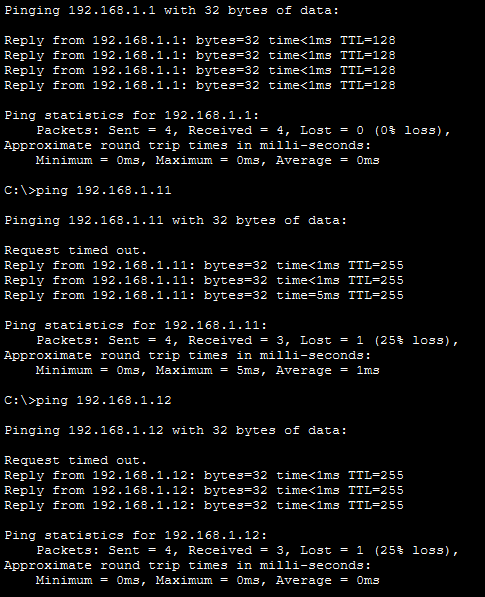

### Result

| Destination | Result |
|---|---|
| PC-A | Successful |
| S1 | Successful |
| S2 | Successful |

---

## 10. Examine S2 MAC Address Table After Ping

After generating traffic:

```text
show mac address-table
```

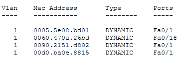

| MAC Address | Type | Port | Device |
|---|---|---|---|
| `0005.5e08.bd01` | Dynamic | `Fa0/1` | S1 FastEthernet0/1 |
| `0060.470a.26bd` | Dynamic | `Fa0/18` | PC-B |
| `0090.2151.d802` | Dynamic | `Fa0/1` | S1 VLAN 1 |
| `00d0.ba0e.8815` | Dynamic | `Fa0/1` | PC-A via S1 |

### Observation

From S2's perspective:

```text
PC-B MAC → Fa0/18
```

because PC-B is directly connected to S2.

PC-A is located behind S1, so S2 learns:

```text
PC-A MAC → Fa0/1
```

This does not mean PC-A is physically connected to S2 Fa0/1.

It means:

> To reach PC-A, S2 must forward the frame through Fa0/1 toward S1.

---

## 11. Examine PC-B ARP Cache After Ping

On PC-B:

```cmd
arp -a
```

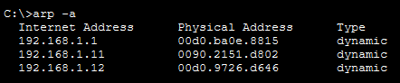

| IP Address | MAC Address | Device |
|---|---|---|
| `192.168.1.1` | `00d0.ba0e.8815` | PC-A |
| `192.168.1.11` | `0090.2151.d802` | S1 |
| `192.168.1.12` | `00d0.9726.d646` | S2 |

### Observation

After PC-B communicates with the other devices, its ARP cache contains additional IPv4-to-MAC mappings.

---

# MAC Address Table vs ARP Table

| Table | Mapping | Used By |
|---|---|---|
| MAC Address Table | MAC Address → Switch Port | Switch |
| ARP Table | IPv4 Address → MAC Address | Hosts and Layer 3 devices |

### Example

```text
ARP Table

192.168.1.1
      ↓
PC-A MAC
```

```text
S2 MAC Address Table

PC-A MAC
      ↓
Fa0/1
```

Together, they help deliver traffic correctly.

---

# How a Switch Learns MAC Addresses

When S2 receives a frame from PC-B:

```text
PC-B
  │
  │ Frame
  │ Source MAC = PC-B
  ▼
S2 Fa0/18
```

S2 learns:

```text
PC-B MAC → Fa0/18
```

When S2 receives a frame from PC-A through S1:

```text
PC-A
  │
  ▼
S1
  │
  ▼
S2 Fa0/1
```

S2 learns:

```text
PC-A MAC → Fa0/1
```

The switch learns based on **where the source frame entered**.

---

# Known vs Unknown Destination MAC

## Known Destination

If the destination MAC is already in the MAC address table:

```text
Destination MAC found
        ↓
Forward frame only
through known port
```

## Unknown Destination

If the destination MAC is not in the table:

```text
Destination MAC unknown
        ↓
Flood frame out
all relevant ports
except incoming port
```

After receiving a response, the switch can learn the previously unknown source MAC address.

---

# Reflection

## What challenges might occur in larger networks?

Larger Ethernet networks may contain many devices and therefore many MAC address and ARP entries.

Possible challenges include:

- Larger MAC address tables
- More ARP entries
- Frequent changes as devices connect and disconnect
- More difficult troubleshooting
- Broadcast traffic
- MAC address aging
- Identifying where devices are connected
- Maintaining accurate Layer 2 information

---

# Key Takeaways

- Switches dynamically learn MAC addresses from incoming Ethernet frames.
- A switch associates a source MAC address with the port where the frame was received.
- The MAC address table maps MAC addresses to switch ports.
- `show mac address-table` displays the switch MAC address table.
- `clear mac address-table dynamic` removes dynamically learned entries.
- Dynamic entries can be relearned when traffic is generated again.
- PC-B is learned directly on S2 `Fa0/18`.
- PC-A is learned by S2 through `Fa0/1` because PC-A is located behind S1.
- ARP maps IPv4 addresses to MAC addresses.
- A PC ARP cache and a switch MAC address table store different types of Layer 2 information.
- Known destination MAC addresses are forwarded toward the associated port.
- Unknown destination MAC addresses are flooded within the local Layer 2 network.

---

## Lab Reference

Cisco Networking Academy  
CCNA: Introduction to Networks (ITN)  
Lab 7.3.7 — View the Switch MAC Address Table

This lab was adapted and completed using Cisco Packet Tracer as part of my networking self-study portfolio.