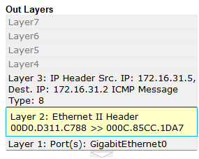
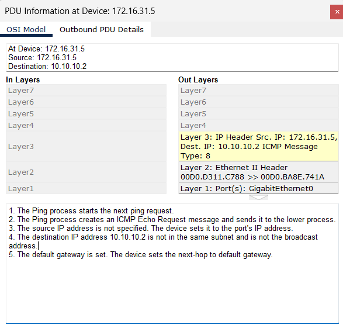
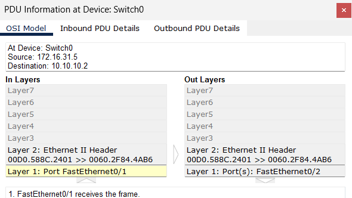

# Lab 9.1.3 — Identify MAC and IP Addresses

## Overview

This Packet Tracer lab examines how MAC addresses and IPv4 addresses behave during local and remote communication.

The activity uses Simulation Mode to follow PDUs through switches, a hub, a router, and a wireless access point.

The main focus is to observe:

- How MAC addresses are used on local links
- How IP addresses identify end-to-end communication
- What changes when a router forwards a packet
- How Layer 2 and Layer 3 addressing differ

---

## Objectives

- Gather PDU information for local network communication.
- Gather PDU information for remote network communication.
- Compare source and destination MAC addresses.
- Compare source and destination IPv4 addresses.
- Observe how switches, hubs, routers, and access points handle PDUs.
- Identify where MAC addresses change during routed communication.

---

# Part 1 — Local Network Communication

## 1. Local Ping

The first test uses:

```cmd
ping 172.16.31.2
```

from:

```text
172.16.31.5
```

The source and destination are on the same local network.

---

## 2. Initial PDU Information

The first PDU contains:

| Field | Value |
|---|---|
| At Device | `172.16.31.5` |
| Destination MAC | `000C:85CC:1DA7` |
| Source MAC | `00D0:D311:C788` |
| Source IPv4 | `172.16.31.5` |
| Destination IPv4 | `172.16.31.2` |



---

## 3. Local PDU Path

The PDU travels through:

```text
172.16.31.5
      ↓
   Switch1
      ↓
     Hub
      ↓
172.16.31.2
```

### PDU Information

| At Device | Destination MAC | Source MAC | Source IPv4 | Destination IPv4 |
|---|---|---|---|---|
| `172.16.31.5` | `000C:85CC:1DA7` | `00D0:D311:C788` | `172.16.31.5` | `172.16.31.2` |
| Switch1 | `000C:85CC:1DA7` | `00D0:D311:C788` | N/A | N/A |
| Hub | N/A | N/A | N/A | N/A |
| `172.16.31.2` | `00D0:D311:C788` | `000C:85CC:1DA7` | `172.16.31.2` | `172.16.31.5` |

---

## 4. Local Communication Observation

During local communication:

```text
Source MAC      → remains associated with the sender
Destination MAC → remains associated with the receiver

Source IP       → remains associated with the sender
Destination IP  → remains associated with the receiver
```

Switches forward the Ethernet frame without changing the source and destination addresses.

The hub works at Layer 1 and simply repeats the signal.

---

## 5. Additional Local Tests

The activity also tests:

```cmd
ping 172.16.31.2
```

from:

```text
172.16.31.3
```

and:

```cmd
ping 172.16.31.4
```

from:

```text
172.16.31.5
```

The same local communication pattern is observed.

---

# Part 2 — Remote Network Communication

## 6. Remote Ping

The remote communication test uses:

```cmd
ping 10.10.10.2
```

from:

```text
172.16.31.5
```

These devices are on different IPv4 networks.

---

## 7. Initial Remote PDU Information

The source device creates a PDU with:

| Field | Value |
|---|---|
| At Device | `172.16.31.5` |
| Destination MAC | `00D0:BA8E:741A` |
| Source MAC | `00D0:D311:C788` |
| Source IPv4 | `172.16.31.5` |
| Destination IPv4 | `10.10.10.2` |



### Observation

The destination MAC belongs to the default gateway/router interface.

The PC does not use the remote host's MAC address because the destination is outside the local network.

---

## 8. Remote PDU Path

The PDU travels through:

```text
172.16.31.5
      ↓
   Switch1
      ↓
    Router
      ↓
   Switch0
      ↓
Access Point
      ↓
10.10.10.2
```

---

## 9. Remote PDU Information
| MAC Address | Belongs To | Role |
|---|---|---|
| `00D0:D311:C788` | Host `172.16.31.5` | Source PC on the `172.16.31.x` network |
| `000C:85CC:1DA7` | Host `172.16.31.2` | Destination PC in the local-network communication |
| `00D0:BA8E:741A` | Router interface on the `172.16.31.x` side | Default-gateway MAC used by `172.16.31.5` for remote communication |
| `00D0:588C:2401` | Router interface on the `10.10.10.x` side | Source MAC of the new frame created by the router |
| `0060:2F84:4AB6` | Host `10.10.10.2` | Remote destination host |

| At Device | Destination MAC | Source MAC | Source IPv4 | Destination IPv4 |
|---|---|---|---|---|
| `172.16.31.5` | `00D0:BA8E:741A` | `00D0:D311:C788` | `172.16.31.5` | `10.10.10.2` |
| Switch1 | `00D0:BA8E:741A` | `00D0:D311:C788` | N/A | N/A |
| Router | `0060:2F84:4AB6` | `00D0:588C:2401` | `172.16.31.5` | `10.10.10.2` |
| Switch0 | `0060:2F84:4AB6` | `00D0:588C:2401` | N/A | N/A |
| Access Point | N/A | N/A | N/A | N/A |
| `10.10.10.2` | `00D0:588C:2401` | `0060:2F84:4AB6` | `10.10.10.2` | `172.16.31.5` |



---

## 10. Why the MAC Addresses Change

The MAC addresses change when the packet reaches the router.

```text
172 Network
PC → Router

Source MAC      = PC
Destination MAC = Router
```

The router removes the original Layer 2 frame and creates a new frame for the next network:

```text
10 Network
Router → Destination

Source MAC      = Router
Destination MAC = Remote Host
```

Therefore:

```text
MAC addresses = local-link information
IP addresses  = end-to-end information
```

---

## 11. MAC vs IP Behavior

| Address Type | Local Communication | Remote Communication |
|---|---|---|
| Source MAC | Same local sender | Changes at router |
| Destination MAC | Same local receiver | Changes at router |
| Source IP | Stays associated with original sender | Stays associated with original sender |
| Destination IP | Stays associated with final receiver | Stays associated with final receiver |

---

# Device Behavior

## Switch

A switch operates mainly at Layer 2.

It forwards Ethernet frames based on MAC addresses.

It does not normally change the source or destination MAC addresses.

---

## Hub

A hub operates at Layer 1.

It does not examine MAC or IP addresses.

It simply repeats the incoming signal out of its other ports.

---

## Router

A router operates at Layer 3.

It:

- Reads the destination IP address
- Determines the next network
- Removes the incoming Layer 2 frame
- Creates a new Layer 2 frame for the outgoing network

This is where the MAC addresses change.

---

## Access Point

The access point bridges traffic between wired and wireless media.

It forwards the traffic without changing the end-to-end IPv4 source and destination addresses.

---

# Reflection Questions

## 1. Were different cable or media types used?

Yes.

The topology includes wired Ethernet connections and wireless communication.

---

## 2. Did the cable type change the PDU information?

No.

The physical medium changes how the bits are transmitted, but the logical addressing information remains based on the network protocols.

---

## 3. Did the hub lose any information?

No.

The hub simply repeats the physical signal and does not process the Layer 2 or Layer 3 addressing information.

---

## 4. What does the hub do with MAC and IP addresses?

Nothing.

A hub operates at Layer 1 and does not examine MAC or IP addresses.

---

## 5. Did the wireless access point change the information?

No significant Layer 3 addressing change occurred.

The access point bridges traffic between wired and wireless media.

---

## 6. Were MAC or IP addresses lost during wireless transfer?

No.

The addressing information remained available as the PDU moved across the wireless segment.

---

## 7. What was the highest OSI layer used by the hub and access point?

- Hub: Layer 1
- Access Point: Layer 2

---

## 8. Did the hub or access point replicate PDUs that were rejected?

The hub can repeat traffic because it does not inspect Layer 2 destination information.

The access point forwards traffic according to Layer 2 behavior.

---

## 9. Which MAC address appears first in the PDU details?

The destination MAC address appears before the source MAC address.

---

## 10. Why do MAC addresses appear in that order?

The Ethernet frame format places the destination MAC address before the source MAC address.

---

## 11. What pattern was observed in MAC addressing?

MAC addresses remain the same within a local Layer 2 segment but change when the packet crosses a router into another network.

---

## 12. Did switches replicate rejected PDUs?

Switches can flood frames when the destination MAC address is unknown, but normally forward known destinations only through the appropriate port.

---

## 13. Where did the MAC addresses suddenly change?

At the router.

The router removes the original Ethernet frame and creates a new Layer 2 frame for the outgoing network.

---

## 14. Which device uses MAC addresses beginning with `00D0:BA`?

The source-side router/default gateway interface uses the MAC address beginning with `00D0:BA`.

---

## 15. What did the other MAC addresses belong to?

They belong to the source host, destination host, and router interfaces on the different network segments.

---

## 16. Did the original source and destination IPv4 addresses change?

No.

During the routed request, the source IP remained `172.16.31.5` and the destination IP remained `10.10.10.2`.

---

## 17. What happens to the IP addresses in the ping reply?

They reverse.

The original destination becomes the source of the reply, and the original source becomes the destination.

---

## 18. What pattern is used for IPv4 addressing?

Devices on the same local network share the same network portion.

Different router interfaces belong to different IP networks.

---

## 19. Why do different router ports need different IP networks?

Each router interface connects to a different Layer 3 network.

Routers forward packets between these separate IP networks.

---

## 20. What would be different with IPv6?

IPv6 addresses would replace IPv4 addresses, and IPv6 Neighbor Discovery would be used instead of IPv4 ARP.

The basic concept would remain similar:

```text
Layer 2 addresses → local communication
Layer 3 addresses → end-to-end routed communication
```

---

# Key Takeaways

- MAC addresses are used for Layer 2 communication on the local link.
- IPv4 addresses identify the original source and final destination across networks.
- Switches forward frames based on MAC addresses.
- Hubs operate at Layer 1 and do not examine MAC or IP addresses.
- Routers separate different IP networks.
- MAC addresses change when a router builds a new Layer 2 frame.
- Source and destination IPv4 addresses normally remain unchanged while the packet is routed.
- Remote hosts use the MAC address of the default gateway as the initial destination MAC.
- The router is the key point where Layer 2 addressing changes.
- Wireless and wired media can carry the same higher-layer network information.

---

## Lab Reference

Cisco Networking Academy  
CCNA: Introduction to Networks (ITN)  
Packet Tracer 9.1.3 — Identify MAC and IP Addresses

This documentation reflects my own implementation, observations, and understanding of the activity.