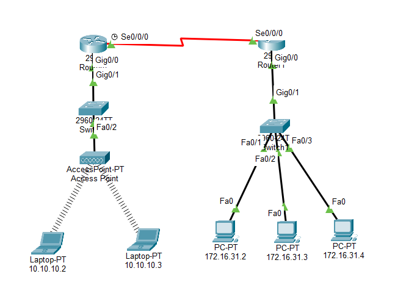
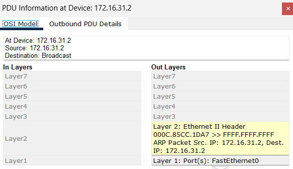
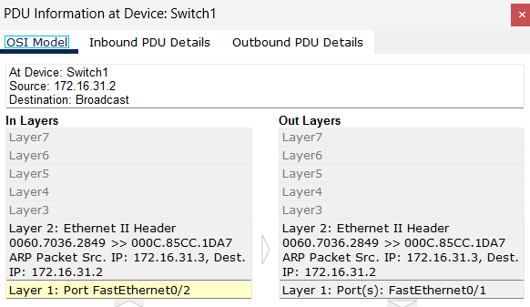
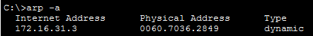
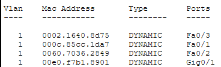
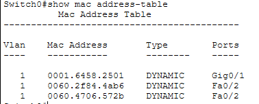
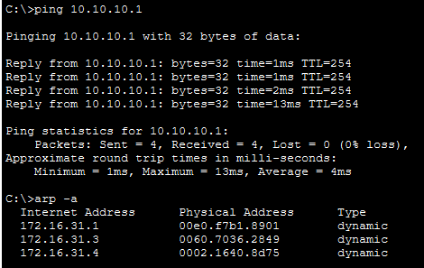
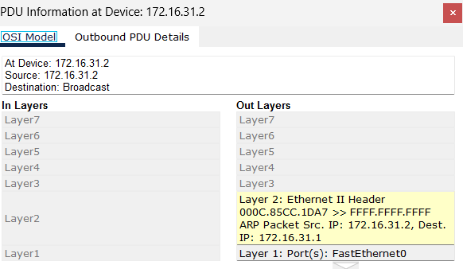
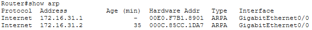

# Lab 9.2.9 — Examine the ARP Table

## Overview

This Packet Tracer lab examines how Address Resolution Protocol (ARP) resolves IPv4 addresses to MAC addresses.

The lab also examines how switches learn MAC addresses and how ARP behaves differently when communicating with local and remote devices.

---

## Objectives

- Examine an ARP request and reply.
- Examine the ARP table on an end device.
- Examine MAC address tables on switches.
- Observe how switches learn MAC addresses.
- Examine ARP during remote network communication.
- Understand the role of the default gateway in remote communication.

---
## Network Topology



## Addressing Table

| Device | Interface | MAC Address | Switch Interface |
|---|---|---|---|
| Router0 | `G0/0` | `0001.6458.2501` | `G0/1` |
| Router0 | `S0/0/0` | N/A | N/A |
| Router1 | `G0/0` | `00E0.F7B1.8901` | `G0/1` |
| Router1 | `S0/0/0` | N/A | N/A |
| `10.10.10.2` | Wireless | `0060.2F84.4AB6` | `F0/2` |
| `10.10.10.3` | Wireless | `0060.4706.572B` | `F0/2` |
| `172.16.31.2` | `F0` | `000C.85CC.1DA7` | `F0/1` |
| `172.16.31.3` | `F0` | `0060.7036.2849` | `F0/2` |
| `172.16.31.4` | `G0` | `0002.1640.8D75` | `F0/3` |

---

# Part 1 — Examine an ARP Request

## 1. Clear the ARP Table

On host `172.16.31.2`:

```cmd
arp -d
```

This clears previously learned IPv4-to-MAC address mappings.

---

## 2. Generate an ARP Request

In Simulation Mode:

```cmd
ping 172.16.31.3
```

Because `172.16.31.2` does not initially know the MAC address associated with `172.16.31.3`, it must perform ARP before the ICMP Echo Request can be delivered.



### ARP Request

```text
172.16.31.2 wants to communicate with 172.16.31.3
                         ↓
             Destination MAC unknown
                         ↓
                   ARP Request
                         ↓
             "Who has 172.16.31.3?"
```

The Ethernet destination MAC for the ARP request is:

```text
FFFF.FFFF.FFFF
```

This is the Ethernet broadcast MAC address.

### Observation

The broadcast MAC address is not assigned to one specific device.

The switch floods the ARP broadcast to the other ports in the VLAN so that the device owning the requested IPv4 address can respond.

---

## 3. Examine the ARP Reply

The device with IPv4 address:

```text
172.16.31.3
```

recognizes itself as the target and sends an ARP reply.

Its MAC address is:

```text
0060.7036.2849
```



### ARP Event Flow

| Time (sec) | Last Device | At Device | ARP Type |
|---:|---|---|---|
| `0.000` | — | `172.16.31.2` | ARP Request created |
| `0.001` | `172.16.31.2` | Switch1 | ARP Request |
| `0.002` | Switch1 | `172.16.31.3` | ARP Request |
| `0.002` | Switch1 | `172.16.31.4` | ARP Request |
| `0.002` | Switch1 | Router1 | ARP Request |
| `0.003` | `172.16.31.3` | Switch1 | ARP Reply |
| `0.004` | Switch1 | `172.16.31.2` | ARP Reply |

### Address Flow

```text
ARP REQUEST

172.16.31.2
000C.85CC.1DA7
        │
        │ Broadcast
        ▼
      Switch1
        │
        ├──────────────► Other local devices
        │
        ▼
172.16.31.3
0060.7036.2849


ARP REPLY

172.16.31.3
0060.7036.2849
        │
        │ Unicast
        ▼
      Switch1
        │
        ▼
172.16.31.2
000C.85CC.1DA7
```

### Observation

The ARP request is broadcast because the destination MAC is unknown.

The ARP reply can be sent directly back to the requesting host because the requester included its MAC address in the ARP request.

### Questions and Answers

**1. Is the destination MAC address listed in the table?**  
No. The destination is the broadcast MAC address `FFFF.FFFF.FFFF`.

**2. How many copies did Switch1 make?**  
3 copies.

**3. Which device accepted the ARP Request?**  
`172.16.31.3`

**4. What happened to the MAC addresses?**  
The ARP Request uses:
- Source MAC = `172.16.31.2` MAC
- Destination MAC = `FFFF.FFFF.FFFF` (broadcast)

The ARP Reply uses:
- Source MAC = `172.16.31.3` MAC
- Destination MAC = `172.16.31.2` MAC

**5. How many copies did Switch1 make for the ARP Reply?**  
1 copy because the ARP Reply is unicast.

---

## 4. ICMP Communication After ARP

After ARP resolves the destination MAC address, the ICMP Echo Request can be transmitted.

```text
172.16.31.2
IP:  172.16.31.2
MAC: 000C.85CC.1DA7

        ↓ ICMP

172.16.31.3
IP:  172.16.31.3
MAC: 0060.7036.2849
```

The source and destination MAC addresses now correspond with the source and destination IPv4 addresses because both devices are on the same local network.

---

## 5. Examine the ARP Table

Return to Realtime Mode and run:

```cmd
arp -a
```



The expected learned mapping is:

| IPv4 Address | MAC Address | Device |
|---|---|---|
| `172.16.31.3` | `0060.7036.2849` | Host `172.16.31.3` |

### Observation

The ARP table stores:

```text
IPv4 Address → MAC Address
```

An end device issues an ARP request when it needs the MAC address associated with a local IPv4 destination or local next hop and does not already have a usable mapping.

---

# Part 2 — Examine Switch MAC Address Tables

## 6. Generate Additional Traffic

From `172.16.31.2`:

```cmd
ping 172.16.31.4
```

From `10.10.10.2`:

```cmd
ping 10.10.10.3
```

Generating traffic allows the switches to learn additional source MAC addresses.

---

## 7. Examine Switch1 MAC Address Table

On Switch1:

```text
show mac-address-table
```



Based on the addressing table, important mappings include:

| MAC Address | Expected Port | Device |
|---|---|---|
| `000C.85CC.1DA7` | `F0/1` | `172.16.31.2` |
| `0060.7036.2849` | `F0/2` | `172.16.31.3` |
| `0002.1640.8D75` | `F0/3` | `172.16.31.4` |
| `0001.6458.2501` | `G0/1` | Router0 `G0/0` |

### Observation

A switch learns MAC addresses from the **source MAC address of incoming Ethernet frames**.

Its MAC address table stores:

```text
MAC Address → Switch Port
```

---

## 8. Examine Switch0 MAC Address Table

On Switch0:

```text
show mac-address-table
```



Important mappings include:

| MAC Address | Expected Port | Device |
|---|---|---|
| `00E0.F7B1.8901` | `G0/1` | Router1 `G0/0` |
| `0060.2F84.4AB6` | `F0/2` | `10.10.10.2` via Access Point |
| `0060.4706.572B` | `F0/2` | `10.10.10.3` via Access Point |

### Why are two MAC addresses associated with `F0/2`?

Both wireless hosts are reachable through the same Access Point.

From Switch0's perspective:

```text
10.10.10.2
0060.2F84.4AB6
       )))
        │
10.10.10.3
0060.4706.572B
       )))
        │
   Access Point
        │
        │
     Switch0
       F0/2
```

Therefore Switch0 learns:

```text
0060.2F84.4AB6 → F0/2
0060.4706.572B → F0/2
```

A single switch port can therefore have multiple MAC addresses associated with it.

---

# Part 3 — ARP in Remote Communication

## 9. Generate Remote Traffic

From `172.16.31.2`:

```cmd
ping 10.10.10.1
```

Then examine the ARP table:

```cmd
arp -a
```



### Important Observation

`10.10.10.1` is on a remote network.

Therefore, `172.16.31.2` does **not** need the MAC address of `10.10.10.1`.

Instead, it needs the MAC address of its **default gateway**.

---

## 10. Clear ARP and Repeat in Simulation Mode

Clear the ARP table:

```cmd
arp -d
```

Repeat:

```cmd
ping 10.10.10.1
```

The host first generates ARP traffic because it needs to determine the MAC address of the local router interface.



### Remote ARP Process

```text
172.16.31.2
wants to reach
10.10.10.1
        │
        ▼
Is destination local?
        │
       No
        │
        ▼
Use default gateway
        │
        ▼
ARP for gateway's MAC
        │
        ▼
Send Ethernet frame
to the router
```

### Key Difference

For local communication:

```text
ARP for destination host
```

For remote communication:

```text
ARP for default gateway
```

The source does not ARP for the remote destination because ARP broadcasts remain within the local broadcast domain.

---

## 11. Examine Router1

On Router1, enter privileged EXEC mode:

```text
enable
```

The activity then examines the router's Layer 2/ARP information.

### Router ARP Table

```text
show arp
```



The ARP table shows IPv4-to-MAC mappings learned by the router for devices on its directly connected Ethernet network.

### Observation

Routers maintain ARP information for directly connected Ethernet neighbors.

The router can respond to ARP requests for its own Ethernet interface and then route the packet toward the remote network.

The first ping may initially fail or be delayed while ARP resolution occurs.

---

# ARP Table vs MAC Address Table

| Table | Used By | Mapping | Purpose |
|---|---|---|---|
| ARP Table | PCs and routers | IPv4 → MAC | Determine the Layer 2 address for a local IPv4 destination or next hop |
| MAC Address Table | Switches | MAC → Port | Determine which switch port should forward an Ethernet frame |

### Combined Process

```text
PC
 │
 │ ARP
 ▼
IPv4 → MAC
 │
 │
 ▼
Ethernet Frame
 │
 ▼
Switch
 │
 │ MAC Address Table
 ▼
MAC → Port
 │
 ▼
Forward Frame
```

---

# Local vs Remote ARP

| Characteristic | Local Destination | Remote Destination |
|---|---|---|
| Destination IP | Local host | Remote host |
| ARP resolves | Destination host MAC | Default gateway MAC |
| ARP broadcast leaves LAN | No | No |
| Initial Ethernet destination | Local host | Router/default gateway |
| Router required | No | Yes |

---

# Important Concepts

## ARP Request

An ARP request asks:

```text
Who has this IPv4 address?
```

It is sent using the Ethernet broadcast destination:

```text
FFFF.FFFF.FFFF
```

---

## ARP Reply

The device that owns the requested IPv4 address responds with its MAC address.

The reply can then be sent directly to the requesting host.

---

## ARP Cache

An ARP cache temporarily stores:

```text
IPv4 Address → MAC Address
```

This prevents the host from having to perform ARP before every frame.

---

## MAC Address Learning

Switches learn:

```text
Source MAC Address → Incoming Port
```

The switch can then use this information when forwarding future frames.

---

## Default Gateway

A host uses its default gateway when the destination IPv4 address belongs to another network.

The host resolves:

```text
Default Gateway IP → Router MAC
```

It does not attempt to resolve the remote host's MAC address directly.

---

# Key Takeaways

- ARP resolves IPv4 addresses to MAC addresses.
- ARP operates within the local network.
- An ARP request is an Ethernet broadcast.
- An ARP reply identifies the MAC address associated with the requested IPv4 address.
- ARP entries are stored temporarily in an ARP cache.
- Switches learn source MAC addresses from incoming frames.
- A switch MAC address table maps MAC addresses to switch ports.
- One switch port can learn multiple MAC addresses when multiple devices are reachable through that port.
- For a local destination, the host resolves the destination host's MAC address.
- For a remote destination, the host resolves the default gateway's MAC address.
- Routers route packets between different IP networks.
- ARP and switch MAC learning work together to deliver Ethernet frames across a LAN.

---

## Lab Reference

**Cisco Networking Academy — CCNA: Introduction to Networks (ITN)**  
**Packet Tracer 9.2.9 — Examine the ARP Table**

This repository documents my own implementation, observations, and understanding of the activity.