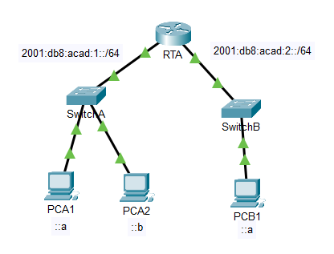
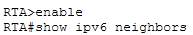
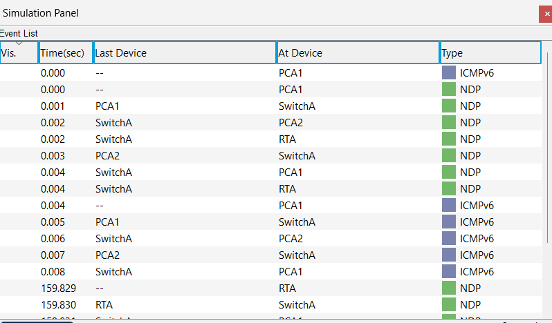
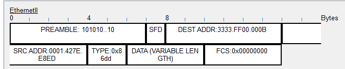
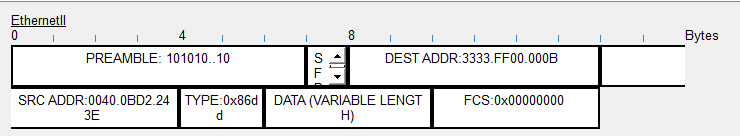
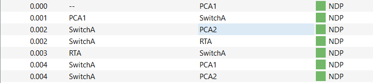
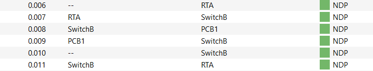
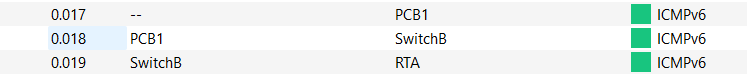
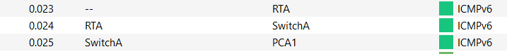
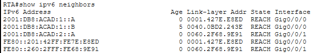

# Lab 9.3.4 — IPv6 Neighbor Discovery

## Overview

This lab explores how IPv6 Neighbor Discovery (NDP) allows IPv6 devices to discover neighboring devices and obtain the Layer 2 information required for communication.

The activity examines Neighbor Discovery when communicating with devices on both local and remote IPv6 networks.

---

## Objectives

- Examine IPv6 Neighbor Discovery on a local network.
- Observe NDP and ICMPv6 messages in Simulation Mode.
- Examine Layer 2 and Layer 3 addressing during Neighbor Discovery.
- Examine Neighbor Discovery when communicating with a remote network.
- Examine the IPv6 neighbor table on a router.
- Compare local and remote IPv6 Neighbor Discovery.

---

## Network Topology



---

## Addressing Table

| Device | Interface | IPv6 Address / Prefix | Default Gateway |
|---|---|---|---|
| RTA | G0/0/0 | `2001:db8:acad:1::1/64` | N/A |
| RTA | G0/0/1 | `2001:db8:acad:1::1/64` | N/A |
| PCA1 | NIC | `2001:db8:acad:1::A/64` | `fe80::1` |
| PCA2 | NIC | `2001:db8:acad:1::B/64` | `fe80::1` |
| PCB1 | NIC | `2001:db8:acad:2::A/64` | `fe80::1` |

> The addressing table above follows the Cisco lab document. The actual interface configuration can be verified in Packet Tracer during the lab.

---

# Part 1 — IPv6 Neighbor Discovery: Local Network

## 1. Check the IPv6 Neighbor Table

The existing IPv6 neighbor entries on RTA were checked using:

```cisco
enable
show ipv6 neighbors
```

Existing dynamically learned entries can be cleared using:

```cisco
clear ipv6 neighbors
```

This provides a clean starting point for observing the Neighbor Discovery process.



---

## 2. Generate Local IPv6 Traffic

PCA1 was used to ping PCA2:

```cmd
ping -n 1 2001:db8:acad:1::b
```

Both devices are on the same IPv6 network.

Packet Tracer was changed to **Simulation Mode** with the following filters:

- ICMPv6
- NDP



---

## 3. Examine Neighbor Discovery

Before PCA1 can send the ICMPv6 Echo Request, it needs the Layer 2 information required to reach PCA2.

IPv6 Neighbor Discovery is used to obtain this information.

### Simplified Process

```text
PCA1
  │
  │ Neighbor Discovery
  ▼
SwitchA
  │
  ▼
PCA2
  │
  │ Neighbor information returned
  ▼
PCA1
  │
  │ ICMPv6 Echo Request
  ▼
PCA2
```

---

## 4. Neighbor Solicitation

PCA1 sends a Neighbor Discovery message to locate the required neighbor.

- DEST ADDR: `3333.FF00.000B`
- SRC ADDR:  `0001.427E.E8ED`

3333.FF00.000B is a multicast MAC address, not FFFF.FFFF.FFFF like an IPv4 ARP broadcast.



---

## 5. Neighbor Advertisement

The destination provides the required neighbor information back to PCA1.

- DEST ADDR: `3333.FF00.000B`
- SRC ADDR:  `0040.0BD2.243E`

After the information is learned, PCA1 has the Layer 2 information necessary to communicate with PCA2.



---

## 6. Complete the Local Ping

After Neighbor Discovery is completed, PCA1 can send the ICMPv6 Echo Request to PCA2.

The communication completes with an ICMPv6 Echo Reply.

|          Time | Protocol | Meaning                  |
| ------------: | -------- | ------------------------ |
| `0.000–0.004` | NDP      | Neighbor Discovery       |
| `0.004–0.006` | ICMPv6   | Echo Request toward PCA2 |
| `0.007–0.008` | ICMPv6   | Echo Reply toward PCA1   |


### Observation

The first communication requires Neighbor Discovery because PCA1 does not initially have the required Layer 2 information.

When the ping is repeated, NDP events may no longer appear because the neighbor information has already been learned.

---

# Part 2 — IPv6 Neighbor Discovery: Remote Network

## 1. Generate Remote IPv6 Traffic

PCA1 was used to ping PCB1:

```cmd
ping -n 1 2001:db8:acad:2::a
```

Unlike PCA2, PCB1 is located on another IPv6 network.

Simulation Mode was again used with:

- ICMPv6
- NDP



| Stage | Approx. Time | From | To | Protocol | What Happens |
|---|---:|---|---|---|---|
| 1 | `0.000` | PCA1 | — | ICMPv6 | PCA1 creates an Echo Request for remote host PCB1. |
| 2 | `0.000–0.004` | PCA1 | RTA | NDP | PCA1 discovers the Layer 2 information for its default gateway, RTA. |
| 3 | `0.005–0.006` | PCA1 | RTA | ICMPv6 | PCA1 sends the Echo Request to RTA through SwitchA. |
| 4 | `0.006–0.011` | RTA | PCB1 | NDP | RTA discovers the Layer 2 information required to reach PCB1 through SwitchB. |
| 5 | `0.011–0.013` | RTA | PCB1 | ICMPv6 | RTA forwards the Echo Request to PCB1. |
| 6 | `0.013–0.017` | PCB1 | RTA | NDP | PCB1 obtains the Layer 2 information required for the return path through RTA. |
| 7 | `0.017–0.019` | PCB1 | RTA | ICMPv6 | PCB1 sends the Echo Reply toward RTA. |
| 8 | `0.019–0.023` | RTA | Local LAN | NDP | Additional Neighbor Discovery occurs before RTA forwards the reply toward PCA1. |
| 9 | `0.023–0.025` | RTA | PCA1 | ICMPv6 | RTA forwards the Echo Reply through SwitchA to PCA1. |
---

## 2. Discover the Next Hop

Because PCB1 is on a remote network, PCA1 cannot send the Ethernet frame directly to PCB1.

PCA1 first needs the Layer 2 information for its local router/default gateway.

```text
PCA1
  │
  │ NDP
  ▼
RTA
```

PCA1 can then create the Ethernet frame required to send the IPv6 packet toward RTA.



---

## 3. Router Neighbor Discovery

After RTA receives the IPv6 packet, it determines that PCB1 is reachable through another directly connected network.

If RTA does not already know the necessary Layer 2 information for PCB1, it performs Neighbor Discovery on that LAN.

```text
PCA1
   │
   ▼
SwitchA
   │
   ▼
  RTA
   │
   │ Neighbor Discovery
   ▼
Destination LAN
   │
   ▼
 PCB1
```

Therefore, Neighbor Discovery occurs independently on each local network where Layer 2 information is required.

---

## 4. Complete the Remote Ping

Once the necessary neighbor information has been learned, the ICMPv6 Echo Request can reach PCB1.

PCB1 then returns an ICMPv6 Echo Reply toward PCA1.




---

# IPv6 Neighbor Table

RTA's IPv6 neighbor table was examined using:

```cisco
show ipv6 neighbors
```

The table contains IPv6 neighbors that RTA has learned on its directly connected networks.



| Device | Interface | Global Unicast IPv6 | Link-Local IPv6 | MAC Address | RTA Interface |
|---|---|---|---|---|---|
| **PCA1** | NIC | `2001:DB8:ACAD:1::A` | `FE80::201:42FF:FE7E:E8ED` | `0001.427E.E8ED` | `G0/0/0` |
| **PCA2** | NIC | `2001:DB8:ACAD:1::B` | Not shown in current table | `0040.0BD2.243E` | `G0/0/0` |
| **PCB1** | NIC | `2001:DB8:ACAD:2::A` | `FE80::260:2FFF:FE68:9E91` | `0060.2F68.9E91` | `G0/0/1` |

---

# Local vs Remote Neighbor Discovery

| Scenario | Neighbor Information Required |
|---|---|
| Local destination | Destination host |
| Remote destination | Local router/default gateway |
| Router forwarding to destination LAN | Destination/next-hop neighbor on that LAN |

### Local Communication

```text
PCA1 ─── NDP ───> PCA2
```

PCA1 discovers information about **PCA2**.

### Remote Communication

```text
PCA1 ─── NDP ───> RTA ─── NDP ───> PCB1
```

PCA1 discovers its **next hop**, while RTA may separately discover the destination on its directly connected LAN.

---

# IPv4 ARP vs IPv6 Neighbor Discovery

| IPv4 | IPv6 |
|---|---|
| ARP | Neighbor Discovery (NDP) |
| ARP Request | Neighbor Solicitation |
| ARP Reply | Neighbor Advertisement |
| ARP protocol | ICMPv6 |
| Uses broadcast for ARP Request | Uses multicast for Neighbor Discovery |
| `arp -a` | `show ipv6 neighbors` on the router |
| Resolves IPv4-to-MAC information | Discovers IPv6 neighbor Layer 2 information |

---

# Important Commands

## RTA

```cisco
show ipv6 neighbors
clear ipv6 neighbors
```

## PCA1 — Local Communication

```cmd
ping -n 1 2001:db8:acad:1::b
```

## PCA1 — Remote Communication

```cmd
ping -n 1 2001:db8:acad:2::a
```

---

# Key Findings

- IPv6 uses Neighbor Discovery instead of ARP.
- Neighbor Discovery operates through ICMPv6.
- NDP can determine the Layer 2 information required for IPv6 communication.
- Neighbor Discovery uses multicast rather than the IPv4 ARP broadcast mechanism.
- A local host discovers information about the local destination.
- For remote communication, the source host needs information about its local router/default gateway.
- A router may perform another Neighbor Discovery process on the destination LAN.
- Learned neighbors are stored in an IPv6 neighbor table.
- Previously learned neighbor information can prevent NDP from being repeated for every packet.

---

# Lab Reference

Cisco Networking Academy — Packet Tracer 9.3.4: IPv6 Neighbor Discovery