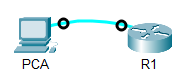
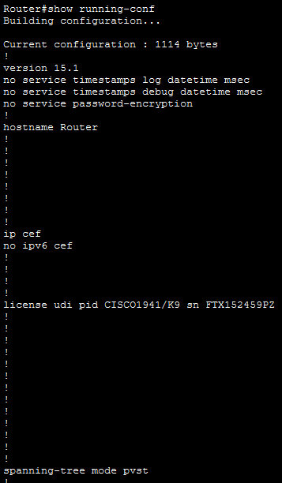
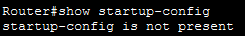
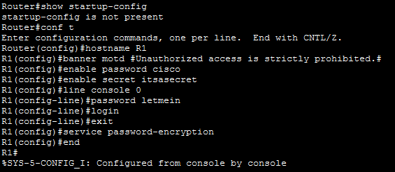
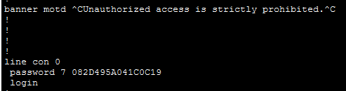
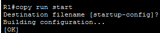
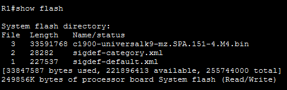
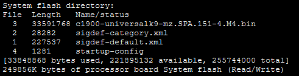

# Lab 10.1.4 — Configure Initial Router Settings

## Overview

This lab focuses on performing the initial configuration of a Cisco router.

The activity includes examining the router's default configuration, configuring basic security settings, protecting console and privileged EXEC access, configuring a message-of-the-day banner, verifying the configuration, and saving the running configuration.

---

## Objectives

- Verify the default router configuration.
- Establish a console connection to the router.
- Configure the router hostname.
- Configure privileged EXEC passwords.
- Configure console access security.
- Encrypt plain-text passwords.
- Configure a message-of-the-day banner.
- Verify the router configuration.
- Save the running configuration to NVRAM.
- Optionally back up the startup configuration to flash.

---

## Network Topology



---

# Part 1 — Verify the Default Router Configuration

## 1. Establish a Console Connection

PCA was connected to R1 using a console cable.

### Connection

| Device | Port |
|---|---|
| PCA | `RS-232` |
| R1 | `Console` |

The router CLI was accessed through:

```text
PCA → Desktop → Terminal
```

---

## 2. Enter Privileged EXEC Mode

The router was accessed using:

```cisco
enable
```

The prompt changed from:

```text
Router>
```

to:

```text
Router#
```

This indicates privileged EXEC mode.

---

## 3. Examine the Running Configuration

The current router configuration was viewed using:

```cisco
show running-config
```



### Observations

| Item | Result |
|---|---|
| Default hostname | `Router` |
| FastEthernet interfaces | `0/1/0`, `0/1/1`, `0/1/2`, `0/1/3` |
| GigabitEthernet interfaces | `0/0`, `0/1` |
| Serial interfaces | `0/0/0`, `0/0/1` |
| VTY line range | `0-4` |

---

## 4. Examine the Startup Configuration

The startup configuration was checked using:

```cisco
show startup-config
```

The router displayed:

```text
startup-config is not present
```



### Observation

The message appears because no configuration has yet been saved to NVRAM.

---

# Part 2 — Configure and Verify the Initial Router Configuration

## 1. Configure the Hostname

Enter global configuration mode:

```cisco
configure terminal
```

Configure the router hostname:

```cisco
hostname R1
```

The prompt changes to:

```text
R1(config)#
```

---

## 2. Configure the MOTD Banner

Configure the message-of-the-day banner:

```cisco
banner motd #Unauthorized access is strictly prohibited.#
```

The banner warns users that unauthorized access is prohibited.

---

## 3. Configure Privileged EXEC Passwords

Configure the unencrypted enable password:

```cisco
enable password cisco
```

Configure the encrypted enable secret:

```cisco
enable secret itsasecret
```

The `enable secret` takes precedence over the `enable password`.

---

## 4. Configure Console Security

Enter console line configuration:

```cisco
line console 0
```

Configure the console password:

```cisco
password letmein
```

Require password authentication:

```cisco
login
```

Return to global configuration mode:

```cisco
exit
```

---

## 5. Encrypt Plain-Text Passwords

Enable password encryption:

```cisco
service password-encryption
```

This prevents supported plain-text passwords from being displayed directly in the configuration.

---

## Complete Initial Configuration

```cisco
enable
configure terminal

hostname R1

banner motd #Unauthorized access is strictly prohibited.#

enable password cisco
enable secret itsasecret

line console 0
password letmein
login
exit

service password-encryption

end
```



---

# Verification

## 1. Verify the Running Configuration

The router configuration was verified using:

```cisco
show running-config
```

The output was checked to confirm:

- Hostname is `R1`.
- MOTD banner is configured.
- Console password is configured.
- Console login is enabled.
- Enable secret is configured.
- Password encryption is enabled.

---

## 2. Verify Console Login

The console session was exited and restarted.

The router displayed:

```text
Unauthorized access is strictly prohibited.

User Access Verification

Password:
```



The console password used was:

```text
letmein
```

---

## 3. Verify Privileged EXEC Access

After reaching user EXEC mode, privileged EXEC mode was accessed using:

```cisco
enable
```

The password used was:

```text
itsasecret
```

### Observation

The `enable secret` password is used instead of the `enable password` because the encrypted enable secret has higher priority.

---

# Part 3 — Save the Running Configuration

## 1. Save to NVRAM

The running configuration was saved using:

```cisco
copy running-config startup-config
```

The shorter unambiguous version is:

```cisco
copy run start
```



This ensures the configuration is retained after a reboot or power loss.

---

## 2. Verify the Startup Configuration

The saved configuration can be verified using:

```cisco
show startup-config
```

The configured hostname, passwords, banner, and other settings should now appear.

---

# Optional — Back Up the Startup Configuration to Flash

## 1. Examine Flash Storage

Flash contents were viewed using:

```cisco
show flash
```



The IOS image can usually be identified by its Cisco IOS image filename and relatively large file size.

---

## 2. Copy Startup Configuration to Flash

The startup configuration was backed up using:

```cisco
copy startup-config flash
```

When prompted:

```text
Destination filename [startup-config]?
```

Press:

```text
Enter
```

to accept the default filename.

---

## 3. Verify the Backup

Run:

```cisco
show flash
```

again.



The `startup-config` file should now appear in flash storage.

---

# Important Commands

| Purpose | Command |
|---|---|
| Enter privileged EXEC mode | `enable` |
| View running configuration | `show running-config` |
| View startup configuration | `show startup-config` |
| Enter global configuration mode | `configure terminal` |
| Configure hostname | `hostname R1` |
| Configure enable password | `enable password cisco` |
| Configure enable secret | `enable secret itsasecret` |
| Configure console line | `line console 0` |
| Configure console password | `password letmein` |
| Require console authentication | `login` |
| Encrypt passwords | `service password-encryption` |
| Configure MOTD banner | `banner motd #Unauthorized access is strictly prohibited.#` |
| Save configuration | `copy running-config startup-config` |
| View flash | `show flash` |
| Back up startup config to flash | `copy startup-config flash` |

---

# Key Findings

- Cisco routers initially use the hostname `Router`.
- Privileged EXEC mode provides access to administrative commands.
- Console access should be protected using a password and the `login` command.
- `enable secret` is preferred over `enable password`.
- `service password-encryption` prevents supported passwords from appearing as plain text.
- MOTD banners provide an administrative/security warning to users accessing the router.
- The running configuration is stored in RAM.
- The startup configuration is stored in NVRAM.
- `copy running-config startup-config` preserves the configuration after reboot.
- The startup configuration can also be backed up to flash.

---

# Running Configuration vs Startup Configuration

| Configuration | Storage | Purpose |
|---|---|---|
| Running configuration | RAM | Current active router configuration |
| Startup configuration | NVRAM | Configuration loaded when the router starts |

---

# Lab Reference

Cisco Networking Academy — Packet Tracer 10.1.4: Configure Initial Router Settings