# Lab 10.3.4 — Connect a Router to a LAN

## Overview

This lab focuses on examining, configuring, and verifying router interfaces in a multi-network topology.

Router information is first examined using Cisco IOS `show` commands. The Ethernet interfaces on R1 and R2 are then configured with IPv4 addresses, activated, and documented with descriptions. Finally, interface status, routing tables, and end-to-end connectivity are verified.

---

## Objectives

- Display router interface information.
- Examine interface status and addressing.
- Examine the IPv4 routing table.
- Configure router Ethernet interfaces.
- Assign IPv4 addresses and subnet masks.
- Activate interfaces using `no shutdown`.
- Configure interface descriptions.
- Save router configurations to NVRAM.
- Verify interface configuration and routing.
- Test end-to-end network connectivity.

---

## Network Topology

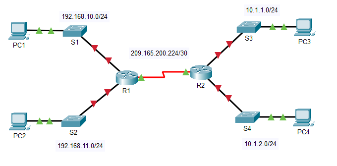

The topology contains two routers connected by a serial WAN link. Each router connects to two separate LANs.

---

## Addressing Table

| Device | Interface | IPv4 Address | Subnet Mask | Default Gateway |
|---|---|---|---|---|
| R1 | G0/0 | `192.168.10.1` | `255.255.255.0` | N/A |
| R1 | G0/1 | `192.168.11.1` | `255.255.255.0` | N/A |
| R1 | S0/0/0 (DCE) | `209.165.200.225` | `255.255.255.252` | N/A |
| R2 | G0/0 | `10.1.1.1` | `255.255.255.0` | N/A |
| R2 | G0/1 | `10.1.2.1` | `255.255.255.0` | N/A |
| R2 | S0/0/0 | `209.165.200.226` | `255.255.255.252` | N/A |
| PC1 | NIC | `192.168.10.10` | `255.255.255.0` | `192.168.10.1` |
| PC2 | NIC | `192.168.11.10` | `255.255.255.0` | `192.168.11.1` |
| PC3 | NIC | `10.1.1.10` | `255.255.255.0` | `10.1.1.1` |
| PC4 | NIC | `10.1.2.10` | `255.255.255.0` | `10.1.2.1` |

---

# Part 1 — Display Router Information

## 1. Examine Router Interfaces

R1 was accessed through the CLI using:

```cisco
enable
```

The following commands were used to examine interface information:

```cisco
show interfaces
show interfaces serial 0/0/0
show interfaces gigabitethernet 0/0
```

These commands provide information such as:

- Interface status
- IPv4 address
- MAC address
- Bandwidth
- Line protocol status
- Traffic statistics

| Question | Answer |
|---|---|
| Command to display all interface statistics | `show interfaces` |
| Command for Serial0/0/0 only | `show interfaces serial 0/0/0` |
| R1 S0/0/0 IP address | `209.165.200.225` |
| R1 S0/0/0 bandwidth | `1.544 mbps` |
| R1 G0/0 IP address | `Initially unassigned` |
| R1 G0/0 MAC address | `000d.bd6c.7d01` |
| R1 G0/0 bandwidth | `100 mbps` |

---

## 2. Examine the Interface Summary

A concise interface summary was displayed using:

```cisco
show ip interface brief
```

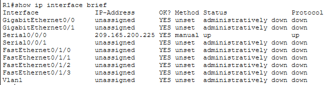

This command provides:

| Information | Displayed? |
|---|---|
| Interface name | Yes |
| IPv4 address | Yes |
| Interface status | Yes |
| Line protocol status | Yes |
| Subnet mask | No |

`show ip interface brief` is useful for quickly identifying whether router interfaces are correctly addressed and operational.

| Question | R1 | R2 |
|---|---|---|
| Serial interfaces | `2` | `2` |
| Ethernet interfaces | `6` | `2` |
| GigabitEthernet interfaces | `2` | `2` |
| FastEthernet interfaces | `4` | `0` |
| Are all Ethernet interfaces the same? | No | No |
| Difference | `2` GigabitEthernet and `4` FastEthernet interfaces | 2 GigabitEthernet only |

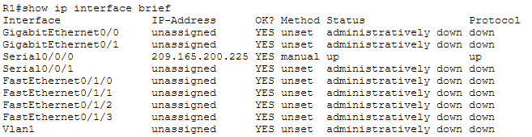
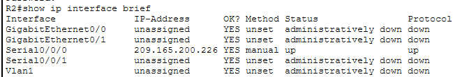

---

## 3. Examine the Routing Table

The IPv4 routing table was displayed using:

```cisco
show ip route
```

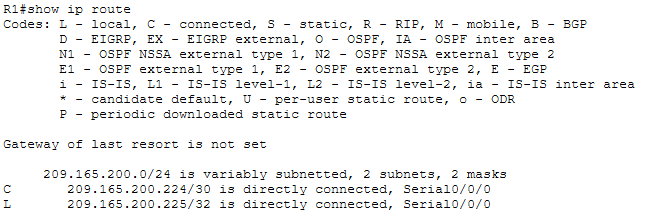

### Important Route Codes

| Code | Meaning |
|---|---|
| `C` | Directly connected network |
| `L` | Local interface address |
| `O` | Route learned through OSPF |

| Code / Item            | Route / Value        | Meaning                                          |
| ---------------------- | -------------------- | ------------------------------------------------ |
| `C` — Connected        | `209.165.200.224/30` | Directly connected WAN network                   |
| `L` — Local            | `209.165.200.225/32` | R1's own `S0/0/0` IP address                     |
| Interface              | `Serial0/0/0`        | Interface connected to the WAN                   |
| Connected routes (`C`) | `1`                  | One directly connected network                   |
| Gateway of last resort | Not set              | No default route is currently configured         |
| No matching route      | Packet is dropped    | Applies when no matching or default route exists |

A router uses its routing table to determine where packets should be forwarded.

---

# Part 2 — Configure Router Interfaces

## 1. Configure R1 G0/0

R1's first LAN interface was configured as:

```cisco
configure terminal

interface gigabitethernet 0/0
ip address 192.168.10.1 255.255.255.0
description LAN connection to S1
no shutdown

end
```

After the interface was activated, R1 could communicate with PC1.

Verification:

```cisco
ping 192.168.10.10
```

---

## 2. Configure R1 G0/1

The second LAN interface on R1 was configured as:

```cisco
configure terminal

interface gigabitethernet 0/1
ip address 192.168.11.1 255.255.255.0
description LAN connection to S2
no shutdown

end
```

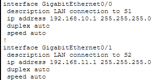

### R1 Interface Summary

| Interface | IPv4 Address | Network | Purpose |
|---|---|---|---|
| G0/0 | `192.168.10.1/24` | `192.168.10.0/24` | PC1 LAN |
| G0/1 | `192.168.11.1/24` | `192.168.11.0/24` | PC2 LAN |
| S0/0/0 | `209.165.200.225/30` | `209.165.200.224/30` | WAN to R2 |

---

## 3. Configure R2 G0/0

```cisco
configure terminal

interface gigabitethernet 0/0
ip address 10.1.1.1 255.255.255.0
description LAN connection to S3
no shutdown

end
```

---

## 4. Configure R2 G0/1

```cisco
configure terminal

interface gigabitethernet 0/1
ip address 10.1.2.1 255.255.255.0
description LAN connection to S4
no shutdown

end
```

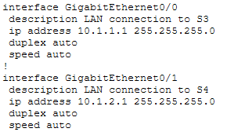

### R2 Interface Summary

| Interface | IPv4 Address | Network | Purpose |
|---|---|---|---|
| G0/0 | `10.1.1.1/24` | `10.1.1.0/24` | PC3 LAN |
| G0/1 | `10.1.2.1/24` | `10.1.2.0/24` | PC4 LAN |
| S0/0/0 | `209.165.200.226/30` | `209.165.200.224/30` | WAN to R1 |

---

## 5. Save the Configurations

The configurations on both routers were saved to NVRAM:

```cisco
copy running-config startup-config
```

This copies the active `running-config` from RAM to the `startup-config` stored in NVRAM.

---

# Part 3 — Verify the Configuration

## 1. Verify R1 Interfaces

```cisco
show ip interface brief
```

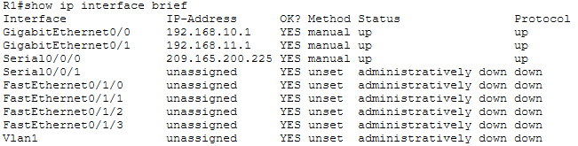

The configured interfaces should display the correct IPv4 addresses and an operational state of:

```text
up     up
```

This means:

```text
Status = up
Protocol = up
```

The physical interface and its line protocol are both operational.

---

## 2. Verify R2 Interfaces

```cisco
show ip interface brief
```

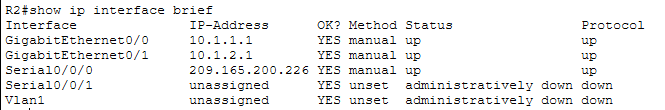

---

## 3. Verify R1 Routing Table

```cisco
show ip route
```

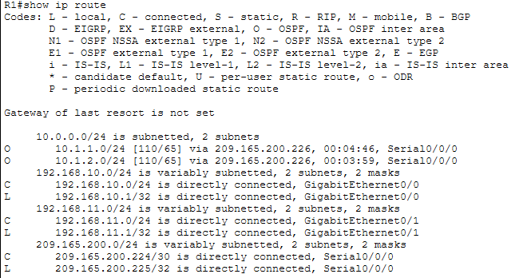

The routing table should contain:

- Directly connected routes (`C`)
- Local routes (`L`)
- OSPF-learned routes (`O`)

---

## 4. Verify R2 Routing Table

```cisco
show ip route
```

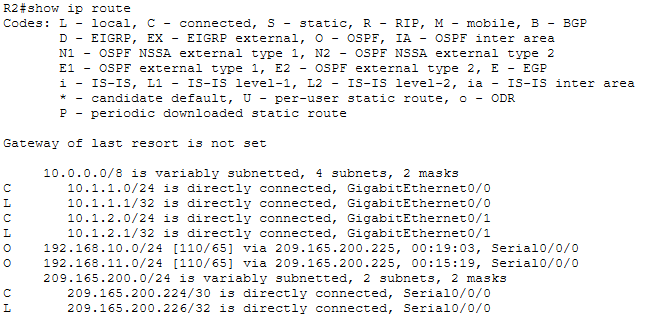

The routers should have routes that allow them to reach all LANs and the WAN in the topology.

---

## Network Summary

| Network | Type | Connected To |
|---|---|---|
| `192.168.10.0/24` | LAN | R1 G0/0 |
| `192.168.11.0/24` | LAN | R1 G0/1 |
| `209.165.200.224/30` | WAN | R1 ↔ R2 |
| `10.1.1.0/24` | LAN | R2 G0/0 |
| `10.1.2.0/24` | LAN | R2 G0/1 |

The topology therefore contains:

- **4 LANs**
- **1 WAN**
- **5 networks total**

---

# End-to-End Connectivity Testing

Connectivity was tested across the complete network.

### PC1 to PC4

From PC1:

```cmd
ping 10.1.2.10
```

### R2 to PC2

From R2:

```cisco
ping 192.168.11.10
```

Successful communication confirms that:

1. Host IPv4 addressing is correct.
2. Default gateways are correct.
3. Router interfaces are operational.
4. Routing information is available.
5. Packets can travel between the LANs through R1 and R2.

---

# Important Commands

| Command | Purpose |
|---|---|
| `show interfaces` | Display detailed statistics for all interfaces |
| `show interfaces serial 0/0/0` | Display detailed information for S0/0/0 |
| `show interfaces gigabitethernet 0/0` | Display detailed information for G0/0 |
| `show ip interface brief` | Display a concise interface summary |
| `show ip route` | Display the IPv4 routing table |
| `interface gigabitethernet 0/0` | Enter G0/0 configuration mode |
| `ip address <IP> <mask>` | Assign an IPv4 address |
| `description <text>` | Document an interface |
| `no shutdown` | Administratively enable an interface |
| `ping <IP>` | Test connectivity |
| `copy running-config startup-config` | Save the configuration to NVRAM |

---

# Key Findings

- Router interfaces require appropriate Layer 3 addressing before they can route traffic for their networks.
- `show interfaces` provides detailed interface information.
- `show ip interface brief` provides a quick overview of interface addressing and operational status.
- `show ip route` displays the networks known by the router.
- `C` identifies directly connected routes.
- `L` identifies the router's own interface addresses.
- `O` identifies routes learned through OSPF.
- `no shutdown` activates a router interface.
- Interface descriptions help document physical and logical connections.
- Each PC uses its local router interface as its default gateway.
- R1 and R2 communicate through the `209.165.200.224/30` serial WAN.
- End-to-end connectivity requires correct host addressing, interface configuration, and routing.
- The running configuration should be saved to NVRAM to preserve it after a restart.

---

# Lab Reference

Cisco Networking Academy — Packet Tracer 10.3.4: Connect a Router to a LAN