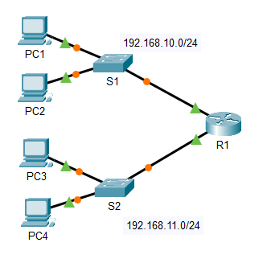
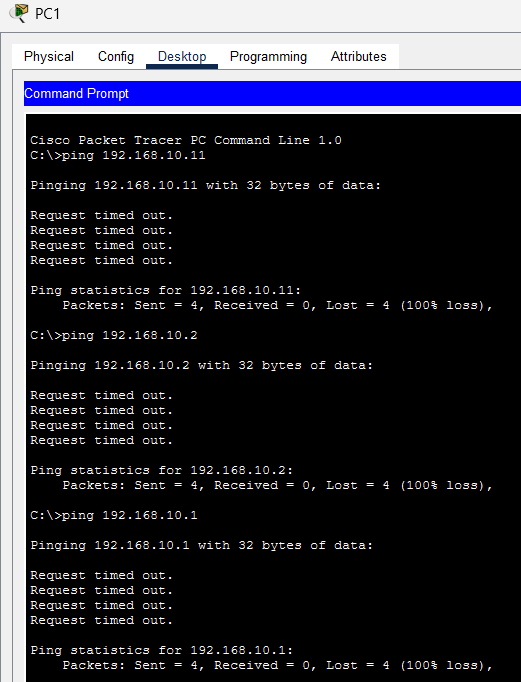
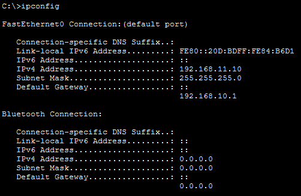
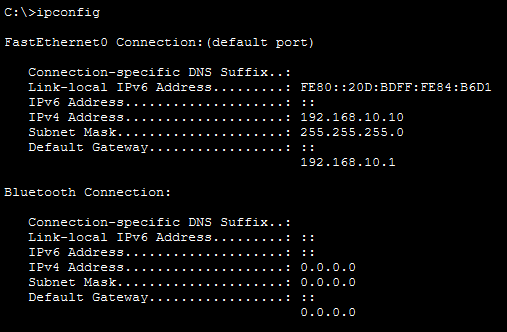
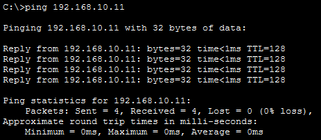
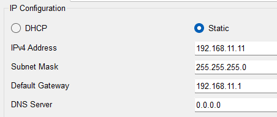
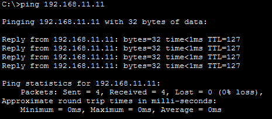

# Lab 10.3.5 — Troubleshoot Default Gateway Issues

## Overview

This lab focuses on troubleshooting IPv4 connectivity problems caused by incorrect host addressing and default gateway configuration.

A structured troubleshooting process is used to:

- Verify network documentation
- Test local connectivity
- Isolate problems
- Identify the cause
- Implement a solution
- Retest connectivity
- Document the result

---

## Objectives

- Complete missing network documentation.
- Verify local network connectivity.
- Identify incorrect IPv4 configuration.
- Troubleshoot default gateway issues.
- Implement configuration corrections.
- Verify local and remote connectivity.
- Document identified problems and solutions.

---

## Network Topology



---

## Addressing Table

| Device | Interface | IPv4 Address | Subnet Mask | Default Gateway |
|---|---|---|---|---|
| R1 | G0/0 | `192.168.10.1` | `255.255.255.0` | N/A |
| R1 | G0/1 | `192.168.11.1` | `255.255.255.0` | N/A |
| S1 | VLAN 1 | `192.168.10.2` | `255.255.255.0` | `192.168.10.1` |
| S2 | VLAN 1 | `192.168.11.2` | `255.255.255.0` | `192.168.11.1` |
| PC1 | NIC | `192.168.10.10` | `255.255.255.0` | `192.168.10.1` |
| PC2 | NIC | `192.168.10.11` | `255.255.255.0` | `192.168.10.1` |
| PC3 | NIC | `192.168.11.10` | `255.255.255.0` | `192.168.11.1` |
| PC4 | NIC | `192.168.11.11` | `255.255.255.0` | `192.168.11.1` |

---

# Part 1 — Verify Documentation and Isolate Problems

## 1. Complete the Default Gateway Information

Devices on the `192.168.10.0/24` network use:

```text
192.168.10.1
```

Devices on the `192.168.11.0/24` network use:

```text
192.168.11.1
```

The default gateway must be the IP address of the router interface connected to the device's local network.

---

## 2. Test Local Connectivity

Connectivity was first tested between devices on the same LAN.

Examples:

```cmd
ping 192.168.10.11
```

```cmd
ping 192.168.10.2
```

```cmd
ping 192.168.10.1
```

| Test | Successful? | Issue | Solution | Verified |
|---|---|---|---|---|
| PC1 → PC2 (`192.168.10.11`) | ❌ No | Incorrect IP address on PC1 | Change PC1 IP address to `192.168.10.10` | ⬜ |
| PC1 → S1 (`192.168.10.2`) | ❌ No | Incorrect IP address on PC1 | Change PC1 IP address to `192.168.10.10` | ⬜ |
| PC1 → R1 (`192.168.10.1`) | ❌ No | Incorrect IP address on PC1 | Change PC1 IP address to `192.168.10.10` | ⬜ |



Local testing helps determine whether the problem is caused by:

- Host IP addressing
- Subnet mask
- Default gateway
- Local connection

---

## 3. Verify Host Addressing

PC addressing was checked using:

```cmd
ipconfig
```



The lab identifies PC1's incorrect IP address as the first known issue.

The expected configuration is:

```text
IP Address:      192.168.10.10
Subnet Mask:     255.255.255.0
Default Gateway: 192.168.10.1
```

---

## Troubleshooting Documentation

| Test | Successful? | Issue | Solution | Verified |
|---|---|---|---|---|
| PC1 → PC2 | ❌ No | Incorrect IP address on PC1 | Correct PC1 IP address | ✅ |
| PC1 → S1 | ✅ Yes | None after PC1 correction | No further action required | ✅ |
| PC1 → R1 | ✅ Yes | None after PC1 correction | No further action required | ✅ |
| PC1 → PC3 | ✅ Yes | None | No action required | ✅ |
| PC1 → PC4 | ❌ No | Suspected PC4 addressing/default gateway issue | Investigate PC4 configuration | ⬜ |

---

# Part 2 — Implement and Verify Solutions

## 1. Correct PC1 Addressing

PC1 was updated to match the documented network configuration.

```text
IP Address:      192.168.10.10
Subnet Mask:     255.255.255.0
Default Gateway: 192.168.10.1
```



---

## 2. Retest Local Connectivity

After correcting the configuration, the original test was repeated.

```cmd
ping 192.168.10.11
```

Successful connectivity confirms that the correction resolved the local issue.



---

## 3. Verify Default Gateways

Each switch and PC was checked to ensure it uses the correct router interface as its default gateway.

### Network `192.168.10.0/24`

```text
Default Gateway = 192.168.10.1
```

Used by:

- S1
- PC1
- PC2

### Network `192.168.11.0/24`

```text
Default Gateway = 192.168.11.1
```

Used by:

- S2
- PC3
- PC4



---

# End-to-End Connectivity

After all local issues were corrected, remote connectivity was tested.

Example:

```cmd
PC1 → ping 192.168.11.11
```

This tests communication from:

```text
PC1
192.168.10.10
      ↓
     R1
      ↓
PC4
192.168.11.11
```



Successful communication confirms that:

- Host IP addresses are correct.
- Subnet masks are correct.
- Default gateways are correct.
- Local connectivity works.
- R1 can route traffic between the two LANs.

---

# Troubleshooting Method

The troubleshooting process used in this lab was:

| Step | Action |
|---|---|
| 1 | Verify network documentation |
| 2 | Test connectivity |
| 3 | Isolate the problem |
| 4 | Identify the cause |
| 5 | Suggest one solution |
| 6 | Implement the solution |
| 7 | Retest connectivity |
| 8 | Document the result |

---

# Local vs Remote Communication

| Communication | Default Gateway Required? |
|---|---|
| Same subnet | No |
| Different subnet | Yes |

Example:

```text
PC1 → PC2
192.168.10.10 → 192.168.10.11
```

Both hosts are on the same subnet, so traffic can be delivered locally.

But:

```text
PC1 → PC4
192.168.10.10 → 192.168.11.11
```

The destination is on another network, so PC1 sends the packet to:

```text
192.168.10.1
```

which is its default gateway.

---

# Key Findings

- A host needs a correct IP address and subnet mask for local communication.
- A default gateway is required to communicate with remote networks.
- The default gateway should be the local router interface address.
- Devices on the same subnet communicate directly.
- Devices on different subnets send remote traffic to the default gateway.
- Local connectivity should be verified before testing remote connectivity.
- Troubleshooting should be performed systematically.
- One solution should be implemented and verified at a time.
- Configuration changes should be retested after each correction.
- Clear troubleshooting documentation helps identify and verify network issues.

---

# Lab Reference

Cisco Networking Academy — Packet Tracer 10.3.5: Troubleshoot Default Gateway Issues