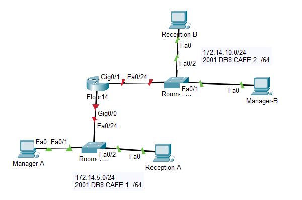
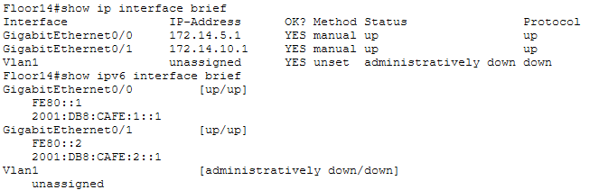
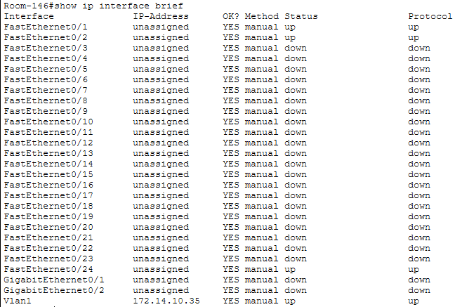
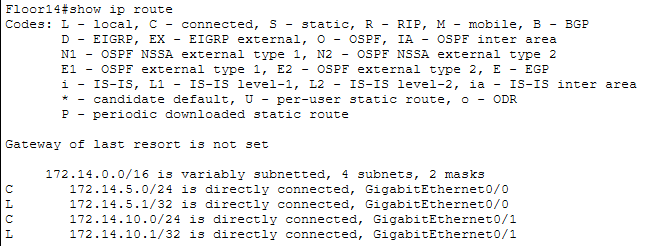
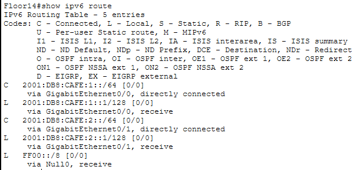
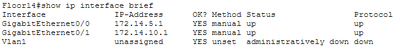
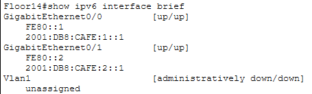

# Lab 10.4.3 — Build a Switch and Router Network (Physical Mode)

## Overview

This lab combines previously learned networking and Cisco IOS skills to build, configure, and verify a small routed network in Packet Tracer Physical Mode.

The topology contains two IPv4/IPv6 LANs:

- Room 145
- Room 146

Both LANs are connected through the Floor14 router.

---

## Objectives

- Build and cable the physical topology.
- Configure IPv4 and IPv6 addressing.
- Configure router interfaces.
- Configure switch management interfaces.
- Configure default gateways.
- Enable IPv6 routing.
- Verify local and remote connectivity.
- Examine router interfaces and routing information.
- Save device configurations.

---

## Network Topology



---

## Network Information

| LAN | Router Interface | IPv4 Network | IPv6 Prefix |
|---|---|---|---|
| Room 145 | `G0/0` | `172.14.5.0/24` | `2001:DB8:CAFE:1::/64` |
| Room 146 | `G0/1` | `172.14.10.0/24` | `2001:DB8:CAFE:2::/64` |

---

## Addressing Table

| Device | Interface | IPv4 Address | IPv6 Address | IPv4 Default Gateway | IPv6 Default Gateway |
|---|---|---|---|---|---|
| Floor14 | G0/0 | `172.14.5.1/24` | `2001:DB8:CAFE:1::1/64` | N/A | N/A |
| Floor14 | G0/1 | `172.14.10.1/24` | `2001:DB8:CAFE:2::1/64` | N/A | N/A |
| Room 145 | VLAN 1 | `172.14.5.2/24` | — | `172.14.5.1` | — |
| Manager-A | NIC | `172.14.5.50/24` | `2001:DB8:CAFE:1::50/64` | `172.14.5.1` | `FE80::1` |
| Reception-A | NIC | `172.14.5.60/24` | `2001:DB8:CAFE:1::60/64` | `172.14.5.1` | `FE80::1` |
| Room 146 | VLAN 1 | `172.14.10.2/24` | — | `172.14.10.1` | — |
| Manager-B | NIC | `172.14.10.50/24` | `2001:DB8:CAFE:2::50/64` | `172.14.10.1` | `FE80::2` |
| Reception-B | NIC | `172.14.10.60/24` | `2001:DB8:CAFE:2::60/64` | `172.14.10.1` | `FE80::2` |

---

# Part 1 — Set Up the Topology

The network consists of:

- 1 router — Floor14
- 2 switches — Room 145 and Room 146
- 4 end devices — Manager-A, Reception-A, Manager-B, and Reception-B

The devices were placed and connected according to the provided topology.

## Physical Connections

| From | Interface | To | Interface |
|---|---|---|---|
| Floor14 | `G0/0` | Room 145 | `Fa0/24` |
| Floor14 | `G0/1` | Room 146 | `Fa0/24` |
| Room 145 | `Fa0/1` | Manager-A | `Fa0` |
| Room 145 | `Fa0/2` | Reception-A | `Fa0` |
| Room 146 | `Fa0/1` | Manager-B | `Fa0` |
| Room 146 | `Fa0/2` | Reception-B | `Fa0` |

---

# Part 2 — Configure Devices and Verify Connectivity

## 1. Configure End-Device Addressing

Static IPv4 and IPv6 addressing was configured on the end devices according to their respective LANs.

### Room 145

| PC | IPv4 Address | Subnet Mask | IPv4 Gateway | IPv6 Address | IPv6 Gateway |
|---|---|---|---|---|---|
| Manager-A | `172.14.5.50` | `255.255.255.0` | `172.14.5.1` | `2001:DB8:CAFE:1::50/64` | `FE80::1` |
| Reception-A | `172.14.5.60` | `255.255.255.0` | `172.14.5.1` | `2001:DB8:CAFE:1::60/64` | `FE80::1` |


### Room 146

| PC | IPv4 Address | Subnet Mask | IPv4 Gateway | IPv6 Address | IPv6 Gateway |
|---|---|---|---|---|---|
| Manager-B | `172.14.10.50` | `255.255.255.0` | `172.14.10.1` | `2001:DB8:CAFE:2::50/64` | `FE80::1` |
| Reception-B | `172.14.10.60` | `255.255.255.0` | `172.14.10.1` | `2001:DB8:CAFE:2::60/64` | `FE80::1` |

---

## 2. Router (FLoor 14) Configuration

### Basic Configuration

The router was configured with basic identification and security settings.

```cisco
enable
configure terminal

hostname Floor14
enable secret class

service password-encryption

banner motd #Authorized Access Only!#

line console 0
 password cisco
 login
exit

line vty 0 4
 password cisco
 login
exit
```

---

### G0/0 Interface

`G0/0` connects Floor14 to the Room 145 LAN.

```cisco
interface gigabitethernet 0/0
 description Connection to Room 145
 ip address 172.14.5.1 255.255.255.0
 ipv6 address 2001:DB8:CAFE:1::1/64
 no shutdown
 exit
```

---

### G0/1 Interface

`G0/1` connects Floor14 to the Room 146 LAN.

```cisco
interface gigabitethernet 0/1
 description Connection to Room 146
 ip address 172.14.10.1 255.255.255.0
 ipv6 address 2001:DB8:CAFE:2::1/64
 no shutdown
 exit
```

---

### Enable IPv6 Routing

```cisco
ipv6 unicast-routing
```

---

### Verify Router Interfaces

The router interfaces were checked using:

```cisco
show ip interface brief
```

and:

```cisco
show ipv6 interface brief
```




---

## 3. Switch (Room 146) Configuration

Room 146 was configured with basic switch security, a VLAN 1 management address, and a default gateway.

### Basic Configuration

```cisco
enable
configure terminal

hostname Room-146
enable secret class

service password-encryption
banner motd #Authorized Access Only!#

line console 0
 password cisco
 login
exit

line vty 0 4
 password cisco
 login
exit
```

### Vlan 1

```cisco
interface vlan 1
 description Connection to Floor 14
 ip address 172.14.10.1 255.255.255.0
 no shutdown
exit
```

### Default Gateway

```
ip default-gateway 172.14.10.1
```



---

## 4. Verification

| Test | Source | Destination | IPv4 Test | IPv6 Test | Result |
|---|---|---|---|---|---|
| Local Room 145 | Manager-A | Reception-A | `172.14.5.50` → `172.14.5.60` | `2001:DB8:CAFE:1::50` → `2001:DB8:CAFE:1::60` | ✅ Successful |
| Local Room 146 | Manager-B | Reception-B | `172.14.10.50` → `172.14.10.60` | `2001:DB8:CAFE:2::50` → `2001:DB8:CAFE:2::60` | ✅ Successful |
| Inter-LAN | Manager-A | Manager-B | `172.14.5.50` → `172.14.10.50` | `2001:DB8:CAFE:1::50` → `2001:DB8:CAFE:2::50` | ✅ Successful |
| Inter-LAN | Reception-A | Reception-B | `172.14.5.60` → `172.14.10.60` | `2001:DB8:CAFE:1::60` → `2001:DB8:CAFE:2::60` | ✅ Successful |

## 5. Save the Configuration

After verification, the device configurations were saved.

```cisco
copy running-config startup-config
```

---

# Part 3 — Examine Device Information

## 1. IPv4 Routing Table

Command:

```cisco
show ip route
```



The Floor14 router should have directly connected routes for:

| Code | Network | Interface |
|---|---|---|
| `C` | `172.14.5.0/24` | `G0/0` |
| `C` | `172.14.10.0/24` | `G0/1` |

`C` represents a directly connected network.

The router automatically installs these connected routes when the interfaces are correctly addressed and operational.

---

## 2. IPv6 Routing Table

Command:

```cisco
show ipv6 route
```



The router should recognize both directly connected IPv6 networks:

```text
2001:DB8:CAFE:1::/64
2001:DB8:CAFE:2::/64
```

---

## 3. Examine Router Interfaces

Detailed interface information can be displayed using:

```cisco
show interfaces gigabitethernet 0/0
```

and:

```cisco
show interfaces gigabitethernet 0/1
```

These commands provide information such as:

- Interface status
- Line protocol status
- MAC address
- Bandwidth
- MTU
- Traffic statistics
- Errors

For IPv6:

```cisco
show ipv6 interface gigabitethernet 0/0
show ipv6 interface gigabitethernet 0/1
```

---

## 4. Interface Summary

IPv4:

```cisco
show ip interface brief
```



IPv6:

```cisco
show ipv6 interface brief
```



---

# Router vs Switch Configuration

| Configuration | Floor14 Router | Room 145 / Room 146 Switches |
|---|---|---|
| Physical interfaces | `G0/0`, `G0/1` | `Fa0/1`, `Fa0/2`, `Fa0/24` |
| Physical interface IP | Configured on router interfaces | Normally not configured |
| Management IP | Router interfaces provide Layer 3 addressing | VLAN 1 SVI |
| Routing | Routes between Room 145 and Room 146 | Layer 2 switching |
| IPv6 routing | `ipv6 unicast-routing` | Not required for Layer 2 forwarding |
| Default gateway | Router acts as the gateway | Points to the local Floor14 interface |

---

---

# Key Findings

- Floor14 connects two separate IPv4 and IPv6 LANs.
- `G0/0` connects to Room 145.
- `G0/1` connects to Room 146.
- Room 145 uses the `172.14.5.0/24` IPv4 network.
- Room 146 uses the `172.14.10.0/24` IPv4 network.
- Room 145 uses the `2001:DB8:CAFE:1::/64` IPv6 prefix.
- Room 146 uses the `2001:DB8:CAFE:2::/64` IPv6 prefix.
- Router physical interfaces are assigned Layer 3 addresses.
- Layer 2 switches use VLAN interfaces for management addressing.
- End devices use their local Floor14 router interface as the default gateway.
- `ipv6 unicast-routing` enables IPv6 forwarding between the two LANs.
- Directly connected networks are automatically installed in the router's routing table.
- `show ip route` and `show ipv6 route` display routing information.
- `show ip interface brief` provides a quick summary of interface addressing and status.
- `no shutdown` activates administratively disabled router interfaces.

---

# Lab Reference

Cisco Networking Academy — Packet Tracer 10.4.3: Build a Switch and Router Network — Physical Mode