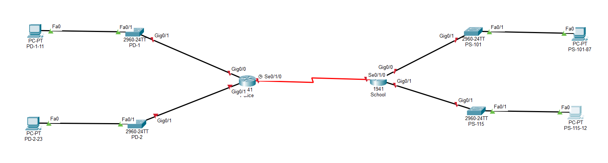
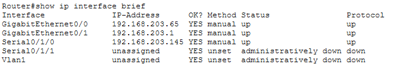
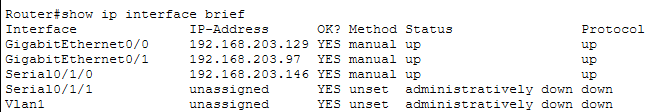
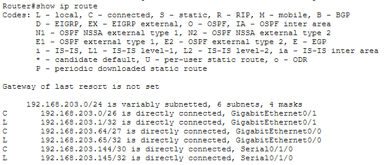
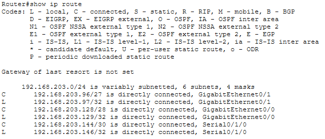

# Lab 11.10.1 — Design and Implement a VLSM Addressing Scheme

## 1. Overview

This lab focuses on designing, implementing, and verifying an IPv4 addressing scheme using Variable Length Subnet Masking (VLSM).

The assigned network is:

```text
192.168.203.0/24
```

The network contains four LANs with different host requirements and one point-to-point WAN connection between the Schools and Police routers.

---

## 2. Objectives

- Analyze host requirements.
- Determine suitable subnet sizes.
- Design a contiguous VLSM addressing scheme.
- Allocate subnets from largest to smallest.
- Configure router interfaces.
- Configure switch management interfaces.
- Configure host addressing.
- Verify routing and interface status.
- Test end-to-end connectivity.
- Troubleshoot incorrect addressing.

---

## 3. Network Topology



### Devices

- Routers: Schools, Police
- Switches: PS-101, PS-115, PD-1, PD-2
- Hosts: PS-101-87, PS-115-12, PD-1-11, PD-2-23

---

### Physical Interface Mapping

| Device | Interface | Connected To |
|---|---|---|
| Schools | `G0/0` | PS-101 |
| Schools | `G0/1` | PS-115 |
| Schools | `S0/1/0` | Police |
| Police | `G0/0` | PD-1 |
| Police | `G0/1` | PD-2 |
| Police | `S0/1/0` | Schools |
| PS-101 | `Fa0/1` | PS-101-87 |
| PS-115 | `Fa0/1` | PS-115-12 |
| PD-2 | `Fa0/1` | PD-2-23 |
| PD-1 | `Fa0/1` | PD-1-11 |

---

## Implementations (Designing)
### 1. Network Requirements

| LAN | Hosts Required |
|---|---:|
| PS-115 | `32` |
| PS-101 | `21` |
| PD-2 | `19` |
| PD-1 | `8` |
| Schools ↔ Police | `2` |

Five subnets are required.

---

### 2. Determine Subnet Sizes

| Network | Hosts Required | Prefix | Subnet Mask | Usable Hosts |
|---|---:|---:|---|---:|
| PS-115 | `32` | `/26` | `255.255.255.192` | `62` |
| PS-101 | `21` | `/27` | `255.255.255.224` | `30` |
| PD-2 | `19` | `/27` | `255.255.255.224` | `30` |
| PD-1 | `8` | `/28` | `255.255.255.240` | `14` |
| Schools ↔ Police | `2` | `/30` | `255.255.255.252` | `2` |

---

### 3. Calculated Address Blocks

| Allocation | Network | Network/CIDR | First Usable | Last Usable | Broadcast |
|---:|---|---|---|---|---|
| 1 | PS-115 | `192.168.203.0/26` | `192.168.203.1` | `192.168.203.62` | `192.168.203.63` |
| 2 | PS-101 | `192.168.203.64/27` | `192.168.203.65` | `192.168.203.94` | `192.168.203.95` |
| 3 | PD-2 | `192.168.203.96/27` | `192.168.203.97` | `192.168.203.126` | `192.168.203.127` |
| 4 | PD-1 | `192.168.203.128/28` | `192.168.203.129` | `192.168.203.142` | `192.168.203.143` |
| 5 | Schools ↔ Police | `192.168.203.144/30` | `192.168.203.145` | `192.168.203.146` | `192.168.203.147` |

---

## Implementations (Configuration)

### 1. Router Configuration

#### Schools G0/0 — PS-101

```cisco
interface gigabitethernet 0/0
 description Connection to PS-101
 ip address 192.168.203.65 255.255.255.224
 no shutdown
```

#### Schools G0/1 — PS-115

```cisco
interface gigabitethernet 0/1
 description Connection to PS-115
 ip address 192.168.203.1 255.255.255.192
 no shutdown
```

#### Schools S0/1/0 — Police

```cisco
interface serial 0/1/0
 description Connection to Police
 ip address 192.168.203.145 255.255.255.252
 no shutdown
```

---

#### Police G0/0 — PD-1

```cisco
interface gigabitethernet 0/0
 description Connection to PD-1
 ip address 192.168.203.129 255.255.255.240
 no shutdown
```

#### Police G0/1 — PD-2

```cisco
interface gigabitethernet 0/1
 description Connection to PD-2
 ip address 192.168.203.97 255.255.255.224
 no shutdown
```

#### Police S0/1/0 — Schools

```cisco
interface serial 0/1/0
 description Connection to Schools
 ip address 192.168.203.146 255.255.255.252
 no shutdown
```

---

### 2. Switch Management

The switches use the VLAN 1 SVI for management. The physical `G0/1` and `Fa0/1` ports remain Layer 2 switchports and do not receive management IP addresses.

#### PS-115

```cisco
interface vlan 1
 ip address 192.168.203.2 255.255.255.192
 no shutdown
exit

ip default-gateway 192.168.203.1
```

#### PS-101

```cisco
interface vlan 1
 ip address 192.168.203.66 255.255.255.224
 no shutdown
exit

ip default-gateway 192.168.203.65
```

#### PD-2

```cisco
interface vlan 1
 ip address 192.168.203.98 255.255.255.224
 no shutdown
exit

ip default-gateway 192.168.203.97
```

#### PD-1

```cisco
interface vlan 1
 ip address 192.168.203.130 255.255.255.240
 no shutdown
exit

ip default-gateway 192.168.203.129
```

---

### 3. PC Addressing

The PCs use the **last usable address** in each assigned subnet.

#### PS-115-12

```text
IP address:      192.168.203.62
Subnet mask:     255.255.255.192
Default gateway: 192.168.203.1
```

#### PS-101-87

```text
IP address:      192.168.203.94
Subnet mask:     255.255.255.224
Default gateway: 192.168.203.65
```

#### PD-2-23

```text
IP address:      192.168.203.126
Subnet mask:     255.255.255.224
Default gateway: 192.168.203.97
```

#### PD-1-11

```text
IP address:      192.168.203.142
Subnet mask:     255.255.255.240
Default gateway: 192.168.203.129
```

---

### Addressing Summary

| Device | Interface | IPv4 Address | Subnet Mask | Default Gateway |
|---|---|---|---|---|
| Schools | G0/0 | `192.168.203.65` | `255.255.255.224` | N/A |
| Schools | G0/1 | `192.168.203.1` | `255.255.255.192` | N/A |
| Schools | S0/1/0 | `192.168.203.145` | `255.255.255.252` | N/A |
| Police | G0/0 | `192.168.203.129` | `255.255.255.240` | N/A |
| Police | G0/1 | `192.168.203.97` | `255.255.255.224` | N/A |
| Police | S0/1/0 | `192.168.203.146` | `255.255.255.252` | N/A |
| PS-115 | VLAN 1 | `192.168.203.2` | `255.255.255.192` | `192.168.203.1` |
| PS-101 | VLAN 1 | `192.168.203.66` | `255.255.255.224` | `192.168.203.65` |
| PD-2 | VLAN 1 | `192.168.203.98` | `255.255.255.224` | `192.168.203.97` |
| PD-1 | VLAN 1 | `192.168.203.130` | `255.255.255.240` | `192.168.203.129` |
| PS-115-12 | NIC | `192.168.203.62` | `255.255.255.192` | `192.168.203.1` |
| PS-101-87 | NIC | `192.168.203.94` | `255.255.255.224` | `192.168.203.65` |
| PD-2-23 | NIC | `192.168.203.126` | `255.255.255.224` | `192.168.203.97` |
| PD-1-11 | NIC | `192.168.203.142` | `255.255.255.240` | `192.168.203.129` |

The final host addressing table should be updated after Packet Tracer confirms all values.

---

## Verification

## Verify Router Interfaces

```cisco
show ip interface brief
```




---

## Verify Routing

```cisco
show ip route
```

The routers should contain routes that allow communication between all VLSM networks.




---

## Connectivity Verification

| Test | Source | Destination |
|---|---|---|
| Local gateway | PS-115-12 | Schools | 
| Local gateway | PS-101-87 | Schools |
| Local gateway | PD-1-11 | Police |
| Local gateway | PD-2-23 | Police |
| WAN | Schools | Police |
| Remote | PS-115-12 | PD-1-11 |
| Remote | PS-101-87 | PD-2-23 

---

# VLSM vs FLSM

| Feature | FLSM | VLSM |
|---|---|---|
| Subnet sizes | Equal | Different |
| Subnet masks | Same | Different |
| Address efficiency | Lower | Higher |
| Allocation order | Equal blocks | Largest to smallest |
| Point-to-point WAN | May waste addresses | Can use `/30` |

---

# Key Findings

- The assigned network is `192.168.203.0/24`.
- VLSM allows differently sized subnets within one address block.
- Five subnets are required.
- A 32-host LAN requires `/26`, not `/27`.
- A 21-host LAN requires `/27`.
- A 19-host LAN requires `/27`.
- An 8-host LAN requires `/28`.
- A two-host point-to-point network can use `/30`.
- Subnets should be allocated contiguously from largest to smallest.
- Router physical interfaces receive Layer 3 IPv4 addresses.
- Switch physical ports operate at Layer 2.
- Switch management addressing is configured on VLAN 1.
- A switch can still forward frames without a management IP.
- Switch default gateways are used by traffic originating from the switch itself.
- End devices use their local router interface as the default gateway.
- Packet Tracer assessment results are useful for isolating incorrect configurations without changing already-correct settings.

---

# Packet Tracer File

The completed Packet Tracer activity is stored in:

[`design-implement-vlsm-addressing-scheme.pkt`](packet-tracer/design-implement-vlsm-addressing-scheme.pkt)

---

# Lab Reference

Cisco Networking Academy — Packet Tracer 11.10.1: Design and Implement a VLSM Addressing Scheme