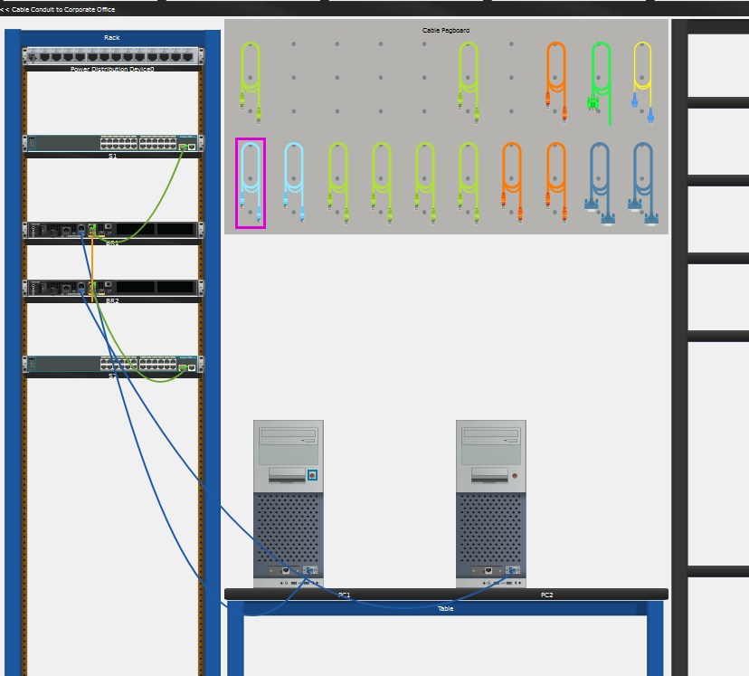
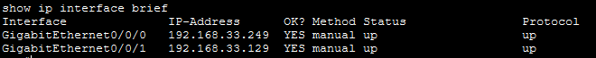
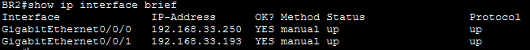

# Lab 11.10.2 — Design and Implement a VLSM Addressing Scheme (Physical Mode)

## Overview

This lab focuses on designing and implementing an IPv4 addressing scheme using Variable Length Subnet Masking (VLSM).

Starting with the `192.168.33.128/25` network, the available address space is divided into multiple subnets based on different host requirements.

The completed VLSM design provides addressing for the current BR1 and BR2 LANs, the router-to-router link, and several future BR2 networks while minimizing wasted IPv4 addresses.

---

## Objectives

- Examine the network addressing requirements.
- Determine the required subnet sizes.
- Design an efficient VLSM addressing scheme.
- Allocate address space for current and future networks.
- Cable the network in Packet Tracer Physical Mode.
- Configure basic Cisco IOS router settings.
- Configure IPv4 addresses on router interfaces.
- Activate and verify router interfaces.
- Verify connectivity across the BR1-BR2 link.
- Save the router configurations.

---

## Network Topology



BR2 also requires address space to be reserved for three future LANs:

- IoT LAN — 5 hosts
- CCTV LAN — 4 hosts
- HVAC C2 LAN — 4 hosts

These future LANs are included in the VLSM design but are not configured on router interfaces during this activity.

---

# Part 1 — Examine Network Requirements

## 1. Starting Network

The IPv4 network provided for the activity is:

```text
192.168.33.128/25
```

A `/25` network contains:

```text
Total addresses: 128
Usable hosts:    126
```

The address range is:

```text
Network:       192.168.33.128
First usable:  192.168.33.129
Last usable:   192.168.33.254
Broadcast:     192.168.33.255
```

---

## 2. Host Requirements

| Network | Hosts Required |
|---|---:|
| BR1 LAN | `40` |
| BR2 LAN | `25` |
| BR2 IoT LAN | `5` |
| BR2 CCTV LAN | `4` |
| BR2 HVAC C2 LAN | `4` |
| BR1 ↔ BR2 Link | `2` |

A total of **6 subnets** must be created.

---

## 3. Determine Subnet Sizes

VLSM subnets are allocated from the largest host requirement to the smallest.

| Network | Hosts Required | Prefix | Subnet Mask | Usable Hosts |
|---|---:|---:|---|---:|
| BR1 LAN | `40` | `/26` | `255.255.255.192` | `62` |
| BR2 LAN | `25` | `/27` | `255.255.255.224` | `30` |
| BR2 IoT LAN | `5` | `/29` | `255.255.255.248` | `6` |
| BR2 CCTV LAN | `4` | `/29` | `255.255.255.248` | `6` |
| BR2 HVAC C2 LAN | `4` | `/29` | `255.255.255.248` | `6` |
| BR1 ↔ BR2 Link | `2` | `/30` | `255.255.255.252` | `2` |

---

# Part 2 — Design the VLSM Address Scheme

## 1. VLSM Allocation

The available address space was allocated sequentially from the largest subnet to the smallest subnet.

| Network | Network/CIDR | First Usable | Last Usable | Broadcast |
|---|---|---|---|---|
| BR1 LAN | `192.168.33.128/26` | `192.168.33.129` | `192.168.33.190` | `192.168.33.191` |
| BR2 LAN | `192.168.33.192/27` | `192.168.33.193` | `192.168.33.222` | `192.168.33.223` |
| BR2 IoT LAN | `192.168.33.224/29` | `192.168.33.225` | `192.168.33.230` | `192.168.33.231` |
| BR2 CCTV LAN | `192.168.33.232/29` | `192.168.33.233` | `192.168.33.238` | `192.168.33.239` |
| BR2 HVAC C2 LAN | `192.168.33.240/29` | `192.168.33.241` | `192.168.33.246` | `192.168.33.247` |
| BR1 ↔ BR2 Link | `192.168.33.248/30` | `192.168.33.249` | `192.168.33.250` | `192.168.33.251` |

### Address Allocation

```text
192.168.33.128/25
│
├── 192.168.33.128/26  → BR1 LAN
├── 192.168.33.192/27  → BR2 LAN
├── 192.168.33.224/29  → BR2 IoT LAN
├── 192.168.33.232/29  → BR2 CCTV LAN
├── 192.168.33.240/29  → BR2 HVAC C2 LAN
└── 192.168.33.248/30  → BR1-BR2 Link
```

---

## 2. Router Addressing Table

The first usable host address of each LAN subnet is assigned to the corresponding router Ethernet interface.

For the BR1-BR2 link, BR1 receives the first usable address and BR2 receives the second usable address.

| Device | Interface | IPv4 Address | Subnet Mask | Connected Network |
|---|---|---|---|---|
| BR1 | G0/0/0 | `192.168.33.249` | `255.255.255.252` | BR1-BR2 Link |
| BR1 | G0/0/1 | `192.168.33.129` | `255.255.255.192` | BR1 LAN |
| BR2 | G0/0/0 | `192.168.33.250` | `255.255.255.252` | BR1-BR2 Link |
| BR2 | G0/0/1 | `192.168.33.193` | `255.255.255.224` | BR2 LAN |

---

# Part 3 — Cable and Configure the IPv4 Network

## 1. Physical Installation and Cabling

The routers and switches were installed in the main wiring closet and connected according to the provided topology.

The main connections are:

| Connection | Interface |
|---|---|
| S1 → BR1 | S1 F0/5 → BR1 G0/0/1 |
| BR1 → BR2 | BR1 G0/0/0 → BR2 G0/0/0 |
| BR2 → S2 | BR2 G0/0/1 → S2 F0/5 |

A console connection was used to access and configure the routers.

---

## 2. BR1 Basic Configuration

```cisco
enable
configure terminal

hostname BR1
no ip domain-lookup
enable secret class

line console 0
 password cisco
 login
 exit

line vty 0 4
 password cisco
 login
 exit

service password-encryption
banner motd #Unauthorized access is prohibited#
```

---

## 3. BR1 Interface Configuration

### G0/0/0 — Connection to BR2

```cisco
interface gigabitethernet 0/0/0
 description Connection to BR2
 ip address 192.168.33.249 255.255.255.252
 no shutdown
 exit
```

### G0/0/1 — Connection to BR1 LAN

```cisco
interface gigabitethernet 0/0/1
 description Connection to BR1 LAN
 ip address 192.168.33.129 255.255.255.192
 no shutdown
 exit
```

---

## 4. BR2 Basic Configuration

```cisco
enable
configure terminal

hostname BR2
no ip domain-lookup
enable secret class

line console 0
 password cisco
 login
 exit

line vty 0 4
 password cisco
 login
 exit

service password-encryption
banner motd #Unauthorized access is prohibited#
```

---

## 5. BR2 Interface Configuration

### G0/0/0 — Connection to BR1

```cisco
interface gigabitethernet 0/0/0
 description Connection to BR1
 ip address 192.168.33.250 255.255.255.252
 no shutdown
 exit
```

### G0/0/1 — Connection to BR2 LAN

```cisco
interface gigabitethernet 0/0/1
 description Connection to BR2 LAN
 ip address 192.168.33.193 255.255.255.224
 no shutdown
 exit
```

---

## 6. Save Configurations

The router configurations were saved to NVRAM.

```cisco
copy running-config startup-config
```

---

# Verification

## 1. Verify Router Interfaces

The interface configuration can be checked using:

```cisco
show ip interface brief
```

### Expected BR1 Interfaces

| Interface | IPv4 Address | Expected Status |
|---|---|---|
| G0/0/0 | `192.168.33.249` | `up/up` |
| G0/0/1 | `192.168.33.129` | `up/up` when LAN connection is operational |



### Expected BR2 Interfaces

| Interface | IPv4 Address | Expected Status |
|---|---|---|
| G0/0/0 | `192.168.33.250` | `up/up` |
| G0/0/1 | `192.168.33.193` | `up/up` when LAN connection is operational |



---

## 2. Verify BR1-BR2 Connectivity

The directly connected `/30` network was tested in both directions.

| Source | Destination | Destination IPv4 | Expected Result |
|---|---|---|---|
| BR1 | BR2 G0/0/0 | `192.168.33.250` | Successful |
| BR2 | BR1 G0/0/0 | `192.168.33.249` | Successful |

From BR1:

```cisco
ping 192.168.33.250
```

From BR2:

```cisco
ping 192.168.33.249
```

---

## Connectivity Limitation

Only the directly connected BR1-BR2 network is expected to provide router-to-router connectivity at this stage.

For example, BR1 has directly connected routes to:

```text
192.168.33.128/26
192.168.33.248/30
```

BR2 has directly connected routes to:

```text
192.168.33.192/27
192.168.33.248/30
```

No routing protocol or static routes are configured in this activity.

Therefore, the routers do not yet have routes to each other's remote LAN networks.

---

# VLSM Design Summary

```text
Original Network
192.168.33.128/25
        │
        ├── /26 → BR1 LAN (40 hosts)
        │
        ├── /27 → BR2 LAN (25 hosts)
        │
        ├── /29 → BR2 IoT LAN (5 hosts)
        │
        ├── /29 → BR2 CCTV LAN (4 hosts)
        │
        ├── /29 → BR2 HVAC C2 LAN (4 hosts)
        │
        └── /30 → BR1-BR2 Link (2 hosts)
```

---

# Key Findings

- VLSM allows subnets of different sizes to be created from the same parent network.
- Subnets should be allocated from the largest host requirement to the smallest.
- A `/26` provides 62 usable host addresses.
- A `/27` provides 30 usable host addresses.
- A `/29` provides 6 usable host addresses.
- A `/30` provides 2 usable host addresses.
- Address space can be reserved for networks that will be implemented in the future.
- Router Ethernet interfaces receive IPv4 addresses from their respective connected subnets.
- The BR1-BR2 point-to-point link uses a `/30` subnet because only two router interfaces require addresses.
- `no shutdown` activates router interfaces.
- `show ip interface brief` provides a quick summary of interface addressing and status.
- Directly connected routers can communicate over their shared network without additional routing configuration.
- Communication with remote LANs requires appropriate routing information.

---

# Reflection

### Why is VLSM more efficient than assigning the same subnet size to every network?

VLSM allows each subnet to be sized according to its actual host requirement. Large networks receive larger address blocks while smaller networks receive smaller blocks, reducing wasted IPv4 addresses.

### Why does the BR1-BR2 link use `/30`?

Only two router interfaces require IPv4 addresses on the point-to-point link. A `/30` provides exactly two usable host addresses.

### What is a shortcut for consecutive `/30` networks?

A `/30` subnet has a block size of `4`, so consecutive network addresses increase by four:

```text
192.168.33.248/30
192.168.33.252/30
```

---

# Lab Reference

Cisco Networking Academy — Packet Tracer 11.10.2: Design and Implement a VLSM Addressing Scheme — Physical Mode