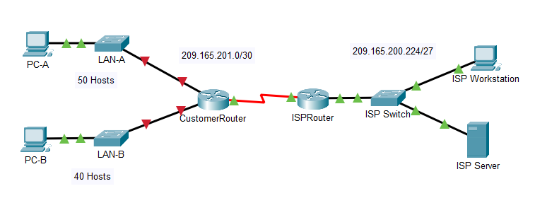
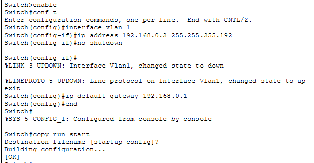
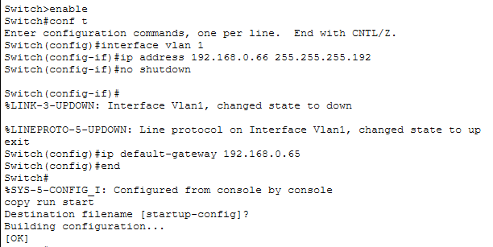
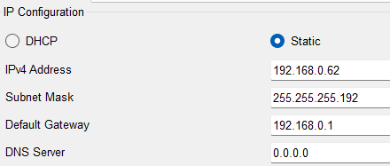
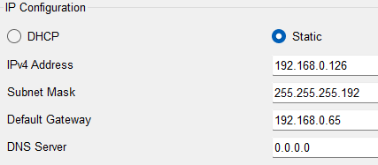
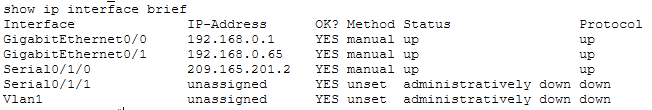
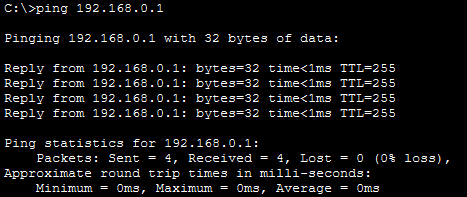
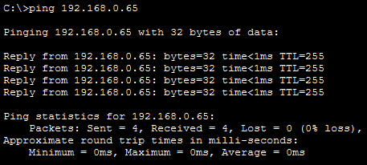
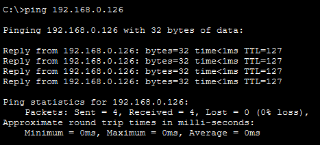

# Lab 11.5.5 — Subnet an IPv4 Network

## Overview

This lab focuses on designing and implementing an IPv4 subnetting scheme for a customer network.

The original network `192.168.0.0/24` is divided into multiple equal-size subnets to support:

- LAN-A
- LAN-B
- Future network expansion

After the subnetting plan is created, the router, switches, and PCs are configured and connectivity is verified.

---

## Objectives

- Design an IPv4 subnetting scheme.
- Determine the correct subnet mask.
- Create multiple equal-size subnets.
- Assign host addresses based on subnet requirements.
- Configure router interfaces.
- Configure switch management interfaces.
- Configure PC addressing.
- Verify local and end-to-end connectivity.
- Troubleshoot addressing problems if necessary.

---

## Network Topology



---

# Part 1 — Design the IPv4 Subnetting Scheme

## Network Requirements

The assigned network is:

```text
192.168.0.0/24
```

Requirements:

| Requirement | Value |
|---|---:|
| LAN-A minimum hosts | `50` |
| LAN-B minimum hosts | `40` |
| Additional unused subnets | `2` |
| Minimum total subnets | `4` |
| Largest host requirement | `50` |

All subnets must use the same subnet mask.

---

## Subnet Mask Analysis

| Prefix | Subnet Mask | Number of Subnets | Usable Hosts per Subnet | Meets Requirements? |
|---|---|---:|---:|---|
| `/25` | `255.255.255.128` | `2` | `126` | ❌ Not enough subnets |
| `/26` | `255.255.255.192` | `4` | `62` | ✅ Yes |
| `/27` | `255.255.255.224` | `8` | `30` | ❌ Not enough hosts |
| `/28` | `255.255.255.240` | `16` | `14` | ❌ |
| `/29` | `255.255.255.248` | `32` | `6` | ❌ |
| `/30` | `255.255.255.252` | `64` | `2` | ❌ |

The correct subnet mask is:

```text
/26
255.255.255.192
```

A `/26` provides:

```text
4 subnets
62 usable host addresses per subnet
```

---

## Subnet Table

| Subnet | Network Address | Prefix | Subnet Mask | Usable Host Range | Broadcast |
|---|---|---|---|---|---|
| 1 | `192.168.0.0` | `/26` | `255.255.255.192` | `192.168.0.1 – 192.168.0.62` | `192.168.0.63` |
| 2 | `192.168.0.64` | `/26` | `255.255.255.192` | `192.168.0.65 – 192.168.0.126` | `192.168.0.127` |
| 3 | `192.168.0.128` | `/26` | `255.255.255.192` | `192.168.0.129 – 192.168.0.190` | `192.168.0.191` |
| 4 | `192.168.0.192` | `/26` | `255.255.255.192` | `192.168.0.193 – 192.168.0.254` | `192.168.0.255` |

Assignments:

- Subnet 1 → LAN-A
- Subnet 2 → LAN-B
- Subnet 3 → Reserved for future use
- Subnet 4 → Reserved for future use

---

# Addressing Plan

Cisco specifies:

- Router interface = first usable host
- Switch VLAN 1 = second usable host
- PC = last usable host

## LAN-A

Subnet:

```text
192.168.0.0/26
```

| Device | Interface | IPv4 Address | Subnet Mask | Default Gateway |
|---|---|---|---|---|
| CustomerRouter | G0/0 | `192.168.0.1` | `255.255.255.192` | N/A |
| LAN-A Switch | VLAN 1 | `192.168.0.2` | `255.255.255.192` | `192.168.0.1` |
| PC-A | NIC | `192.168.0.62` | `255.255.255.192` | `192.168.0.1` |

---

## LAN-B

Subnet:

```text
192.168.0.64/26
```

| Device | Interface | IPv4 Address | Subnet Mask | Default Gateway |
|---|---|---|---|---|
| CustomerRouter | G0/1 | `192.168.0.65` | `255.255.255.192` | N/A |
| LAN-B Switch | VLAN 1 | `192.168.0.66` | `255.255.255.192` | `192.168.0.65` |
| PC-B | NIC | `192.168.0.126` | `255.255.255.192` | `192.168.0.65` |

---

## ISP Addressing

| Device | Interface | IPv4 Address | Subnet Mask | Default Gateway |
|---|---|---|---|---|
| CustomerRouter | S0/1/0 | `209.165.201.2` | `255.255.255.252` | N/A |
| ISPRouter | G0/0 | `209.165.200.225` | `255.255.255.224` | N/A |
| ISPRouter | S0/1/0 | `209.165.201.1` | `255.255.255.252` | N/A |
| ISPSwitch | VLAN 1 | `209.165.200.226` | `255.255.255.224` | `209.165.200.225` |
| ISP Workstation | NIC | `209.165.200.235` | `255.255.255.224` | `209.165.200.225` |
| ISP Server | NIC | `209.165.200.240` | `255.255.255.224` | `209.165.200.225` |

---

# Part 2 — Configure the Devices

## 1. Configure CustomerRouter

Basic router configuration:

```cisco
enable
configure terminal

hostname CustomerRouter
enable secret Class123

line console 0
 password Cisco123
 login
exit
```

### G0/0 — LAN-A

```cisco
interface gigabitethernet 0/0
 ip address 192.168.0.1 255.255.255.192
 no shutdown
exit
```

### G0/1 — LAN-B

```cisco
interface gigabitethernet 0/1
 ip address 192.168.0.65 255.255.255.192
 no shutdown
exit
```

Save the configuration:

```cisco
end
copy running-config startup-config
```

---

## 2. Configure LAN-A Switch

```cisco
enable
configure terminal

interface vlan 1
 ip address 192.168.0.2 255.255.255.192
 no shutdown
exit

ip default-gateway 192.168.0.1

end
copy running-config startup-config
```



---

## 3. Configure LAN-B Switch

```cisco
enable
configure terminal

interface vlan 1
 ip address 192.168.0.66 255.255.255.192
 no shutdown
exit

ip default-gateway 192.168.0.65

end
copy running-config startup-config
```



---

## 4. Configure PC Addressing

| PC | IPv4 Address | Subnet Mask | Default Gateway |
|---|---|---|---|
| PC-A | `192.168.0.62` | `255.255.255.192` | `192.168.0.1` |
| PC-B | `192.168.0.126` | `255.255.255.192` | `192.168.0.65` |




---

# Part 3 — Verification

## Interface Verification

CustomerRouter interfaces can be checked using:

```cisco
show ip interface brief
```

Expected important interfaces:

| Interface | IPv4 Address | Expected State |
|---|---|---|
| G0/0 | `192.168.0.1` | `up/up` |
| G0/1 | `192.168.0.65` | `up/up` |
| S0/1/0 | `209.165.201.2` | Operational |



---

## Connectivity Tests

| Test | Source | Destination | Expected Result | Result |
|---|---|---|---|---|
| Default gateway test | PC-A | `192.168.0.1` | Successful | ✅ |
| Default gateway test | PC-B | `192.168.0.65` | Successful | ✅ |
| End-to-end test | PC-A | `192.168.0.126` | Successful | ✅ |

### PC-A to Default Gateway

```cmd
ping 192.168.0.1
```



### PC-B to Default Gateway

```cmd
ping 192.168.0.65
```



### PC-A to PC-B

```cmd
ping 192.168.0.126
```



---

# Subnetting Summary

```text
Original Network
192.168.0.0/24
        │
        └── Borrow 2 host bits
                ↓
              /26
                ↓
       4 equal-size subnets
                │
     ┌──────────┼──────────┬──────────┐
     │          │          │          │
192.168.0.0  .64        .128       .192
   /26        /26         /26        /26
 LAN-A       LAN-B       Future     Future
```

---

# Important Concepts

| Concept | Meaning |
|---|---|
| Network address | Identifies the subnet itself |
| First host | First usable device address |
| Last host | Last usable device address |
| Broadcast address | Address used to reach all hosts in the subnet |
| Prefix `/26` | 26 network/subnet bits |
| Host bits | `6` |
| Addresses per subnet | `64` |
| Usable hosts per subnet | `62` |
| Borrowed bits | `2` |
| Number of subnets | `4` |

---

# Key Findings

- The original `192.168.0.0/24` network was divided into four `/26` subnets.
- Two host bits were borrowed from the original host portion.
- A `/26` mask provides `62` usable host addresses per subnet.
- `/26` is the only tested mask that satisfies both the host and subnet requirements.
- LAN-A uses `192.168.0.0/26`.
- LAN-B uses `192.168.0.64/26`.
- The third and fourth subnets are reserved for future expansion.
- Router interfaces use the first usable host address.
- Switch management interfaces use the second usable host address.
- PCs use the last usable host address.
- Hosts on different subnets require the router to communicate.
- Correct IP addresses, masks, and default gateways are required for successful connectivity.

---

# Lab Reference

Cisco Networking Academy — Packet Tracer 11.5.5: Subnet an IPv4 Network