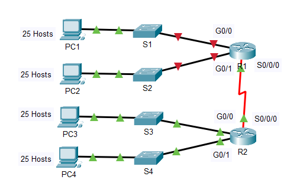
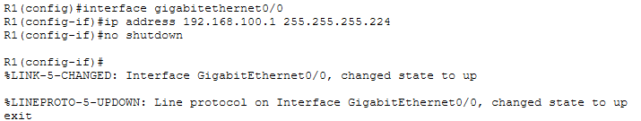
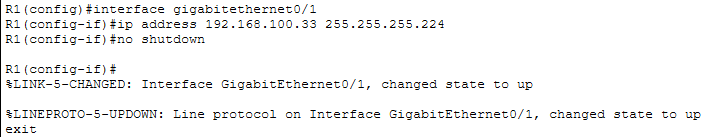
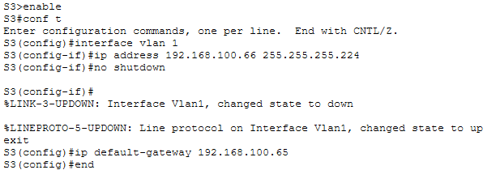
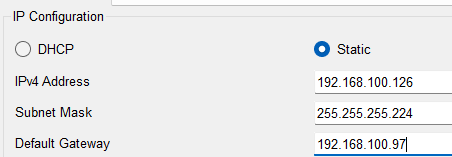
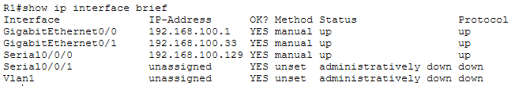
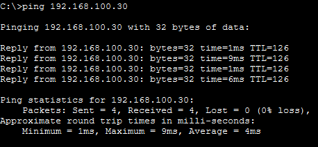

# Lab 11.7.5 — Subnetting Scenario

## Overview

This lab focuses on designing and implementing an IPv4 subnetting scheme for a multi-router network.

The original network `192.168.100.0/24` must be subnetted to provide addressing for:

- Two LANs connected to R1
- Two LANs connected to R2
- One WAN link between R1 and R2

Each LAN requires at least 25 addresses.

After designing the addressing scheme, the required interfaces and devices are configured and end-to-end connectivity is verified.

---

## Objectives

- Determine the required number of subnets.
- Determine the number of subnet bits to borrow.
- Calculate the new subnet mask.
- Determine usable hosts per subnet.
- Calculate subnet, host, and broadcast addresses.
- Assign subnets to the network topology.
- Develop a complete addressing table.
- Configure R1 LAN interfaces.
- Configure the S3 management interface.
- Configure PC4 addressing.
- Verify connectivity across the network.

---

# Network Topology



The topology requires five networks:

```text
R1 G0/0 LAN
R1 G0/1 LAN
R2 G0/0 LAN
R2 G0/1 LAN
R1 ↔ R2 WAN
```

---

# Part 1 — Design the IP Addressing Scheme

## 1. Determine Subnet Requirements

Original network:

```text
192.168.100.0/24
```

Requirements:

| Item | Requirement |
|---|---:|
| LANs | `4` |
| WAN links | `1` |
| Minimum required subnets | `5` |
| Minimum addresses required per LAN | `25` |

At least five subnets are required.

---

## 2. Determine the Number of Borrowed Bits

Starting prefix:

```text
/24
```

The number of created subnets is calculated using:

```text
2^n
```

where `n` is the number of borrowed bits.

```text
2^2 = 4   ❌ Not enough
2^3 = 8   ✅ Enough
```

Therefore:

```text
Borrowed bits = 3
```

The new prefix is:

```text
/24 + 3 = /27
```

---

## 3. Determine the New Subnet Mask

A `/27` subnet mask is:

```text
11111111.11111111.11111111.11100000
```

Decimal:

```text
255.255.255.224
```

| Item | Result |
|---|---|
| Original prefix | `/24` |
| Borrowed bits | `3` |
| New prefix | `/27` |
| New subnet mask | `255.255.255.224` |
| Subnets created | `8` |
| Host bits remaining | `5` |
| Addresses per subnet | `32` |
| Usable hosts per subnet | `30` |

A `/27` provides 30 usable host addresses, satisfying the requirement for at least 25 addresses per LAN.

---

## 4. Determine the Block Size

```text
256 - 224 = 32
```

Therefore, each subnet increases by `32` in the fourth octet:

```text
0
32
64
96
128
160
192
224
```

---

## 5. First Five Subnets in Binary

| Subnet | Network Address | Fourth Octet Binary |
|---:|---|---|
| 0 | `192.168.100.0` | `00000000` |
| 1 | `192.168.100.32` | `00100000` |
| 2 | `192.168.100.64` | `01000000` |
| 3 | `192.168.100.96` | `01100000` |
| 4 | `192.168.100.128` | `10000000` |

---

# Complete Subnet Table

| Subnet | Network Address | First Usable Host | Last Usable Host | Broadcast |
|---:|---|---|---|---|
| 0 | `192.168.100.0/27` | `192.168.100.1` | `192.168.100.30` | `192.168.100.31` |
| 1 | `192.168.100.32/27` | `192.168.100.33` | `192.168.100.62` | `192.168.100.63` |
| 2 | `192.168.100.64/27` | `192.168.100.65` | `192.168.100.94` | `192.168.100.95` |
| 3 | `192.168.100.96/27` | `192.168.100.97` | `192.168.100.126` | `192.168.100.127` |
| 4 | `192.168.100.128/27` | `192.168.100.129` | `192.168.100.158` | `192.168.100.159` |
| 5 | `192.168.100.160/27` | `192.168.100.161` | `192.168.100.190` | `192.168.100.191` |
| 6 | `192.168.100.192/27` | `192.168.100.193` | `192.168.100.222` | `192.168.100.223` |
| 7 | `192.168.100.224/27` | `192.168.100.225` | `192.168.100.254` | `192.168.100.255` |

---

# Subnet Assignment

The first five subnets are assigned according to the activity requirements.

| Subnet | Network | Assignment |
|---:|---|---|
| 0 | `192.168.100.0/27` | R1 G0/0 LAN |
| 1 | `192.168.100.32/27` | R1 G0/1 LAN |
| 2 | `192.168.100.64/27` | R2 G0/0 LAN |
| 3 | `192.168.100.96/27` | R2 G0/1 LAN |
| 4 | `192.168.100.128/27` | R1 ↔ R2 WAN |
| 5 | `192.168.100.160/27` | Unused |
| 6 | `192.168.100.192/27` | Unused |
| 7 | `192.168.100.224/27` | Unused |

---

# Addressing Scheme

The activity specifies:

- Router LAN interfaces → first usable address
- Switch VLAN 1 → second usable address
- PCs → last usable address
- R1 WAN interface → first usable address
- R2 WAN interface → last usable address

## Complete Addressing Table

| Device | Interface | IPv4 Address | Subnet Mask | Default Gateway |
|---|---|---|---|---|
| R1 | G0/0 | `192.168.100.1` | `255.255.255.224` | N/A |
| R1 | G0/1 | `192.168.100.33` | `255.255.255.224` | N/A |
| R1 | S0/0/0 | `192.168.100.129` | `255.255.255.224` | N/A |
| R2 | G0/0 | `192.168.100.65` | `255.255.255.224` | N/A |
| R2 | G0/1 | `192.168.100.97` | `255.255.255.224` | N/A |
| R2 | S0/0/0 | `192.168.100.158` | `255.255.255.224` | N/A |
| S1 | VLAN 1 | `192.168.100.2` | `255.255.255.224` | `192.168.100.1` |
| S2 | VLAN 1 | `192.168.100.34` | `255.255.255.224` | `192.168.100.33` |
| S3 | VLAN 1 | `192.168.100.66` | `255.255.255.224` | `192.168.100.65` |
| S4 | VLAN 1 | `192.168.100.98` | `255.255.255.224` | `192.168.100.97` |
| PC1 | NIC | `192.168.100.30` | `255.255.255.224` | `192.168.100.1` |
| PC2 | NIC | `192.168.100.62` | `255.255.255.224` | `192.168.100.33` |
| PC3 | NIC | `192.168.100.94` | `255.255.255.224` | `192.168.100.65` |
| PC4 | NIC | `192.168.100.126` | `255.255.255.224` | `192.168.100.97` |

---

# Part 2 — Configure Network Devices

Most addressing is already configured in the Packet Tracer activity.

The required configuration focuses on:

- R1 LAN interfaces
- S3 VLAN 1
- PC4

EIGRP routing between R1 and R2 is already configured.

---

## 1. Configure R1 G0/0

```cisco
enable
configure terminal

interface gigabitethernet 0/0
 ip address 192.168.100.1 255.255.255.224
 no shutdown
exit
```



---

## 2. Configure R1 G0/1

```cisco
interface gigabitethernet 0/1
 ip address 192.168.100.33 255.255.255.224
 no shutdown
exit

end
```



---

## 3. Configure S3

S3 belongs to the subnet connected to R2 G0/0:

```text
192.168.100.64/27
```

Configure the VLAN 1 management interface:

```cisco
enable
configure terminal

interface vlan 1
 ip address 192.168.100.66 255.255.255.224
 no shutdown
exit

ip default-gateway 192.168.100.65

end
```



---

## 4. Configure PC4

PC4 belongs to:

```text
192.168.100.96/27
```

Configure:

| Setting | Value |
|---|---|
| IPv4 Address | `192.168.100.126` |
| Subnet Mask | `255.255.255.224` |
| Default Gateway | `192.168.100.97` |



---

# Verification

## Verify R1 Interfaces

```cisco
show ip interface brief
```

Expected LAN interfaces:

| Interface | IPv4 Address | Expected Status |
|---|---|---|
| G0/0 | `192.168.100.1` | `up/up` |
| G0/1 | `192.168.100.33` | `up/up` |



---

## Connectivity Verification

The activity allows connectivity testing from R1, S3, and PC4.

### R1 Tests

| Source | Destination | Address | Expected |
|---|---|---|---|
| R1 | S1 | `192.168.100.2` | ✅ |
| R1 | PC1 | `192.168.100.30` | ✅ |
| R1 | S2 | `192.168.100.34` | ✅ |
| R1 | PC2 | `192.168.100.62` | ✅ |
| R1 | R2 G0/0 | `192.168.100.65` | ✅ |
| R1 | S3 | `192.168.100.66` | ✅ |
| R1 | PC3 | `192.168.100.94` | ✅ |
| R1 | R2 G0/1 | `192.168.100.97` | ✅ |
| R1 | S4 | `192.168.100.98` | ✅ |
| R1 | PC4 | `192.168.100.126` | ✅ |
| R1 | R2 WAN | `192.168.100.158` | ✅ |

---

### S3 Tests

S3 can be used to verify communication from the third LAN to other networks.

---

### PC4 Tests

PC4 can be used to verify end-to-end connectivity across the routed network.

Example:

```cmd
ping 192.168.100.30
```

This tests communication from PC4 to PC1 through R2 and R1.



---

# Addressing Logic

The addressing pattern used throughout the activity is:

| Device Type | Address Selection |
|---|---|
| Router LAN interface | First usable address |
| Switch VLAN 1 | Second usable address |
| PC | Last usable address |
| R1 WAN interface | First usable address |
| R2 WAN interface | Last usable address |

Example for Subnet 2:

```text
Network:       192.168.100.64/27
First host:    192.168.100.65  → R2 G0/0
Second host:   192.168.100.66  → S3 VLAN 1
Last host:     192.168.100.94  → PC3
Broadcast:     192.168.100.95
```

---

# Important Concepts

| Concept | Explanation |
|---|---|
| Subnetting | Divides one larger network into multiple smaller networks |
| Borrowed bits | Host bits converted into subnet bits |
| `/27` | 27 network/subnet bits and 5 host bits |
| Block size | `32` addresses per subnet |
| Usable hosts | `30` hosts per `/27` subnet |
| Network address | Identifies the subnet |
| Broadcast address | Represents all hosts within the subnet |
| Default gateway | Router interface used to reach remote networks |
| SVI | Virtual switch interface used for management addressing |
| EIGRP | Dynamic routing protocol already configured between R1 and R2 |

---

# Key Findings

- The topology requires five different IP networks.
- Three bits must be borrowed from the `/24` host portion.
- Borrowing three bits creates eight `/27` subnets.
- Each `/27` subnet contains 32 total addresses and 30 usable host addresses.
- The `/27` mask satisfies the requirement of at least 25 addresses per LAN.
- The subnet block size is 32.
- Each router interface must belong to the subnet of the network it connects to.
- Switch management addresses are assigned to VLAN 1.
- PCs use the local router interface as their default gateway.
- Different subnets require routing to communicate.
- EIGRP provides routing between R1 and R2 in this activity.
- Successful pings verify that the subnetting and addressing scheme is functioning correctly.

---

# Lab Reference

Cisco Networking Academy — Packet Tracer 11.7.5: Subnetting Scenario