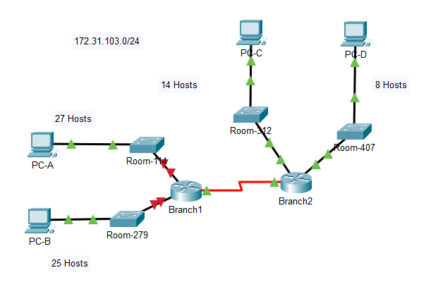
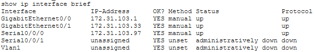
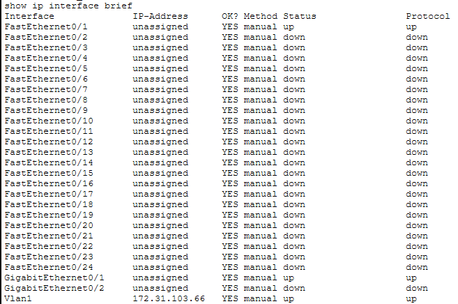
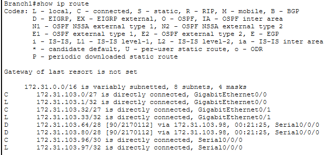

# Lab 11.9.3 — VLSM Design and Implementation Practice

## Overview

This lab focuses on designing and implementing an IPv4 addressing scheme using Variable Length Subnet Masking (VLSM).

The assigned network is:

```text
172.31.103.0/24
```

The network must support four LANs with different host requirements and one point-to-point WAN connection between Branch1 and Branch2.

VLSM is used so that each network receives only the amount of IPv4 address space it requires.

---

## Objectives

- Examine the network requirements.
- Determine the number of required subnets.
- Select an appropriate subnet mask for each network.
- Allocate VLSM subnets from largest to smallest.
- Calculate network, usable host, and broadcast addresses.
- Create a complete IPv4 addressing scheme.
- Assign addresses to routers, switches, and PCs.
- Configure the required devices.
- Verify network connectivity.

---

## Network Topology



The topology contains:

- 2 routers — Branch1 and Branch2
- 4 switches — Room-114, Room-279, Room-312, and Room-407
- 4 PCs — PC-A, PC-B, PC-C, and PC-D
- 4 LANs
- 1 WAN connection

---

# Part 1 — Examine Network Requirements

## Base Network

```text
172.31.103.0/24
```

## Host Requirements

| Network | Hosts Required |
|---|---:|
| Room-114 LAN | `27` |
| Room-279 LAN | `25` |
| Room-312 LAN | `14` |
| Room-407 LAN | `8` |
| Branch1 ↔ Branch2 WAN | `2` |

A total of **5 subnets** are required.

---

## Required Prefixes

The smallest subnet capable of satisfying each requirement was selected.

| Network | Hosts Required | Prefix | Subnet Mask | Usable Hosts |
|---|---:|---:|---|---:|
| Room-114 | `27` | `/27` | `255.255.255.224` | `30` |
| Room-279 | `25` | `/27` | `255.255.255.224` | `30` |
| Room-312 | `14` | `/28` | `255.255.255.240` | `14` |
| Room-407 | `8` | `/28` | `255.255.255.240` | `14` |
| Branch1 ↔ Branch2 | `2` | `/30` | `255.255.255.252` | `2` |

### Why Room-407 Uses `/28`

A `/29` provides:

```text
2^3 - 2 = 6 usable hosts
```

Room-407 requires `8`, so `/29` is too small.

A `/28` provides:

```text
2^4 - 2 = 14 usable hosts
```

Therefore `/28` is required.

---

# Part 2 — Design the VLSM Scheme

VLSM subnets are allocated from the largest host requirement to the smallest.

```text
27 hosts
   ↓
25 hosts
   ↓
14 hosts
   ↓
8 hosts
   ↓
2-host WAN
```

---

## VLSM Allocation

```text
172.31.103.0/24
│
├── 172.31.103.0/27     Room-114
├── 172.31.103.32/27    Room-279
├── 172.31.103.64/28    Room-312
├── 172.31.103.80/28    Room-407
└── 172.31.103.96/30    Branch1 ↔ Branch2
```

---

## Complete VLSM Subnet Table

| Subnet | Hosts Needed | Network/CIDR | First Usable | Last Usable | Broadcast |
|---|---:|---|---|---|---|
| Room-114 | `27` | `172.31.103.0/27` | `172.31.103.1` | `172.31.103.30` | `172.31.103.31` |
| Room-279 | `25` | `172.31.103.32/27` | `172.31.103.33` | `172.31.103.62` | `172.31.103.63` |
| Room-312 | `14` | `172.31.103.64/28` | `172.31.103.65` | `172.31.103.78` | `172.31.103.79` |
| Room-407 | `8` | `172.31.103.80/28` | `172.31.103.81` | `172.31.103.94` | `172.31.103.95` |
| Branch1 ↔ Branch2 | `2` | `172.31.103.96/30` | `172.31.103.97` | `172.31.103.98` | `172.31.103.99` |

---

# Address Assignment Rules

The addressing scheme follows these rules:

| Device Type | Address Used |
|---|---|
| Router LAN interface | First usable address |
| Switch VLAN 1 | Second usable address |
| PC | Last usable address |
| Branch1 WAN interface | First usable WAN address |
| Branch2 WAN interface | Last usable WAN address |

---

# Complete Addressing Plan

## Room-114 LAN

```text
Network:    172.31.103.0/27
Mask:       255.255.255.224
Broadcast:  172.31.103.31
```

| Device | Interface | IPv4 Address | Default Gateway |
|---|---|---|---|
| Branch1 | LAN interface to Room-114 | `172.31.103.1/27` | N/A |
| Room-114 | VLAN 1 | `172.31.103.2/27` | `172.31.103.1` |
| PC-A | NIC | `172.31.103.30/27` | `172.31.103.1` |

---

## Room-279 LAN

```text
Network:    172.31.103.32/27
Mask:       255.255.255.224
Broadcast:  172.31.103.63
```

| Device | Interface | IPv4 Address | Default Gateway |
|---|---|---|---|
| Branch1 | LAN interface to Room-279 | `172.31.103.33/27` | N/A |
| Room-279 | VLAN 1 | `172.31.103.34/27` | `172.31.103.33` |
| PC-B | NIC | `172.31.103.62/27` | `172.31.103.33` |

---

## Room-312 LAN

```text
Network:    172.31.103.64/28
Mask:       255.255.255.240
Broadcast:  172.31.103.79
```

| Device | Interface | IPv4 Address | Default Gateway |
|---|---|---|---|
| Branch2 | LAN interface to Room-312 | `172.31.103.65/28` | N/A |
| Room-312 | VLAN 1 | `172.31.103.66/28` | `172.31.103.65` |
| PC-C | NIC | `172.31.103.78/28` | `172.31.103.65` |

---

## Room-407 LAN

```text
Network:    172.31.103.80/28
Mask:       255.255.255.240
Broadcast:  172.31.103.95
```

| Device | Interface | IPv4 Address | Default Gateway |
|---|---|---|---|
| Branch2 | LAN interface to Room-407 | `172.31.103.81/28` | N/A |
| Room-407 | VLAN 1 | `172.31.103.82/28` | `172.31.103.81` |
| PC-D | NIC | `172.31.103.94/28` | `172.31.103.81` |

---

## Branch1 ↔ Branch2 WAN

```text
Network:    172.31.103.96/30
Mask:       255.255.255.252
Broadcast:  172.31.103.99
```

| Device | Interface | IPv4 Address |
|---|---|---|
| Branch1 | Serial WAN | `172.31.103.97/30` |
| Branch2 | Serial WAN | `172.31.103.98/30` |

---

# Consolidated Addressing Table

| Device | Interface | IPv4 Address | Subnet Mask | Default Gateway |
|---|---|---|---|---|
| Branch1 | Room-114 LAN interface | `172.31.103.1` | `255.255.255.224` | N/A |
| Branch1 | Room-279 LAN interface | `172.31.103.33` | `255.255.255.224` | N/A |
| Branch1 | Serial WAN | `172.31.103.97` | `255.255.255.252` | N/A |
| Branch2 | Room-312 LAN interface | `172.31.103.65` | `255.255.255.240` | N/A |
| Branch2 | Room-407 LAN interface | `172.31.103.81` | `255.255.255.240` | N/A |
| Branch2 | Serial WAN | `172.31.103.98` | `255.255.255.252` | N/A |
| Room-114 | VLAN 1 | `172.31.103.2` | `255.255.255.224` | `172.31.103.1` |
| Room-279 | VLAN 1 | `172.31.103.34` | `255.255.255.224` | `172.31.103.33` |
| Room-312 | VLAN 1 | `172.31.103.66` | `255.255.255.240` | `172.31.103.65` |
| Room-407 | VLAN 1 | `172.31.103.82` | `255.255.255.240` | `172.31.103.81` |
| PC-A | NIC | `172.31.103.30` | `255.255.255.224` | `172.31.103.1` |
| PC-B | NIC | `172.31.103.62` | `255.255.255.224` | `172.31.103.33` |
| PC-C | NIC | `172.31.103.78` | `255.255.255.240` | `172.31.103.65` |
| PC-D | NIC | `172.31.103.94` | `255.255.255.240` | `172.31.103.81` |

> The exact physical router interface identifiers such as `G0/0` and `G0/1` should be filled in after confirming the interface labels in the assigned Packet Tracer topology.

---

# Part 3 — Configure Network Devices

The Packet Tracer activity already contains part of the addressing configuration.

Only the devices identified by the assigned activity need to be completed manually.

---

## 1. Configure Router LAN Interfaces

```
Example(Branch 1):

```cisco
interface gigabitethernet 0/0
 ip address 172.31.103.1 255.255.255.224
 no shutdown
```

```cisco
interface gigabitethernet 0/1
 ip address 172.31.103.33 255.255.255.224
 no shutdown
```



---

## 2. Configure Switch VLAN 1

Example for Room-312:

```cisco
interface vlan 1
 ip address 172.31.103.66 255.255.255.240
 no shutdown
exit

ip default-gateway 172.31.103.65
```



---

## 3. Configure PC Addressing

Each PC uses the last usable address in its assigned subnet.

| PC | IPv4 Address | Subnet Mask | Default Gateway |
|---|---|---|---|
| PC-A | `172.31.103.30` | `255.255.255.224` | `172.31.103.1` |
| PC-B | `172.31.103.62` | `255.255.255.224` | `172.31.103.33` |
| PC-C | `172.31.103.78` | `255.255.255.240` | `172.31.103.65` |
| PC-D | `172.31.103.94` | `255.255.255.240` | `172.31.103.81` |

---

# Part 4 — Verification

## Verify Interfaces

Use:

```cisco
show ip interface brief
```

Check that configured interfaces contain:

- Correct IPv4 address
- Correct subnet
- `up/up` status

---

## Verify Routing

Use:

```cisco
show ip route
```

The routing table should contain routes to all required VLSM networks.



---

## Connectivity Verification

Connectivity should be verified between local and remote networks.

| Test | Source | Destination | Destination IP | Expected |
|---|---|---|---|---|
| Local | PC-A | Branch1 gateway | `172.31.103.1` | ✅ |
| Local | PC-B | Branch1 gateway | `172.31.103.33` | ✅ |
| Local | PC-C | Branch2 gateway | `172.31.103.65` | ✅ |
| Local | PC-D | Branch2 gateway | `172.31.103.81` | ✅ |
| Inter-LAN | PC-A | PC-B | `172.31.103.62` | ✅ |
| Inter-LAN | PC-C | PC-D | `172.31.103.94` | ✅ |
| Remote | PC-A | PC-C | `172.31.103.78` | ✅ |
| Remote | PC-A | PC-D | `172.31.103.94` | ✅ |
| WAN | Branch1 | Branch2 | `172.31.103.98` | ✅ |

Successful remote tests confirm that the VLSM addressing design and routing are functioning correctly.

---

# VLSM Address Utilization

| Subnet | Total Addresses | Usable Hosts | Required Hosts | Unused Usable Addresses |
|---|---:|---:|---:|---:|
| Room-114 `/27` | `32` | `30` | `27` | `3` |
| Room-279 `/27` | `32` | `30` | `25` | `5` |
| Room-312 `/28` | `16` | `14` | `14` | `0` |
| Room-407 `/28` | `16` | `14` | `8` | `6` |
| WAN `/30` | `4` | `2` | `2` | `0` |

This demonstrates why VLSM is more efficient than assigning the same subnet size to every network.

---

# FLSM vs VLSM

| Feature | FLSM | VLSM |
|---|---|---|
| Subnet masks | Same for all networks | Different based on requirements |
| Subnet size | Equal | Variable |
| Address usage | More waste | More efficient |
| Allocation | Equal-size subnets | Largest to smallest |
| Example | All `/27` | `/27`, `/28`, `/30` |

---

# VLSM Design Process

```text
Start with the /24 network
         ↓
List host requirements
         ↓
Sort largest → smallest
         ↓
Choose smallest suitable prefix
         ↓
Allocate largest subnet first
         ↓
Move to next available network address
         ↓
Continue until all networks are assigned
         ↓
Assign device addresses
         ↓
Configure devices
         ↓
Verify connectivity
```

---

# Key Findings

- VLSM allows different subnet sizes within the same IPv4 address block.
- The assigned network is `172.31.103.0/24`.
- Five networks are required.
- Room-114 requires `/27`.
- Room-279 requires `/27`.
- Room-312 requires `/28`.
- Room-407 requires `/28`.
- The WAN requires `/30`.
- The largest subnet is allocated first.
- Subsequent networks begin at the next valid subnet boundary.
- Router LAN interfaces use the first usable address.
- Switch VLAN 1 interfaces use the second usable address.
- PCs use the last usable address.
- The WAN uses the first and last usable addresses.
- VLSM reduces wasted IPv4 address space.
- `/29` cannot support Room-407 because it only provides 6 usable hosts.
- Correct subnet boundaries prevent overlapping address ranges.
- Successful ping tests verify the VLSM design and implementation.

---

# Lab Reference

Cisco Networking Academy — Packet Tracer 11.9.3: VLSM Design and Implementation Practice