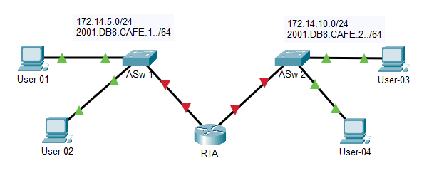
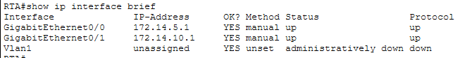
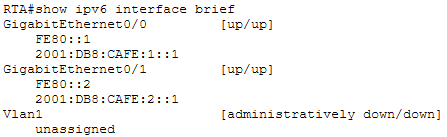

# Lab 12.4.5 — Basic Device Configuration

## Overview

This lab focuses on configuring and troubleshooting a dual-stack network using IPv4 and IPv6.

The activity requires completing the network documentation, configuring basic Cisco IOS settings on a router and switch, completing host addressing, and verifying end-to-end connectivity.

The final objective is to establish successful IPv4 and IPv6 communication between the required network devices.

---

## Objectives

- Complete the network addressing documentation.
- Configure basic Cisco IOS router settings.
- Configure basic Cisco IOS switch settings.
- Configure router interfaces.
- Configure a switch VLAN 1 management interface.
- Configure IPv4 addressing.
- Configure IPv6 addressing.
- Configure IPv4 and IPv6 default gateways.
- Add interface descriptions.
- Save device configurations.
- Verify IPv4 connectivity.
- Verify IPv6 connectivity.
- Troubleshoot configuration and connectivity problems.
- Establish full end-to-end connectivity.

---

## Network Topology



The router connects two different LANs and provides Layer 3 connectivity between them.

The switches provide Layer 2 connectivity between the end devices and the router.

---

## Addressing Table

> The exact addressing information depends on the topology generated by the Packet Tracer activity.

| Device | Interface | IPv4 Address | Subnet Mask | IPv6 Address | IPv4 Default Gateway | IPv6 Default Gateway |
|---|---|---|---|---|---|---|
| RTA | G0/0 | `172.14.5.1/24` | `255.255.255.0` | `2001:DB8:CAFE:1::1/64` | N/A | N/A |
| RTA | G0/1 | `172.14.10.1/24` | `255.255.255.0` | `2001:DB8:CAFE:2::1/64` | N/A | N/A |
| ASw-1 | VLAN 1 | `172.14.5.35/24` | `255.255.255.0` | — | `172.14.5.1` | — |
| ASw-2 | VLAN 1 | `172.14.10.35/24` | `255.255.255.0` | — | `172.14.10.1` | — |
| User-01 | NIC | `172.14.5.50/24` | `255.255.255.0` | `2001:DB8:CAFE:1::50/64` | `172.14.5.1` | `FE80::1` |
| User-02 | NIC | `172.14.5.60/24` | `255.255.255.0` | `2001:DB8:CAFE:1::60/64` | `172.14.5.1` | `FE80::1` |
| User-03 | NIC | `172.14.10.50/24` | `255.255.255.0` | `2001:DB8:CAFE:2::50/64` | `172.14.10.1` | `FE80::2` |
| User-04 | NIC | `172.14.10.60/24` | `255.255.255.0` | `2001:DB8:CAFE:2::60/64` | `172.14.10.1` | `FE80::2` |

---

# Implementation

## 1. Complete Network Documentation

The missing IPv4 and IPv6 addressing information was identified from the Packet Tracer topology and recorded in the addressing table.

The addressing information includes:

- IPv4 addresses
- IPv4 subnet masks
- IPv6 addresses
- IPv6 prefix lengths
- IPv4 default gateways
- IPv6 default gateways

---

## 2. Router Configuration

The router was configured with basic Cisco IOS security and management settings.

### Basic Configuration

```cisco
enable
configure terminal

hostname RTA
no ip domain-lookup

enable secret class
service password-encryption

banner motd #Unauthorized access is prohibited#
```

### Console Access

```cisco
line console 0
 password cisco
 login
 exit
```

### VTY Access

```cisco
line vty 0 4
 password cisco
 login
 exit
```

---

### G0/0 — Connection to ASw-1 / LAN 1

```cisco
interface gigabitethernet 0/0
 description Connection to ASw-1
 ip address 172.14.5.1 255.255.255.0
 ipv6 address 2001:DB8:CAFE:1::1/64
 ipv6 address FE80::1 link-local
 no shutdown
 exit
```

### G0/1 — Connection to ASw-2 / LAN 2

```cisco
interface gigabitethernet 0/1
 description Connection to ASw-2
 ip address 172.14.10.1 255.255.255.0
 ipv6 address 2001:DB8:CAFE:2::1/64
 ipv6 address FE80::2 link-local
 no shutdown
 exit
```

### Enable IPv6 Routing

```cisco
ipv6 unicast-routing
```

---

## 3. Switch Configuration

### ASw-2 Switch Configuration

#### Basic Configuration

```cisco
enable
configure terminal

hostname ASw-2
no ip domain-lookup

enable secret class
service password-encryption

banner motd #Unauthorized access is prohibited#
```

#### Console Access

```cisco
line console 0
 password cisco
 login
 exit
```

#### VTY Access

```cisco
line vty 0 4
 password cisco
 login
 exit
```

---

#### VLAN 1 Management Interface

```cisco
interface vlan 1
 description Management Interface
 ip address 172.14.10.35 255.255.255.0
 no shutdown
 exit
```

#### Default Gateway

```cisco
ip default-gateway 172.14.10.1
```

---

## 4. Configure Host Addressing

The hosts were partially configured in the activity.

The remaining IPv4 information and complete IPv6 addressing were configured according to the addressing table.

Each host requires the appropriate:

```text
IPv4 address
Subnet mask
IPv4 default gateway

IPv6 address
IPv6 prefix length
IPv6 default gateway
```

The default gateway must correspond to the router interface connected to the host's local LAN.

---

## 5. Save Configurations

The completed IOS configurations were saved to startup-config.

```cisco
copy running-config startup-config
```

---

# Verification

## 1. Verify Interface Status

The router interfaces were checked using:

```cisco
show ip interface brief
show ipv6 interface brief
```

Expected operational interfaces should normally display:

```text
Status:   up
Protocol: up
```




---

## 2. Verify IPv4 Connectivity

| Test | Destination | Destination IPv4 | Purpose | Result |
|---|---|---|---|---|
| Local gateway | RTA G0/0 | `172.14.5.1` | Verify access to the local router | ✅ Successful |
| Switch management | ASw-1 VLAN 1 | `172.14.5.35` | Verify local switch management connectivity | ✅ Successful |
| Local host | User-02 | `172.14.5.60` | Verify communication within LAN 1 | ✅ Successful |
| Remote router interface | RTA G0/1 | `172.14.10.1` | Verify communication through RTA | ✅ Successful |
| Remote switch | ASw-2 VLAN 1 | `172.14.10.35` | Verify connectivity to the remote LAN | ✅ Successful |
| Remote host | User-03 | `172.14.10.50` | Verify end-to-end routed connectivity | ✅ Successful |
| Remote host | User-04 | `172.14.10.60` | Verify end-to-end routed connectivity | ✅ Successful |

Example commands:

```text
ping 172.14.5.1
ping 172.14.5.35
ping 172.14.5.60
ping 172.14.10.1
ping 172.14.10.35
ping 172.14.10.50
ping 172.14.10.60
```

---

## 3. Verify IPv6 Connectivity

| Test | Destination | Destination IPv6 | Purpose | Result |
|---|---|---|---|---|
| Local gateway | RTA G0/0 | `FE80::1` | Verify access to the local IPv6 gateway | ✅ Successful |
| Local host | User-02 | `2001:DB8:CAFE:1::60` | Verify IPv6 communication within LAN 1 | ✅ Successful |
| Remote router interface | RTA G0/1 | `2001:DB8:CAFE:2::1` | Verify communication with RTA's remote interface | ✅ Successful |
| Remote host | User-03 | `2001:DB8:CAFE:2::50` | Verify end-to-end IPv6 routing | ✅ Successful |
| Remote host | User-04 | `2001:DB8:CAFE:2::60` | Verify end-to-end IPv6 routing | ✅ Successful |

Example commands:

```text
ping 2001:DB8:CAFE:1::60
ping 2001:DB8:CAFE:2::1
ping 2001:DB8:CAFE:2::50
ping 2001:DB8:CAFE:2::60
```

---

# Troubleshooting

Any failed connectivity tests were investigated systematically.

| Problem | Possible Cause | Verification | Solution |
|---|---|---|---|
| IPv4 ping fails | Incorrect IPv4 address | Check host/interface addressing | Correct IPv4 address |
| IPv4 ping fails | Incorrect subnet mask | Compare with addressing table | Correct subnet mask |
| Remote IPv4 ping fails | Incorrect default gateway | Check host gateway | Configure correct router interface |
| IPv6 ping fails | Incorrect IPv6 address/prefix | Check IPv6 configuration | Correct IPv6 address/prefix |
| Remote IPv6 ping fails | Incorrect IPv6 gateway | Check IPv6 gateway | Configure correct IPv6 gateway |
| Router interface unreachable | Interface administratively down | `show ip interface brief` | `no shutdown` |
| Switch management unreachable | Incorrect VLAN 1 configuration | Check VLAN 1 SVI | Correct VLAN 1 addressing |

After correcting identified issues, connectivity tests were repeated to confirm successful communication.

---

# Router vs Switch Addressing

| Configuration | Router | Layer 2 Switch |
|---|---|---|
| Physical interface IP | Configured on routed Ethernet interfaces | Normally not configured on Layer 2 switchports |
| IPv4 address | Router interface | VLAN 1 SVI |
| IPv6 address | Router interface | VLAN 1 SVI when required |
| Default gateway | Router acts as a gateway for connected LANs | Points to local router interface |
| Layer 3 routing | Yes | No normal routing in this activity |
| `no shutdown` | Activates router interface | Activates SVI |

---

# Key Findings

- Routers provide Layer 3 connectivity between different LANs.
- Router physical interfaces can be assigned IPv4 and IPv6 addresses.
- Layer 2 switches use an SVI such as VLAN 1 for management addressing.
- Physical Layer 2 switchports do not normally require IP addresses.
- End devices use the router interface on their local LAN as the default gateway.
- IPv4 and IPv6 can operate simultaneously in a dual-stack network.
- Interface descriptions improve network documentation.
- `no shutdown` is required to activate administratively disabled interfaces.
- `show ip interface brief` provides a concise IPv4 interface summary.
- `show ipv6 interface brief` provides a concise IPv6 interface summary.
- Successful local connectivity does not automatically prove remote connectivity.
- Failed pings can result from incorrect addressing, subnet masks, gateways, interface status, or device configuration.
- Configurations should be saved from running-config to startup-config after verification.

---

# Configuration Flow

```text
Complete Addressing Table
        ↓
Configure Router
        ↓
Configure Router Interfaces
        ↓
Configure Switch
        ↓
Configure VLAN 1
        ↓
Configure Hosts
        ↓
Save Configurations
        ↓
Verify IPv4
        ↓
Verify IPv6
        ↓
Troubleshoot Problems
        ↓
Verify End-to-End Connectivity
```

---

# Lab Reference

Cisco Networking Academy — Packet Tracer 12.4.5: Basic Device Configuration