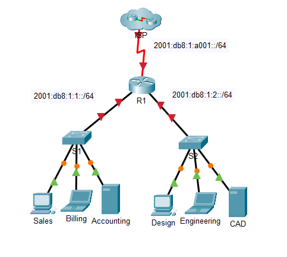
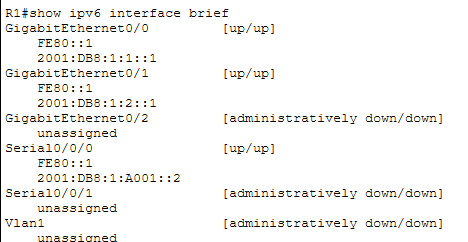
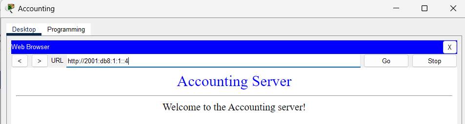
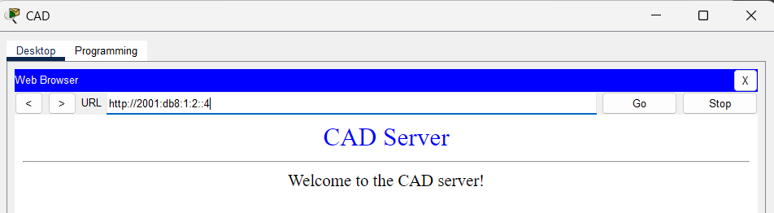

# Lab 12.6.6 — Configure IPv6 Addressing

## Overview

This lab focuses on configuring IPv6 addressing on a router, servers, and clients in Packet Tracer.

R1 connects two local IPv6 networks and an external ISP network. IPv6 routing is enabled on R1 so packets can be forwarded between the different IPv6 networks.

---

## Objectives

- Enable IPv6 routing on R1.
- Configure global unicast IPv6 addresses.
- Configure link-local IPv6 addresses.
- Configure IPv6 addresses on servers.
- Configure IPv6 addresses on clients.
- Configure IPv6 default gateways.
- Verify router IPv6 interfaces.
- Test web connectivity to servers.
- Verify connectivity to the ISP.

---

## Network Topology



The network contains three IPv6 networks:

| Network | Purpose |
|---|---|
| `2001:DB8:1:1::/64` | Sales, Billing and Accounting LAN |
| `2001:DB8:1:2::/64` | Design, Engineering and CAD LAN |
| `2001:DB8:1:A001::/64` | R1 ↔ ISP link |

---

## Addressing Table

| Device | Interface | IPv6 Address | Default Gateway |
|---|---|---|---|
| R1 | G0/0 | `2001:DB8:1:1::1/64` | N/A |
| R1 | G0/0 | `FE80::1` | N/A |
| R1 | G0/1 | `2001:DB8:1:2::1/64` | N/A |
| R1 | G0/1 | `FE80::1` | N/A |
| R1 | S0/0/0 | `2001:DB8:1:A001::2/64` | N/A |
| R1 | S0/0/0 | `FE80::1` | N/A |
| Sales | NIC | `2001:DB8:1:1::2/64` | `FE80::1` |
| Billing | NIC | `2001:DB8:1:1::3/64` | `FE80::1` |
| Accounting | NIC | `2001:DB8:1:1::4/64` | `FE80::1` |
| Design | NIC | `2001:DB8:1:2::2/64` | `FE80::1` |
| Engineering | NIC | `2001:DB8:1:2::3/64` | `FE80::1` |
| CAD | NIC | `2001:DB8:1:2::4/64` | `FE80::1` |
| ISP | S0/0/0 | `2001:DB8:1:A001::1/64` | `FE80::1` |

---

# Implementation

## 1. Enable IPv6 Routing

IPv6 packet forwarding was enabled on R1.

```cisco
enable
configure terminal
ipv6 unicast-routing
```

Without `ipv6 unicast-routing`, R1 would not route IPv6 traffic between the connected IPv6 networks.

---

## 2. Configure R1 IPv6 Interfaces

### G0/0 — LAN 1

```cisco
interface gigabitethernet 0/0
 ipv6 address 2001:DB8:1:1::1/64
 ipv6 address FE80::1 link-local
 no shutdown
 exit
```

### G0/1 — LAN 2

```cisco
interface gigabitethernet 0/1
 ipv6 address 2001:DB8:1:2::1/64
 ipv6 address FE80::1 link-local
 no shutdown
 exit
```

### S0/0/0 — ISP

```cisco
interface serial 0/0/0
 ipv6 address 2001:DB8:1:A001::2/64
 ipv6 address FE80::1 link-local
 no shutdown
 exit
```

---

## 3. Verify R1 IPv6 Configuration

The configured IPv6 addresses and interface status were verified using:

```cisco
show ipv6 interface brief
```

Expected addressing:

| Interface | Global Unicast | Link-Local |
|---|---|---|
| G0/0 | `2001:DB8:1:1::1/64` | `FE80::1` |
| G0/1 | `2001:DB8:1:2::1/64` | `FE80::1` |
| S0/0/0 | `2001:DB8:1:A001::2/64` | `FE80::1` |



The configuration was then saved:

```cisco
copy running-config startup-config
```

---

## 4. Configure Server IPv6 Addressing

### Accounting

```text
IPv6 Address: 2001:DB8:1:1::4
Prefix Length: 64
Default Gateway: FE80::1
```

### CAD

```text
IPv6 Address: 2001:DB8:1:2::4
Prefix Length: 64
Default Gateway: FE80::1
```

---

## 5. Configure Client IPv6 Addressing

| Client | IPv6 Address | Prefix | Default Gateway |
|---|---|---:|---|
| Sales | `2001:DB8:1:1::2` | `/64` | `FE80::1` |
| Billing | `2001:DB8:1:1::3` | `/64` | `FE80::1` |
| Design | `2001:DB8:1:2::2` | `/64` | `FE80::1` |
| Engineering | `2001:DB8:1:2::3` | `/64` | `FE80::1` |

---

# Verification

## 1. Verify Server Connectivity

The clients were used to access both IPv6 web servers.

| Destination | IPv6 Address | Expected Result |
|---|---|---|
| Accounting Server | `2001:DB8:1:1::4` | Website accessible |
| CAD Server | `2001:DB8:1:2::4` | Website accessible |

Accounting:

```text
2001:DB8:1:1::4
```



CAD:

```text
2001:DB8:1:2::4
```



---

## 2. Verify ISP Connectivity

Connectivity to the ISP was tested from the clients.

```text
ping 2001:DB8:1:A001::1
```

| Source | Destination | IPv6 Address | Result |
|---|---|---|---|
| Sales | ISP | `2001:DB8:1:A001::1` | ✅ |
| Billing | ISP | `2001:DB8:1:A001::1` | ✅ |
| Design | ISP | `2001:DB8:1:A001::1` | ✅ |
| Engineering | ISP | `2001:DB8:1:A001::1` | ✅ |

---

# IPv6 Address Types Used

| Address Type | Example | Purpose |
|---|---|---|
| Global Unicast | `2001:DB8:1:1::1/64` | Communication across IPv6 networks |
| Link-Local | `FE80::1` | Communication on the local link and default gateway |
| Prefix | `/64` | Identifies the IPv6 network portion |

---

# Important Concepts

### Global Unicast Address

A global unicast address identifies an IPv6 interface and can be routed between IPv6 networks.

Example:

```text
2001:DB8:1:1::2/64
```

### Link-Local Address

A link-local address operates only on the local network link.

In this activity, R1 uses:

```text
FE80::1
```

as its link-local address on each interface.

Because each interface belongs to a different link, the same `FE80::1` address can be used on multiple R1 interfaces.

### IPv6 Default Gateway

The clients use R1's link-local address as their IPv6 default gateway:

```text
FE80::1
```

This tells the host to send traffic destined for other IPv6 networks to R1.

---

# Key Findings

- IPv6 routing is enabled with `ipv6 unicast-routing`.
- Router interfaces can have both global unicast and link-local IPv6 addresses.
- IPv6 networks commonly use a `/64` prefix.
- Link-local addresses begin with `FE80::/10`.
- The same link-local address can exist on different router interfaces because each interface belongs to a different link.
- A router's link-local address can be used as the IPv6 default gateway.
- `show ipv6 interface brief` displays IPv6 addressing and interface status.
- Incorrect IPv6 addresses must be removed before replacing them to avoid keeping multiple addresses on an interface.
- Successful web access verifies connectivity to the IPv6 servers.
- Successful ISP pings verify IPv6 connectivity beyond the local LAN.

---

# Configuration Flow

```text
Enable IPv6 Routing
        ↓
Configure R1 G0/0
        ↓
Configure R1 G0/1
        ↓
Configure R1 S0/0/0
        ↓
Verify R1
        ↓
Configure Servers
        ↓
Configure Clients
        ↓
Test Web Servers
        ↓
Ping ISP
```

---

# Lab Reference

Cisco Networking Academy — Packet Tracer 12.6.6: Configure IPv6 Addressing