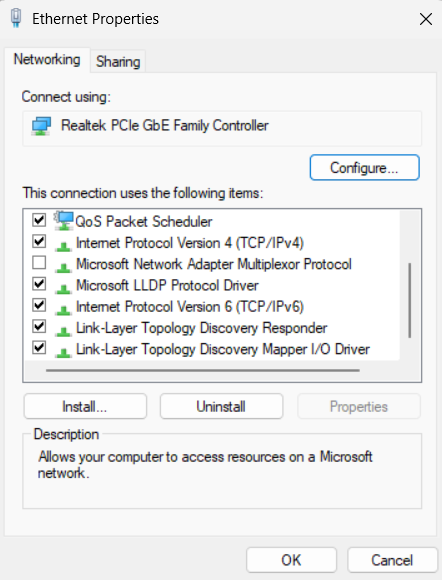

# Lab 12.7.4 — Identify IPv6 Addresses

## Overview

This lab focuses on identifying different IPv6 address types, practicing IPv6 address compression and decompression, and examining the IPv6 configuration of a Windows PC.

---

## Objectives

- Identify common IPv6 address types.
- Practice IPv6 address compression.
- Practice IPv6 address decompression.
- Verify that IPv6 is enabled on a Windows PC.
- Examine IPv6 addressing using `ipconfig /all`.
- Identify the IPv6 addresses assigned to a network interface.

---

# Part 1 — IPv6 Address Types

## 1. Identify IPv6 Address Types

| IPv6 Address | Address Type |
|---|---|
| `2001:0db8:1:acad::fe55:6789:b210` | Global Unicast |
| `::1` | Loopback |
| `fc00:22:a:2::cd4:23e4:76fa` | Unique Local |
| `2033:db8:1:1:22:a33d:259a:21fe` | Global Unicast |
| `fe80::3201:cc01:65b1` | Link-Local |
| `ff00::` | Multicast |
| `ff00::db7:4322:a231:67c` | Multicast |
| `ff02::2` | Multicast |

### IPv6 Address Type Summary

| Address Type | Typical Range / Example | Purpose |
|---|---|---|
| Global Unicast | `2000::/3` | Routable IPv6 communication |
| Link-Local | `FE80::/10` | Communication on the local link |
| Unique Local | `FC00::/7` | Private/internal IPv6 communication |
| Multicast | `FF00::/8` | Communication with a group of devices |
| Loopback | `::1` | Refers to the local device |

---

## 2. IPv6 Compression and Decompression

IPv6 addresses can be shortened using two main rules:

1. Leading zeros within a hextet can be removed.
2. One continuous sequence of all-zero hextets can be replaced with `::`.

### A

Original:

```text
2002:0ec0:0200:0001:0000:04eb:44ce:08a2
```

Compressed:

```text
2002:ec0:200:1:0:4eb:44ce:8a2
```

### B

Original:

```text
fe80:0000:0000:0001:0000:60bb:008e:7402
```

Compressed:

```text
fe80::1:0:60bb:8e:7402
```

### C

Compressed:

```text
fe80::7042:b3d7:3dec:84b8
```

Decompressed:

```text
fe80:0000:0000:0000:7042:b3d7:3dec:84b8
```

### D

Compressed:

```text
ff00::
```

Decompressed:

```text
ff00:0000:0000:0000:0000:0000:0000:0000
```

### E

Original:

```text
2001:0030:0001:acad:0000:330e:10c2:32bf
```

Compressed:

```text
2001:30:1:acad:0:330e:10c2:32bf
```

---

# Part 2 — Examine Host IPv6 Configuration

## 1. Verify IPv6

The active Windows network adapter was checked to verify that Internet Protocol Version 6 (TCP/IPv6) was installed and enabled.



IPv6 can normally obtain addressing information automatically rather than requiring manual configuration.

---

## 2. Examine IPv6 Addressing

The following command was used to examine the complete network configuration:

```cmd
ipconfig /all
```

Important IPv6 information to identify includes:

| Information | Purpose |
|---|---|
| IPv6 Address | Identifies the host on an IPv6 network |
| Link-Local IPv6 Address | Used for communication on the local link |
| Default Gateway | Router used to reach other networks |
| DNS Server | Resolves domain names to IP addresses |
| DHCPv6 Information | Information related to IPv6 configuration services |

---

## IPv6 Address Observations

The IPv6 addresses found on the PC should be recorded from the actual `ipconfig /all` output.

| Item | Observation |
|---|---|
| Global Unicast Address | Present |
| Temporary IPv6 Address | Present |
| Link-Local Address | Present |
| IPv6 Default Gateway | Link-local address present |
| Unique-Local Address | Not observed |

The actual values depend on the IPv6 configuration provided by the local network.

---

# Important Concepts

### Global Unicast Address

A global unicast address is used for IPv6 communication across networks.

Example:

```text
2001:DB8::1
```

### Link-Local Address

A link-local address is automatically available for communication on the local network link.

Example:

```text
FE80::1
```

### Unique Local Address

Unique local addresses are intended for internal IPv6 communication.

They use the range:

```text
FC00::/7
```

### Multicast Address

IPv6 multicast addresses identify groups of interfaces.

They begin with:

```text
FF00::/8
```

Example:

```text
FF02::2
```

`FF02::2` represents all IPv6 routers on the local link.

### Loopback Address

The IPv6 loopback address is:

```text
::1
```

It refers to the local host and is equivalent in purpose to IPv4:

```text
127.0.0.1
```

---

# Key Findings

- IPv6 addresses contain 128 bits.
- IPv6 addresses are represented using hexadecimal notation.
- IPv6 addresses can be compressed to make them easier to read.
- Leading zeros within a hextet can be removed.
- `::` can replace one continuous sequence of zero hextets.
- `::` can only be used once in an IPv6 address.
- Global unicast addresses are used for routable IPv6 communication.
- Link-local addresses are used for communication on the local link.
- Unique local addresses are intended for internal communication.
- Multicast addresses communicate with groups of IPv6 interfaces.
- `::1` is the IPv6 loopback address.
- Windows IPv6 information can be examined using `ipconfig /all`.

---

# Reflection

### How will IPv6 need to be supported in the future?

Networking devices, operating systems, applications, and network administrators need to support IPv6 as its deployment continues alongside IPv4.

### Will IPv4 continue to be used?

IPv4 and IPv6 can coexist through dual-stack networks during the transition to IPv6. The transition is gradual rather than requiring all networks to change at the same time.

---

# Lab Reference

Cisco Networking Academy — Lab 12.7.4: Identify IPv6 Addresses