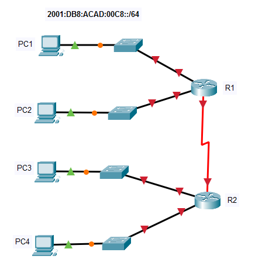
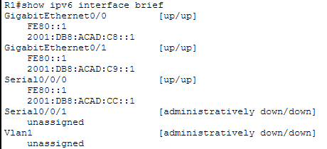
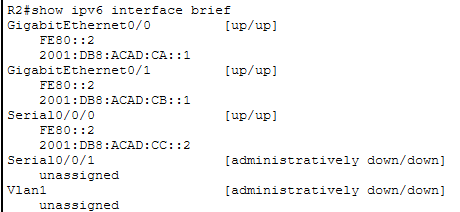

# Lab 12.9.1 — Implement a Subnetted IPv6 Addressing Scheme

## Overview

This lab focuses on designing and implementing an IPv6 addressing scheme using consecutive `/64` subnets.

The starting IPv6 network is:

```text
2001:DB8:ACAD:00C8::/64
```

Five IPv6 networks are required:

- Four LAN networks
- One router-to-router network

The routers are configured with global unicast and link-local IPv6 addresses, while the PCs use IPv6 automatic configuration.

---

## Objectives

- Determine consecutive IPv6 `/64` subnets.
- Assign IPv6 networks to four LANs.
- Configure IPv6 addressing on R1 and R2.
- Configure router link-local addresses.
- Enable IPv6 routing.
- Configure PCs using IPv6 Auto Config.
- Verify IPv6 connectivity between the PCs.

---

## Network Topology



R1 and R2 route traffic between the four IPv6 LANs.

---

# IPv6 Addressing Design

## 1. Starting Network

The provided starting IPv6 subnet is:

```text
2001:DB8:ACAD:00C8::/64
```

The subnet ID is incremented consecutively for each additional network:

```text
00C8
00C9
00CA
00CB
00CC
```

---

## 2. Subnet Table

| Network | IPv6 Subnet |
|---|---|
| R1 G0/0 LAN | `2001:DB8:ACAD:00C8::/64` |
| R1 G0/1 LAN | `2001:DB8:ACAD:00C9::/64` |
| R2 G0/0 LAN | `2001:DB8:ACAD:00CA::/64` |
| R2 G0/1 LAN | `2001:DB8:ACAD:00CB::/64` |
| R1 ↔ R2 | `2001:DB8:ACAD:00CC::/64` |

### Why does `00C8` become `00C9`?

IPv6 uses hexadecimal numbering.

Therefore:

```text
00C8
00C9
00CA
00CB
00CC
```

Each value represents the next consecutive `/64` subnet.

---

## Addressing Table

| Device | Interface | Global Unicast IPv6 Address | Link-Local |
|---|---|---|---|
| R1 | G0/0 | `2001:DB8:ACAD:00C8::1/64` | `FE80::1` |
| R1 | G0/1 | `2001:DB8:ACAD:00C9::1/64` | `FE80::1` |
| R1 | S0/0/0 | `2001:DB8:ACAD:00CC::1/64` | `FE80::1` |
| R2 | G0/0 | `2001:DB8:ACAD:00CA::1/64` | `FE80::2` |
| R2 | G0/1 | `2001:DB8:ACAD:00CB::1/64` | `FE80::2` |
| R2 | S0/0/0 | `2001:DB8:ACAD:00CC::2/64` | `FE80::2` |
| PC1 | NIC | Auto Config | Auto |
| PC2 | NIC | Auto Config | Auto |
| PC3 | NIC | Auto Config | Auto |
| PC4 | NIC | Auto Config | Auto |

---

# Implementation

## 1. Configure R1

Enable IPv6 routing:

```cisco
enable
configure terminal
ipv6 unicast-routing
```

### R1 G0/0

```cisco
interface gigabitethernet 0/0
 ipv6 address 2001:DB8:ACAD:00C8::1/64
 ipv6 address FE80::1 link-local
 no shutdown
 exit
```

### R1 G0/1

```cisco
interface gigabitethernet 0/1
 ipv6 address 2001:DB8:ACAD:00C9::1/64
 ipv6 address FE80::1 link-local
 no shutdown
 exit
```

### R1 S0/0/0

```cisco
interface serial 0/0/0
 ipv6 address 2001:DB8:ACAD:00CC::1/64
 ipv6 address FE80::1 link-local
 no shutdown
 exit
```

Save the configuration:

```cisco
end
copy running-config startup-config
```

---

## 2. Configure R2

Enable IPv6 routing:

```cisco
enable
configure terminal
ipv6 unicast-routing
```

### R2 G0/0

```cisco
interface gigabitethernet 0/0
 ipv6 address 2001:DB8:ACAD:00CA::1/64
 ipv6 address FE80::2 link-local
 no shutdown
 exit
```

### R2 G0/1

```cisco
interface gigabitethernet 0/1
 ipv6 address 2001:DB8:ACAD:00CB::1/64
 ipv6 address FE80::2 link-local
 no shutdown
 exit
```

### R2 S0/0/0

```cisco
interface serial 0/0/0
 ipv6 address 2001:DB8:ACAD:00CC::2/64
 ipv6 address FE80::2 link-local
 no shutdown
 exit
```

Save the configuration:

```cisco
end
copy running-config startup-config
```

---

## 3. Configure the PCs

PC1, PC2, PC3, and PC4 were configured using:

```text
Desktop → IP Configuration → IPv6 Configuration → Auto Config
```

The PCs automatically obtain IPv6 addressing information for their respective LANs.

| PC | Connected Network | Configuration |
|---|---|---|
| PC1 | `2001:DB8:ACAD:00C8::/64` | Auto Config |
| PC2 | `2001:DB8:ACAD:00C9::/64` | Auto Config |
| PC3 | `2001:DB8:ACAD:00CA::/64` | Auto Config |
| PC4 | `2001:DB8:ACAD:00CB::/64` | Auto Config |

---

# Verification

## 1. Verify Router Interfaces

Run on both routers:

```cisco
show ipv6 interface brief
```

Expected R1 networks:

| Interface | IPv6 Network |
|---|---|
| G0/0 | `2001:DB8:ACAD:00C8::/64` |
| G0/1 | `2001:DB8:ACAD:00C9::/64` |
| S0/0/0 | `2001:DB8:ACAD:00CC::/64` |

Expected R2 networks:

| Interface | IPv6 Network |
|---|---|
| G0/0 | `2001:DB8:ACAD:00CA::/64` |
| G0/1 | `2001:DB8:ACAD:00CB::/64` |
| S0/0/0 | `2001:DB8:ACAD:00CC::/64` |




---

## 2. Verify PC Connectivity

IPv6 connectivity was tested between PCs on different LANs.

| Source | Destination | Result |
|---|---|---|
| PC1 | PC2 | ✅ |
| PC1 | PC3 | ✅ |
| PC1 | PC4 | ✅ |
| PC2 | PC4 | ✅ |

Example:

```text
ping <destination-IPv6-address>
```

Successful pings confirm that IPv6 addressing and routing are functioning correctly.

---

# Important Concepts

## IPv6 Subnetting

Unlike the earlier IPv4 VLSM labs, this activity keeps each LAN at `/64`.

The subnet identifier is changed to create different networks:

```text
2001:DB8:ACAD:00C8::/64
              ^^^^

2001:DB8:ACAD:00C9::/64
2001:DB8:ACAD:00CA::/64
2001:DB8:ACAD:00CB::/64
2001:DB8:ACAD:00CC::/64
```

---

## Router Interface Addressing

The first address in each LAN subnet is assigned to the corresponding router interface:

```text
Subnet:  2001:DB8:ACAD:00C8::/64
Router:  2001:DB8:ACAD:00C8::1/64
```

For the R1–R2 network:

```text
Network: 2001:DB8:ACAD:00CC::/64

R1 = 2001:DB8:ACAD:00CC::1/64
R2 = 2001:DB8:ACAD:00CC::2/64
```

---

## Link-Local Addresses

R1 uses:

```text
FE80::1
```

R2 uses:

```text
FE80::2
```

These addresses are used for communication on the local link and are not routed between networks.

---

## IPv6 Auto Configuration

The PCs use IPv6 Auto Config rather than manually assigned addresses.

The router advertises IPv6 prefix information to hosts, allowing them to automatically configure their IPv6 addressing.

---

# Key Findings

- IPv6 networks commonly use a `/64` prefix for LANs.
- Consecutive IPv6 subnets can be created by incrementing the subnet ID.
- IPv6 subnet IDs are written in hexadecimal.
- `00C8` is followed by `00C9`, `00CA`, `00CB`, and `00CC`.
- Router LAN interfaces use the first address in each assigned subnet.
- R1 and R2 use separate addresses on their shared IPv6 network.
- R1 uses `FE80::1` as its link-local address.
- R2 uses `FE80::2` as its link-local address.
- PCs can automatically configure IPv6 addresses.
- `ipv6 unicast-routing` enables IPv6 packet forwarding on a router.
- `show ipv6 interface brief` can be used to verify IPv6 interface configuration.
- Successful PC-to-PC pings verify end-to-end IPv6 connectivity.

---

# Lab Reference

Cisco Networking Academy — Packet Tracer 12.9.1: Implement a Subnetted IPv6 Addressing Scheme